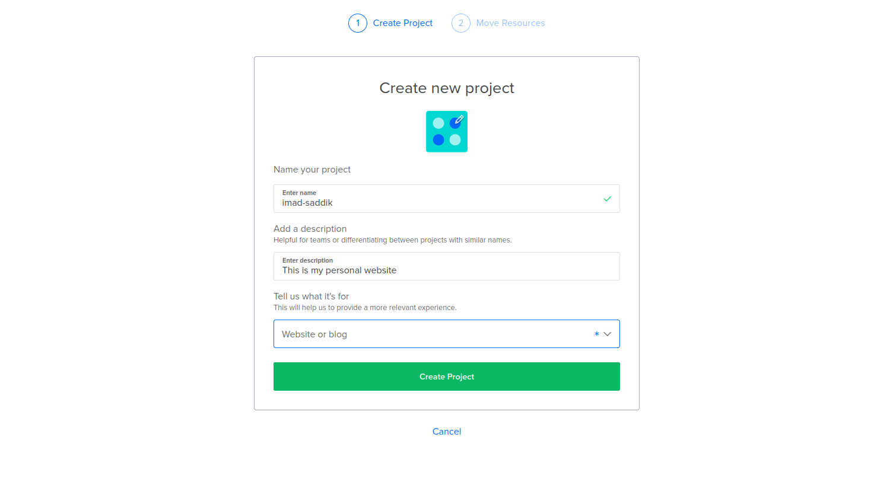
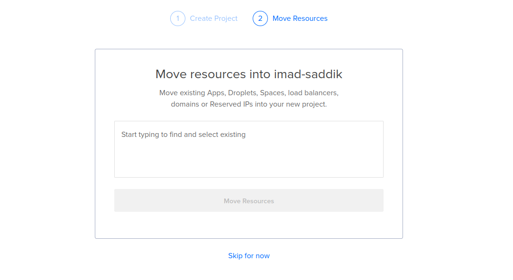
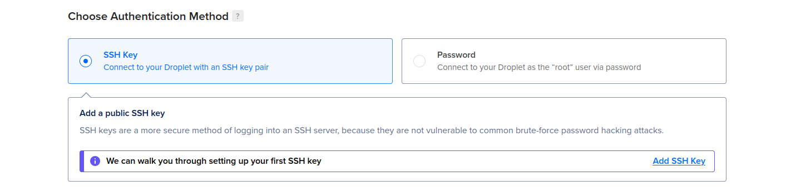

# Module 1: The foundation

## Cloud setup & access

### Introduction

Before you deploy any code, you need a secure environment. You will use DigitalOcean, but these concepts apply to AWS EC2, Linode, or even a Raspberry Pi.

By the end of this section, you will have a server running Ubuntu 24.04 LTS, accessed securely via SSH keys, with password authentication completely disabled.

### Create the project

In this handbook, you will use DigitalOcean to host your web application. If you don’t have an account, [create one here](https://m.do.co/c/4f9010fc5eb3) to get **$200 in free credit**.

After creating your account, create a project to hold your resources. Click on the **New project** button.


_The location of the **+ New Project** button on the DigitalOcean dashboard._

Give your project a name and a description. Write something expressive so you can remember the purpose of the project later. I named mine “imad-saddik”. Click on **Create Project** when you are done.


Give the project a name and a description._

DigitalOcean will ask if you want to move resources to this project. Click **Skip for now** because you are starting from scratch.


_Skip this step because you don’t have any resources yet._

### Create the droplet

Now, create the virtual machine. In DigitalOcean, these are called “droplets”. Click on **Create** in the top menu, then select **droplets**.

A droplet is a Linux-based virtual machine that runs on virtualized hardware. This machine will host the code for your website.


_Click **Create**, then select **droplets** to start setting up your server._

Choose a **Region** where your VM will be hosted. Always select a region that is geographically near you or your target users. I live in Morocco, so I chose the Frankfurt (Germany) datacenter.


_Select the region where your droplet will be hosted._

Next, choose an **Operating System**. Linux is the standard for servers. Select **Ubuntu 24.04 (LTS)** because it is stable and well-supported.


_Choose the operating system for your droplet._

Now you need to choose the size of your virtual machine. You can pick between **shared CPU** and **dedicated CPU**. Inside each option, you must decide how much **RAM**, **disk space**, and how many **CPU cores** you want.

Dedicated VMs are more expensive because the resources are **reserved only for you**. Adding more RAM, disk space, or CPU cores will also increase the price.

The good thing is that you can **change the droplet size later** if needed. For now, you will create a droplet with a shared CPU and the lowest resources. This costs **$4 per month**, and I will show you how to upgrade it later.


_Select the droplet size that fits your needs._

If you need more storage, click **Add Volume** and enter the size in GB. This feature is not free, it costs **$1 per month for every 10 GB**. You can also enable automatic backups if you need them.


_Additional storage and backup options._

### Authentication

This is a critical security step. You can access your server using a **Password** or an **SSH key**. **Always use an SSH key.** Passwords can be guessed, but SSH keys are much safer.

Select **SSH Key** and click on the **Add SSH Key** button.


_Select SSH key for better security._

To generate a key, open your terminal on your local computer and run this command:

```bash
ssh-keygen -t rsa -b 4096 -f ~/.ssh/<your_key_name> -C "<key_comment>"
```

Here is what the arguments do:

- `-t rsa`: Specifies the type of cryptography ([RSA](https://en.wikipedia.org/wiki/RSA_cryptosystem)).
- `-b 4096`: Generates a strong 4096-bit key.
- `-f ~/.ssh/<your_key_name>`: Saves the key with a specific name so you don’t overwrite your default keys.
- `-C "<key_comment>"`: Adds a comment to help you identify the key.

You will be asked to add a **passphrase**. This is an extra password to protect your private key. If someone steals your private key file, they cannot use it without this passphrase.

```bash
ssh-keygen -t rsa -b 4096 -f ~/.ssh/<your_key_name> -C "<key_comment>"

# Output:
Generating public/private rsa key pair.
Enter passphrase for "/home/<your_username>/.ssh/<your_key_name>" (empty for no passphrase):
```

If you do not want to use a passphrase, press **Enter** twice. If you do add one, remember that you will need to enter it every time you log in to the VM.

This is fine for manual login. However, if you have a **CI workflow** that needs to log in automatically, it is better not to set a passphrase.

You have generated the key pair. Now, copy the public key.

```bash
cat ~/.ssh/<your_key_name>.pub
```

The command displays your public key. Copy the entire text starting with `ssh-rsa`. Paste it into the box, give it a name, and click **Add SSH Key**.


_Add the public SSH key._

You can add more than one SSH key by clicking the **New SSH Key** button. This allows you to add a specific key for your CI without a passphrase, while keeping the one on your computer protected with a passphrase.


_Add multiple SSH keys._

You are almost done. Select **Add improved metrics monitoring and alerting** because it is free.


_Select the free monitoring option._
