# Module 2: The application runtime

## Manual deployment

### Introduction

You have a secure server; now, it’s time to put it to work by turning it into a web server.

In this chapter, you will move your codebase to the cloud, install the necessary runtimes (Python and Node.js), and configure a process manager to keep your backend alive.

### Move the project to the VM

You will be deploying a full-stack application that uses **Vue.js** for the frontend and **FastAPI** for the backend.

To follow this guide exactly, your project should have a structure similar to mine. You can find the full source code for my website here: [https://github.com/ImadSaddik/ImadSaddikWebsite](https://github.com/ImadSaddik/ImadSaddikWebsite).

> [!NOTE]
> The goal here isn't to deploy my specific website on your server, but to use this repository as a reference or a practice dummy if you don't have your own app ready yet.

The folders you need to focus on are:

- `/backend`: Contains the API code and `requirements.txt` for the `Python` dependencies.
- `/frontend`: Contains the `Vue.js` source code and `package.json` for the `Node.js` dependencies.

If your project uses a different structure or stack, please adjust the file paths in the commands below accordingly.

#### Compress and upload the code

On your local machine, create a compressed archive of your project to speed up the transfer. Run this command inside your project folder:

```bash
tar -czvf source_code.tar.gz --exclude='node_modules' --exclude='venv' --exclude='__pycache__' --exclude='.git' .
```

> [!NOTE]
> The `.` at the end means "compress everything in the current directory". You can replace it with a specific folder or file if you only want to compress part of your project.
>
> We exclude `node_modules` and `venv` because they contain large files that can be easily recreated on the server. The `__pycache__` and `.git` folders are also unnecessary for deployment.

Now, send the file to your VM using the `scp` ([secure copy](https://en.wikipedia.org/wiki/Secure_copy_protocol)) command. Because you configured your SSH alias in the previous chapter, you don't need to type your IP address or key path; just use `my-website`.

```bash
scp source_code.tar.gz my-website:/tmp/
```

> [!NOTE]
> We upload to `/tmp/` first because your user might not have permission to write directly to the final destination yet.

Connect to your VM and verify that the file arrived safely.

```bash
ssh my-website
ls /tmp/source_code.tar.gz
```

#### Organize the project files

You might be tempted to put your project inside your home directory (`/home/<your_username>`). While that works for development, best practice for production is to use a neutral location like `/var/www` or a dedicated folder like `/web_app`.

This approach keeps your application logic separate from your personal user files (`.ssh`, `.bash_history`) and prevents permission issues if you ever modify your user account.

Create the dedicated folder:

```bash
sudo mkdir /web_app
```

Move the compressed file into this new folder and extract it.

```bash
sudo mv /tmp/source_code.tar.gz /web_app/
cd /web_app
sudo tar -xzvf source_code.tar.gz
```

Verify that your files are extracted correctly.

```bash
ls
# Output: README.md ...
```

Currently, these files are owned by `root` (because you used sudo). Change the ownership to your user account so you can manage the files without needing `sudo` for every minor change.

```bash
sudo chown -R <your_username>:<your_username> /web_app
```

Run this command to check who owns the files now:

```bash
ls -la /web_app
```

Look at the third and fourth columns in the output.

```text
total 44
drwxrwxr-x 7 <your_username> <your_username> 4096 Oct 28 07:20 .
drwxr-xr-x 23 root           root            4096 Oct 28 07:19 ..
...
drwxrwxr-x 6 <your_username> <your_username> 4096 Oct 26 21:37 frontend
```

If you see your username there instead of `root`, the ownership is correct.

While you are here, install the Python tools required for the backend.

```bash
sudo apt install python3-pip python3-venv python3-dev -y
```

### Run the backend

Before you configure the production servers ([Nginx](https://nginx.org/) and [Gunicorn](https://gunicorn.org/)), you need to ensure the application runs properly.

First, move to the backend folder, create a virtual environment named `venv`, and activate it.

```bash
cd /web_app/backend

python3 -m venv venv
source venv/bin/activate
```

Your new virtual environment is currently empty. You need to install the backend packages inside it.

```bash
pip install -r requirements.txt
```

Now, start the backend server for testing. You will use [uvicorn](https://uvicorn.dev/) to run the FastAPI app.

```bash
uvicorn main:app --host 0.0.0.0 --port 8000
```

You should see output indicating that the server has started:

```text
INFO: Started server process [5602]
INFO: Waiting for application startup.
INFO: Application startup complete.
INFO: Uvicorn running on http://0.0.0.0:8000 (Press CTRL+C to quit)
```

#### Verify the backend is running

You need to verify that your API is alive.

First, check if your firewall is active. In the previous chapter, you configured **UFW** to block external connections.

```bash
sudo ufw status
```

- **If it says `inactive`**: You are safe to test in the browser, but remember to enable it later for security.
- **If it says `active`**: Great. This means you cannot access port `8000` from the outside, which is what we want.

To test the app through the firewall, open a **new terminal window**, SSH into the server, and run:

```bash
curl http://127.0.0.1:8000/api/health
```

If you see a JSON response (like `{"status": "ok"}`), your backend is working.

Stop the server now by pressing `Ctrl+C` in the original terminal.

### Frontend setup and swap memory

We are using Vue.js for the frontend, which means we need to install [Node.js](https://nodejs.org/en). The best way to install Node.js is with [NVM](https://github.com/nvm-sh/nvm) (Node Version Manager).

Run this command to install NVM:

```bash
curl -o- https://raw.githubusercontent.com/nvm-sh/nvm/v0.40.3/install.sh | bash
```

Your current terminal session doesn’t know about NVM yet. Run this command to load it immediately:

```bash
source ~/.bashrc
```

Now, install the latest LTS (Long Term Support) version of Node.js.

```bash
nvm install --lts
```

You also need [pnpm](https://pnpm.io/) to install the frontend dependencies.

```bash
npm install -g pnpm@latest-10
```

Navigate to the frontend directory and install the dependencies.

```bash
cd /web_app/frontend
pnpm install
```

#### The build process and swap memory

Now, try to build the project.

```bash
pnpm run build
```

**Did the build fail?** If you are using a droplet with low RAM (like the $4 plan), this command will likely fail with an "Out of Memory" error or simply say `Killed`. This happens because the build process needs more RAM than the server has available.

You might see the following error:

```text
Building for production...Killed
ELIFECYCLE Command failed with exit code 137.
```

To fix this, you will create a [swap file](https://wiki.archlinux.org/title/Swap). This creates [virtual RAM](https://en.wikipedia.org/wiki/Virtual_memory) using your hard drive space.

Create a 2GB swap file (you can adjust the size if needed, but 2GB is a good starting point).

```bash
sudo fallocate -l 2G /swapfile
```

**What is `/swapfile`?** It is not a directory; it is a single file acting as "virtual RAM". By creating a file instead of a dedicated partition, you can easily resize or delete it later without messing with the hard drive's partition table.

Set the correct permissions:

```bash
# Secure the file so only root can read it
sudo chmod 600 /swapfile
```

Mark the file as swap space and enable it:

```bash
sudo mkswap /swapfile
sudo swapon /swapfile
```

Verify that the swap is active.

```bash
sudo swapon --show
```

Output should show:

```text
NAME      TYPE  SIZE USED PRIO
/swapfile file  2G   0B   -2
```

Here is what this means:

- **TYPE** `file`: Confirms you successfully created a swap file (not a partition).
- **SIZE** `2G`: You have added 2GB of virtual memory.
- **USED** `0B`: This is normal! Linux is smart; it will only start using this slower "fake RAM" once your actual physical RAM is full.
- **PRIO** `-2`: The priority level. Linux uses swap with lower priority than physical RAM.

By default, this swap configuration will be lost when the server reboots. To ensure the swap file loads automatically every time the system starts, you must add it to the [fstab](https://wiki.archlinux.org/title/Fstab) file.

Run this command to append the configuration to the file:

```bash
echo '/swapfile none swap sw 0 0' | sudo tee -a /etc/fstab
```

**Why use `tee` instead of `>>`?** You might wonder why we didn't just use `sudo echo "..." >> /etc/fstab`. That would fail with a "Permission denied" error.

This happens because the redirection (`>>`) is handled by your current shell (which is not root), not by `sudo`. The `tee` command solves this by accepting input and writing it to a file with root privileges.

- `echo '...'`: Creates the text string.
- `|` (Pipe): Passes that text to the next command.
- `sudo tee -a`: Writes the text to the file as root. The `-a` flag stands for append (so you don't overwrite the existing file).

Now that you have extra memory, go back to your frontend directory and try the build command again.

```bash
cd /web_app/frontend
pnpm run build
```

If the build still fails, or if you see a [heap limit error](https://stackoverflow.com/questions/53230823/fatal-error-ineffective-mark-compacts-near-heap-limit-allocation-failed-javas), it means Node.js is restricting itself to a low memory limit, ignoring your new swap space.

This is the error you might see:

```text
FATAL ERROR: Ineffective mark-compacts near heap limit Allocation failed - JavaScript heap out of memory
```

You need to tell Node.js explicitly that it is allowed to use more memory. Run the build command with this specific flag:

```bash
NODE_OPTIONS="--max-old-space-size=2048" pnpm run build
```

Here is what this command does:

- `NODE_OPTIONS`: This environment variable passes arguments to the Node.js process.
- `--max-old-space-size=2048`: This sets the maximum size of the memory heap to 2048MB (2GB). Since you added a 2GB swap file, this ensures Node.js can actually use it.

The build should now succeed. You will see a `dist` folder created.

```text
DONE  Build complete. The dist directory is ready to be deployed.
```

#### Verify the frontend build

Let’s verify that the frontend files were built correctly. Go to the `dist` folder.

```bash
cd /web_app/frontend/dist
```

Start a temporary Python web server on port 8080.

```bash
python3 -m http.server 8080
```

If you try to visit `http://<your_droplet_ip>:8080` in your browser, it will fail. This is because in **Chapter 1.2**, you configured the firewall (UFW) to block everything except SSH.

Instead of opening port `8080` to the entire world (which is insecure), you can use your existing SSH connection to create a private [tunnel](https://iximiuz.com/en/posts/ssh-tunnels/) to the server.

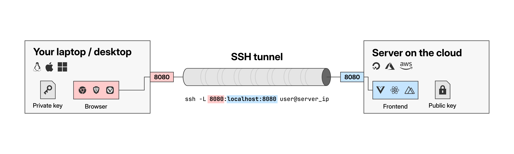
_Visualizing SSH local port forwarding. The `-L` flag creates a secure, encrypted "pipe" that forwards traffic from your local machine (port 8080) directly to the server's internal localhost (port 8080), effectively bypassing the remote firewall._

Think of it like a secure pipe inside your existing SSH connection:

1. Local end: You open port `8080` on your laptop (`localhost`).
2. The tunnel: SSH encrypts any traffic you send to that port.
3. Remote end: SSH delivers that traffic to `localhost:8080` on the server, just as if you were sitting right in front of it.

Open a **new terminal on your local computer** and run this command:

```bash
# Syntax: ssh -L <local_port>:localhost:<remote_port> <alias>
ssh -L 8080:localhost:8080 my-website
```

Now, open your browser and visit `http://localhost:8080`. You should see your Vue.js application.


_The home page of my website._

> [!NOTE]
> Your app will fail to make any API calls because the backend isn't running properly yet. This is normal. You are just testing if the HTML and CSS load correctly.

When you are done, press `Ctrl+C` in both terminals to stop the SSH tunnel and the Python server.

### Gunicorn and Supervisor

Currently, you are running the backend manually using `uvicorn`. If you close the terminal, the site goes down. To make it production-ready, you need two tools:

- `Gunicorn`: A robust server manager that handles multiple processes.
- `Supervisor`: A system that monitors Gunicorn and restarts it automatically if it crashes or if the server reboots.

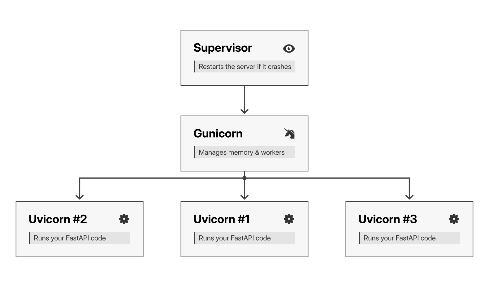
_The process hierarchy: Supervisor watches the manager (Gunicorn), and the manager watches the workers (Uvicorn)._

Let's configure these tools to keep your backend alive and responsive.

#### Install Gunicorn

Navigate to your backend directory and activate the virtual environment.

```bash
cd /web_app/backend
source venv/bin/activate
```

Install Gunicorn inside the environment.

```bash
pip install gunicorn
```

#### Create the startup script

You may ask, why do we need both `Gunicorn` and `Uvicorn`?

- `Gunicorn` acts as the **Manager**. It handles the process, creates multiple workers, and ensures they stay alive.
- `Uvicorn` acts as the **Worker**. It runs inside Gunicorn and handles the actual asynchronous events that FastAPI needs.

Create a shell script that tells Gunicorn exactly how to run your application. **Place this script in your backend root folder, not inside the `venv` folder**. The `venv` folder is often deleted or recreated during deployments, so any files inside it are at risk of being lost.

```bash
# Ensure you are in /web_app/backend
nano gunicorn_start
```

> [!NOTE]
> If you are using my reference repository, this script is located in `/infrastructure/scripts/`. For this guide, we will place it in the backend directory to keep things simple.

Paste the following script into the editor.

> [!IMPORTANT]
> Replace `<your_project_name>` with a name for your app (e.g., `my_blog`) and ensure `USER`/`GROUP` match your username.

```bash
#!/bin/bash

NAME='<your_project_name>'
APPDIR=/web_app/backend
SOCKFILE=/web_app/backend/gunicorn.sock
USER=<your_username>
GROUP=<your_username>
# Increase this if you have more traffic or a more complex app
NUM_WORKERS=3
TIMEOUT=120

# Gunicorn needs to use Uvicorn's worker class for FastAPI
WORKER_CLASS=uvicorn.workers.UvicornWorker

# We use "*" because we are running behind Nginx via a Unix Socket.
FORWARDED_ALLOW_IPS="*"

echo "Starting $NAME"

cd $APPDIR
source venv/bin/activate

# Create the run directory if it doesn't exist
RUNDIR=$(dirname $SOCKFILE)
test -d $RUNDIR || mkdir -p $RUNDIR

# Start Gunicorn
exec venv/bin/gunicorn main:app \
  --name $NAME \
  --workers $NUM_WORKERS \
  --worker-class $WORKER_CLASS \
  --timeout $TIMEOUT \
  --user=$USER --group=$GROUP \
  --bind=unix:$SOCKFILE \
  --forwarded-allow-ips="$FORWARDED_ALLOW_IPS" \
  --log-level=debug \
  --log-file=-
```

Here is the meaning of the important parts of this script:

#### Identity & Logging

- `NAME`: This gives your process a specific name (like `<project_name>`) so you can easily identify it in system monitoring tools like `top` or `htop`.
- `--log-file=-`: The dash `-` is a special symbol that means "Standard Output". It tells Gunicorn to print logs to the terminal instead of saving them to a file. This allows Supervisor to capture the logs and manage them for us.

#### The Connection (Socket vs. Port)

- `SOCKFILE`: Instead of using a network port (like 8000), you are creating a [Unix Socket file](https://en.wikipedia.org/wiki/Unix_domain_socket). This is a special file that processes use to communicate efficiently. It is faster and more secure than a port because it doesn't open a network connection; only Nginx will have permission to read this file.
- `--bind`: This tells Gunicorn to listen on the socket file defined in `SOCKFILE` instead of an IP address.
- `FORWARDED_ALLOW_IPS`: We set this to `*` because we will be using Nginx (in the next subchapter) to handle the actual internet traffic. Since Nginx and Gunicorn communicate via a trusted Unix socket on the same machine, we trust the forwarded requests.

#### Workers & Performance

- `NUM_WORKERS`: This decides how many concurrent processes to run. [A good rule of thumb](https://docs.gunicorn.org/en/latest/design.html#how-many-workers) is `(2 x CPU cores) + 1`. Since this is a small server, 3 workers is a safe balance.
- `WORKER_CLASS`: By default, Gunicorn expects a standard Python app ([WSGI](https://en.wikipedia.org/wiki/Web_Server_Gateway_Interface)). Since FastAPI is asynchronous ([ASGI](https://en.wikipedia.org/wiki/Asynchronous_Server_Gateway_Interface)), you must tell Gunicorn to use `uvicorn.workers.UvicornWorker` to bridge the gap.
- `TIMEOUT`: If a worker freezes or takes longer than 120 seconds to respond, Gunicorn will kill it and restart it. This prevents your server from getting stuck on a bad request.

#### System management

- `exec`: This is a bash command that replaces the current shell process with the Gunicorn process. This saves memory because it doesn't leave a useless bash script running in the background while the server runs.

Save the file and exit. Now, make the script executable so it can run as a program.

```bash
chmod +x gunicorn_start
```

#### Configure Supervisor

You could run that script manually, but it is better to let **Supervisor** handle it. Supervisor monitors your `gunicorn_start` script, starts it automatically, and immediately restarts it if it ever stops.

First, install Supervisor.

```bash
sudo apt install supervisor
```

Create a folder where Supervisor can save the logs for your application.

```bash
mkdir -p /web_app/backend/logs/
```

Verify that the folder is owned by your user (not root):

```bash
ls -ld /web_app/backend/logs/
```

The output should show your username in the third column:

```text
drwxrwxr-x 2 <your_username> <your_username> 4096 Feb 12 10:30 /web_app/backend/logs/
```

If it shows `root` instead, fix it with:

```bash
sudo chown <your_username>:<your_username> /web_app/backend/logs/
```

Now, create a configuration file to tell Supervisor about your new script.

```bash
sudo nano /etc/supervisor/conf.d/<your_project_name>.conf
```

Paste this configuration:

```ini
[program:<your_project_name>]
command = /web_app/backend/gunicorn_start
user = <your_username>
stdout_logfile = /web_app/backend/logs/supervisor.log
redirect_stderr = true
environment=LANG=en_US.UTF-8,LC_ALL=en_US.UTF-8
stopasgroup = true
killasgroup = true
stopwaitsecs = 10
```

> [!NOTE]
> `stopasgroup` and `killasgroup` ensure that if the main process is stopped, all child processes (workers) are also stopped. This prevents orphan processes from lingering in the background.

Save and exit.

#### Start the service

Tell Supervisor to read the new configuration and start the program.

```bash
sudo supervisorctl reread
sudo supervisorctl update
```

Check the status to ensure it is running.

```bash
sudo supervisorctl status <your_project_name>
```

You should see `RUNNING` or `STARTING`.

```text
<your_project_name>      RUNNING   pid 26928, uptime 0:00:05
```

Finally, check the log file to verify that the `Uvicorn` workers have started successfully.

```bash
cat /web_app/backend/logs/supervisor.log
```

You should see lines confirming that like `3 workers` have started and that the application startup is complete.

```text
...
[2025-10-31 06:34:32 +0000] [26928] [DEBUG] 3 workers
[2025-10-31 06:34:36 +0000] [26936] [INFO] Started server process [26936]
[2025-10-31 06:34:36 +0000] [26934] [INFO] Started server process [26934]
[2025-10-31 06:34:36 +0000] [26935] [INFO] Started server process [26935]
[2025-10-31 06:34:36 +0000] [26935] [INFO] Waiting for application startup.
[2025-10-31 06:34:36 +0000] [26934] [INFO] Waiting for application startup.
[2025-10-31 06:34:36 +0000] [26936] [INFO] Waiting for application startup.
[2025-10-31 06:34:36 +0000] [26935] [INFO] Application startup complete.
[2025-10-31 06:34:36 +0000] [26936] [INFO] Application startup complete.
[2025-10-31 06:34:36 +0000] [26934] [INFO] Application startup complete.
```

Test your API again to confirm it is working through the socket.

```bash
curl --unix-socket /web_app/backend/gunicorn.sock http://localhost/api/health
```

The response should be the same as before (e.g., `{"status": "ok"}`), confirming that Gunicorn is running your FastAPI app correctly.

#### Verify the socket file

The most important part of this setup is the [socket file](https://askubuntu.com/questions/372725/what-are-socket-files). This is the actual connection point that Nginx will use later. Verify it was created successfully:

```bash
ls -l /web_app/backend/gunicorn.sock
```

You should see the file details, and the first character should be an `s` (indicating a socket file):

```text
srwxr-xr-x 1 <your_username> <your_username> 0 Feb 8 13:00 /web_app/backend/gunicorn.sock
^
```

> [!NOTE]
> If the file is missing, the service might have crashed or failed to write to the directory. Check the permissions or logs again.

#### Verify the service (and kill orphans)

Check if your process is running correctly using `ps`.

```bash
ps aux | grep <your_project_name>
```

You should see only **one** cluster of processes with a recent start time. However, if you see dozens of processes, or processes with old dates (e.g., from yesterday or last week), you have "orphan" workers.

> [!INFO]
> An "orphan" process is a computer process whose parent process has finished or terminated, though it remains running itself. You can learn more about orphan processes here: [https://en.wikipedia.org/wiki/Orphan_process](https://en.wikipedia.org/wiki/Orphan_process).

Here is a real example from my server. Look closely at the start dates:

```text
...
imad       29492  0.1  0.5  67576  2404 ?        S     2025 113:15 ... /web_app/backend/venv/bin/gunicorn main:app --name imadsaddik_com --workers 3
imad       29493  0.1  0.5 143900  2396 ?        Sl    2025 112:49 ... /web_app/backend/venv/bin/gunicorn main:app --name imadsaddik_com --workers 3
imad       29494  0.1  0.4  68252  2332 ?        S     2025 112:55 ... /web_app/backend/venv/bin/gunicorn main:app --name imadsaddik_com --workers 3
imad       60096  0.1  0.5 145088  2448 ?        Sl    2025 108:57 ... /web_app/backend/venv/bin/gunicorn main:app --name imadsaddik_com --workers 1
imad       72474  0.1  0.5 145352  2368 ?        Sl    2025 106:08 ... /web_app/backend/venv/bin/gunicorn main:app --name imadsaddik_com --workers 1
imad       73155  0.1  0.5 144452  2376 ?        Sl    2025 106:00 ... /web_app/backend/venv/bin/gunicorn main:app --name imadsaddik_com --workers 1
imad      324750  0.1  0.5 223440  2444 ?        Sl   Jan01  65:47 ... /web_app/backend/venv/bin/gunicorn main:app --name imadsaddik_com --workers 1
imad      358778  0.1  0.5 223540  2444 ?        Sl   Jan04  61:49 ... /web_app/backend/venv/bin/gunicorn main:app --name imadsaddik_com --workers 1
imad      709363  0.1  0.5 222372  2372 ?        Sl   Jan29  23:23 ... /web_app/backend/venv/bin/gunicorn main:app --name imadsaddik_com --workers 1
imad      783416  0.1  1.0 223324  4788 ?        Sl   Feb04  10:08 ... /web_app/backend/venv/bin/gunicorn main:app --name imadsaddik_com --workers 1
imad      833505  0.0  1.2  38128  5760 ?        S    Feb07   0:17 ... /web_app/backend/venv/bin/gunicorn main:app --name imadsaddik_com --workers 1
imad      833507  0.2  6.9 224996 32732 ?        Sl   Feb07   4:02 ... /web_app/backend/venv/bin/gunicorn main:app --name imadsaddik_com --workers 1
```

I have dozens of processes running simultaneously. Some are from yesterday (Feb 07), some are from last month (Jan 01), and some are even from last year (2025)! These are "orphan" workers running in the background, fighting over the same socket file and eating your RAM.

You might wonder if this actually matters. The answer is yes. Run this command to see exactly how much memory each of these ghosts are stealing. It sorts processes by memory usage:

```bash
ps -eo pid,user,rss,comm | grep gunicorn | awk '{printf "%s %s %0.1fM %s\n", $1, $2, $3/1024, $4}' | sort -k3 -hr
```

The output reveals the cost. While my main process (PID 833507) is using 32MB, the orphans are each chewing up small chunks of memory:

```text
833507    imad     32.0M    gunicorn
833505    imad     5.6M     gunicorn
783416    imad     4.7M     gunicorn
85155     imad     2.4M     gunicorn
704132    imad     2.4M     gunicorn
...
213046    imad     2.2M     gunicorn
```

To see the total damage, run this command to sum up their usage:

```bash
ps -eo rss,comm | grep gunicorn | awk '{sum+=$1} END {printf "Total RSS: %.1fM\n", sum/1024}'
# Output: Total RSS: 110.4M
```

That is **110MB of RAM** wasted on a server that might only have 512MB or 1GB total. This is how servers crash "for no reason".

This usually happens for two reasons:

1. **Manual testing:** You ran the startup script manually to test it, but closed the terminal without killing the process (`Ctrl+C`), leaving it running in the background.
2. **Configuration shifts:** You changed the script (e.g., from 3 workers to 1) but didn't kill the old "3-worker" process before starting the new "1-worker" one.

The quick and easy fix is to kill everything and let Supervisor do its job.

> [!WARNING]
> This will cause downtime. The command below kills every `Gunicorn` process instantly. Your site will return a `502 Bad Gateway` error for about 5-10 seconds until Supervisor detects the crash and restarts a fresh instance. If you have active users right now, use the safe option instead.

```bash
# Kill every single Gunicorn process
sudo pkill -f gunicorn

# Wait for Supervisor to wake up
sleep 5

# Check again, you should see only fresh processes
ps aux | grep <your_project_name>
```

If you cannot afford 5 seconds of downtime, you must identify the "Good" process tree and kill only the "Bad" ones.

A healthy Gunicorn setup looks like a family tree.

1. **Supervisor** spawns the **Master**.
2. The **Master** spawns **Workers**.

> [!TIP]
> In the guide, we set `NUM_WORKERS=3`, so you should see **4 processes** total (1 Master + 3 Workers). In the example below (from my production server), I am using `NUM_WORKERS=1`, so I only see **2 processes** (1 Master + 1 Worker).
>
> The formula: `Total Processes = 1 Master + N Workers`

You want to keep the Master and its children and kill the orphans (orphaned Masters). Ask Supervisor for the PID of the Master process.

```bash
sudo supervisorctl pid <your_project_name>
# Example Output: 833505
```

In this example, 833505 is the "Good Guy" (The Master). Memorize this number.

Run `ps -ef` to view the **Parent Process ID (PPID)**, which reveals the hierarchy of your processes. This command uses two specific flags:

- `-e`: Select all processes.
- `-f`: Display the full-format listing, which includes the PPID and other detailed info.

```bash
ps -ef | grep gunicorn
```

Look at the columns: `PID` (The process itself) and `PPID` (The parent who created it).

```text
UID    PID     PPID    ... CMD
imad   29492   1       ... gunicorn main:app (ORPHAN - Parent is 1/Init)
imad   60096   1       ... gunicorn main:app (ORPHAN - Parent is 1/Init)
...
imad   783416  1       ... gunicorn main:app (ORPHAN - Parent is 1/Init)
imad   833505  833485  ... gunicorn main:app (MASTER - This matches the Supervisor PID)
imad   833507  833505  ... gunicorn main:app (WORKER - Parent is 833505)
```

- **PID 833505**: This matches the PID from Step 1. **KEEP IT**.
- **PID 833507**: Look at its PPID (Parent). It is `833505`. This is a legitimate worker owned by the Master. **KEEP IT**.
- **PID 29492 (and others)**: Look at their PPID. It is `1`. In Linux, PID 1 is the [system init process](https://en.wikipedia.org/wiki/Init). This means their original parent died, and they were "orphaned" to the OS. These are the orphans. **KILL THEM**.

Now that you have visually confirmed the orphans (the ones whose PPID is `1`), you can kill them safely without touching the Master (`833505`) or its Worker (`833507`).

```bash
# Syntax: sudo kill <pid_1> <pid_2> <pid_3> ... <pid_n>
sudo kill 29492 60096 783416
```

> [!NOTE]
> Replace `29492`, `60096`, `783416`, etc. with the actual orphan PIDs from **your terminal output**. Do not copy-paste the example numbers; they are only from my server.

Since you are only killing the orphans, the main process continues serving traffic without interruption.

### What is next?

Your application code is on the server, built, and running. The backend is managed by Supervisor and listening on a private socket file.

However, no one from the outside world can access it yet.

In the next subchapter, **Reverse proxy & Headers**, we will install **Nginx** to serve your frontend and proxy requests to your backend. We will also secure your application by configuring essential **Security headers** (like CSP and X-Frame-Options) to protect your users.

## Reverse proxy & security headers

### Introduction

In the previous section, you successfully started your backend and set up a process manager. Your API is alive and listening on a Unix socket file. However, your users cannot access it. Your frontend is also just a folder of static files sitting on the server, waiting to be served.

You need a front door for your server. This is where [Nginx](https://nginx.org/) comes in.

Nginx is an efficient web server. In this architecture, it will act as a [reverse proxy](https://en.wikipedia.org/wiki/Reverse_proxy). When a user types your domain name into their browser, the request hits Nginx first. Nginx then decides what to do with that request:

- If the user wants a web page, Nginx grabs the static HTML, CSS, and JS files from your Vue.js `dist` folder and sends them back immediately.
- If the user action triggers an API call (like searching for an article), Nginx catches the request starting with `/api` and forwards it to your Gunicorn socket.

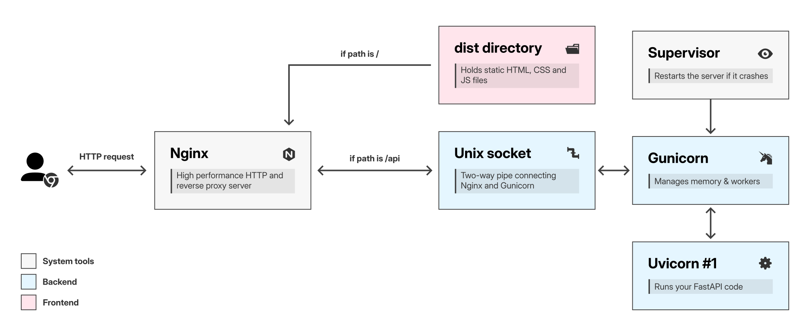
_Nginx acts as a reverse proxy, routing frontend requests to the Vue.js dist folder and backend API requests via a Unix socket to Gunicorn._

In this section, you will install Nginx, connect your frontend and backend, and apply security headers to protect your users from common web vulnerabilities.

### Update the application URLs

Before you configure Nginx, you need to prepare your code. You want your frontend and backend to act as if they live on the exact same server, both in local development and in production. This avoids complex [cross-origin](https://developer.mozilla.org/en-US/docs/Web/HTTP/Guides/CORS) issues.

#### Update the frontend base URL

Open your `main.js` file or wherever you configure [Axios](https://axios-http.com/) in your Vue project. Set the `baseURL` to a relative path.

```javascript
// In main.js
import axios from 'axios';

axios.defaults.baseURL = "/";
```

By doing this, the browser will automatically send requests to the current host. If you are developing locally, the request goes to your local server. If your user is on your production website, the request goes to your production domain.

#### Configure Vite proxy for local development

Because you set the base URL to `/`, your local Vue development server will try to handle API requests itself. You need to tell Vite to forward these requests to your local FastAPI server.

Update your `vite.config.js` to include a proxy rule.

```javascript
...

export default defineConfig({
  ...

  server: {
    port: 8080,
    proxy: {
      "/api": {
        target: "http://localhost:8000",
        changeOrigin: true,
      },
    },
  },
});
```

This setup perfectly mimics how Nginx will work in production.

> [!NOTE]
> The `...` in the code snippet means you should keep the existing configuration and just add the `server` block.

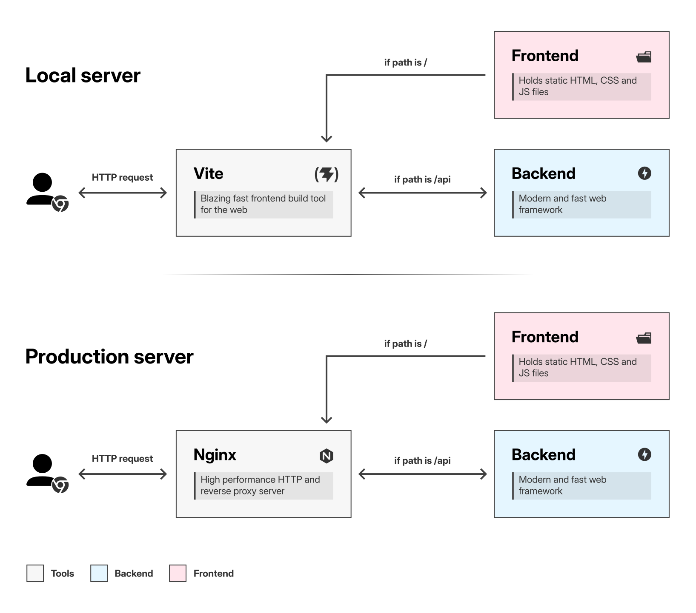
_In development, Vite's dev server proxies API requests to the local FastAPI server. In production, Nginx will handle the proxying._

#### Remove backend CORS

Because your frontend and backend now share the exact same origin in both development and production, the browser will no longer block your requests.

You can completely remove `CORSMiddleware` from your FastAPI `main.py` file.

```python
# Remove this entire block from main.py
app.add_middleware(
    CORSMiddleware,
    allow_origins=settings.CORS_ORIGINS,
    allow_credentials=True,
    allow_methods=["*"],
    allow_headers=["*"],
)
```

#### Rebuild the frontend

Because Vue.js is a static framework, these changes do not happen automatically. You must rebuild the project to bake the new URL into the [minified JavaScript](https://www.cloudflare.com/learning/performance/why-minify-javascript-code/) files.

Navigate to your frontend folder and run the build command.

```bash
cd /web_app/frontend
pnpm run build
```

If your server has low RAM, remember to use the memory flag you learned in the previous subchapter.

```bash
NODE_OPTIONS="--max-old-space-size=2048" pnpm run build
```

### Install and configure Nginx

Now that the application code is ready, install Nginx.

```bash
sudo apt install nginx -y
```

Nginx uses [configuration files](https://nginx.org/en/docs/beginners_guide.html#conf_structure) to know how to route traffic. Create a new configuration file for your website in the `sites-available` directory.

```bash
sudo nano /etc/nginx/sites-available/<your_project_name>
```

You are going to build this file block by block to understand exactly what each part does.

#### The upstream block

The first thing you need to define is where your backend lives. You do this using an `upstream` block. This block points Nginx to the Unix socket file you created with Gunicorn.

Paste this at the top of the file:

```nginx
upstream <your_project_name>_app_server {
    server unix:/web_app/backend/gunicorn.sock fail_timeout=0;
}
```

This acts as a variable. Later in the configuration, instead of typing the long path to the socket, you will tell Nginx to send traffic to `<your_project_name>_app_server`.

`fail_timeout=0` is an important setting. It tells Nginx to never mark the backend as "down" even if it fails to respond. Since Supervisor automatically restarts Gunicorn if it crashes, this setting allows Nginx to resume sending traffic the moment the service is back online, preventing unnecessary downtime.

#### The server block

Next, you define the main `server` block. This tells Nginx to listen for incoming web traffic on port 80 (standard HTTP) and to respond when someone asks for your specific domain.

```nginx
server {
    listen 80;
    server_name <your_droplet_ip>;

    access_log /var/log/nginx/<your_project_name>-access.log;
    error_log /var/log/nginx/<your_project_name>-error.log;
    
    # We will add the location blocks here next
}
```

Setting up dedicated `access_log` and `error_log` files is very important. If something breaks, these files will tell you exactly what went wrong.

> [!NOTE]
> After creating a domain name we will come back to this file and replace `<your_droplet_ip>` with your domain (e.g., `www.mywebsite.com`).

#### Serve the frontend

Inside the `server` block, you need to tell Nginx how to handle regular traffic. You want it to serve your built Vue.js files.

Add this `location /` block inside your `server` block:

```nginx
    location / {
        root /web_app/frontend/dist;
        try_files $uri $uri/ /index.html;
    }
```

Here is how this works:

- `root`: Tells Nginx where to look for files. In this case, it points to the `dist` folder of your Vue.js frontend, which contains the final HTML, CSS, and JS files after the build process.
- `try_files`: This is important for [Single Page Applications](https://developer.mozilla.org/en-US/docs/Glossary/SPA) (SPAs) like Vue.js. It tells Nginx: "Try to find the exact file the user asked for (`$uri`). If it is not there, try a directory (`$uri/`). If neither exists, do not show a 404 error. Instead, return `index.html`." This allows Vue Router to take over and show the correct page or your custom 404 component.

#### Proxy the backend

Now, you need a rule for your API. Add this `location /api` block right below the frontend block:

```nginx
    location /api {
        proxy_pass http://<your_project_name>_app_server;
        proxy_set_header X-Forwarded-For $proxy_add_x_forwarded_for;
        proxy_set_header Host $http_host;
        proxy_redirect off;
    }
```

This block catches any URL that starts with `/api`.

The `proxy_pass` directive hands the request over to your Gunicorn socket. The `proxy_set_header` lines are crucial. They take information about the real user (like their IP address) and pass it along. Without these headers, FastAPI would think every single request was coming from Nginx itself.

Finally, the `proxy_redirect off;` directive stops Nginx from interfering with backend redirects. Sometimes, your FastAPI code might tell the browser to redirect to another URL. If you leave Nginx to its default behavior, it might try to rewrite the `Location` header in that response, which can accidentally point your users to an internal server name instead of your public domain. Setting this to `off` tells Nginx to trust the redirect URLs exactly as FastAPI sends them.

> [!WARNING]
> Be very careful with trailing slashes in your Nginx configuration.
>
> First, use `location /api` instead of `location /api/`. If you leave the trailing slash on the location block, a request to exactly `/api` will trigger a 301 redirect. For API `POST` requests, this redirect can cause the browser to drop the JSON body, resulting in strange 405 or 422 errors in your backend.
>
> Second, never add a trailing slash to the end of your `proxy_pass` URL (for example, `proxy_pass http://<your_project_name>_app_server/;`). If you add that slash, Nginx will chop `/api` out of the URL before sending it to FastAPI. Because your FastAPI code explicitly expects the `/api` prefix, your backend will return 404 Not Found errors for every single request.

#### Test your configuration safely (Optional)

Before you restart your real server, you might want to test how Nginx routes different URLs. Testing this directly on your server can be frustrating if you make a mistake and crash your live site.

You can use a free tool called [Nginx playground](https://nginx-playground.wizardzines.com/) to simulate your routing rules safely in your browser.

To use it, you need to wrap your server block in `events` and `http` blocks. The playground has a built-in testing backend running on port 7777 that echoes back exactly what it receives. Here is a simplified test template you can paste into the playground:

```nginx
events {}

http {
    server {
        listen 80;

        location / {
            return 200 "FRONTEND: Serving Vue.js files\n";
        }

        location /api {
            proxy_pass http://127.0.0.1:7777;
        }
    }
}
```

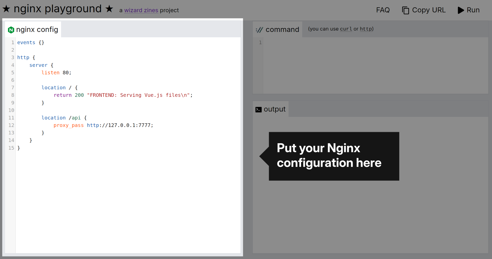
_Paste your Nginx configuration into the playground to test it safely._

In the command panel on the right side of the playground, you can simulate user requests using [curl](https://curl.se/).

> [!NOTE]
> Always use `http://localhost` in the playground's `curl` commands. The playground is completely disconnected from the internet for security. If you type your real domain name, the command will fail with a "Could not resolve host" error.

Try running these two commands to see how your configuration handles them:

```bash
curl http://localhost/api
curl http://localhost/api/search
```

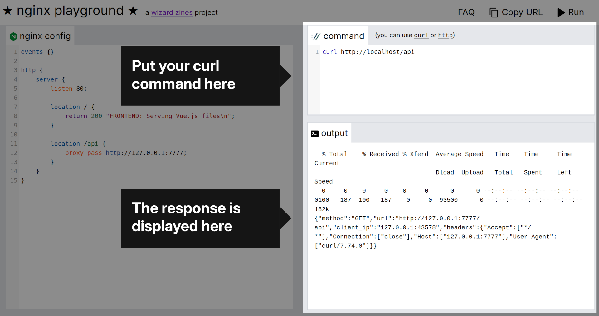
_Put the `curl` commands int the first box, click on the `Run` button, and observe the output in the second box._

This is a great way to verify your trailing slashes and proxy rules before applying them to your production server.

#### How Ubuntu organizes Nginx

You might notice that the final configuration below does not have the `events {}` or `http {}` blocks that you used in the testing playground.

This is because Ubuntu uses a modular system for Nginx. There is a master configuration file located at `/etc/nginx/nginx.conf`. That master file already contains the `events` and `http` blocks required to start the server. At the very bottom of its `http` block, it has a special line that says `include /etc/nginx/sites-enabled/*;`.

You can verify this by printing the contents of the master file:

```bash
cat /etc/nginx/nginx.conf
```

You will see a large file print to your terminal, but if you look closely, the core structure looks exactly like this:

```nginx
user www-data;
worker_processes auto;
# ...

events {
    worker_connections 768;
}

http {
    # ... lots of global settings ...

    include /etc/nginx/conf.d/*.conf;
    include /etc/nginx/sites-enabled/*;
}
```

There are three important things happening in this master file:

- `user www-data;`: This tells Nginx to run using the `www-data` user account.
- `events {}`: The mandatory events block is already defined globally, so you do not need to rewrite it for every website you host.
- `include /etc/nginx/sites-enabled/*;`: When Nginx starts up, it reads this master file, finds your custom project configuration inside the sites-enabled folder, and seamlessly pastes your code right here inside the http block.

This modular system keeps your project files clean and focused only on your specific routing rules.

#### The complete Nginx configuration

Here is what your complete configuration file should look like:

```nginx
upstream <your_project_name>_app_server {
    server unix:/web_app/backend/gunicorn.sock fail_timeout=0;
}

server {
    listen 80;
    server_name <your_droplet_ip>;

    access_log /var/log/nginx/<your_project_name>-access.log;
    error_log /var/log/nginx/<your_project_name>-error.log;

    location / {
        root /web_app/frontend/dist;
        try_files $uri $uri/ /index.html;
    }

    location /api {
        proxy_pass http://<your_project_name>_app_server;
        proxy_set_header X-Forwarded-For $proxy_add_x_forwarded_for;
        proxy_set_header Host $http_host;
        proxy_redirect off;
    }
}
```

Save the file and exit nano (`Ctrl+O`, `Enter`, `Ctrl+X`).

### Enable the site and update the firewall

Nginx uses a two-folder system. Configuration files are created in `sites-available`. To turn them on, you must create a [symbolic link](https://en.wikipedia.org/wiki/Symbolic_link) (a shortcut) to them in the `sites-enabled` folder.

First, delete the default placeholder page that comes with Nginx.

```bash
sudo rm /etc/nginx/sites-enabled/default
```

Now, enable your new configuration.

```bash
sudo ln -s /etc/nginx/sites-available/<your_project_name> /etc/nginx/sites-enabled/<your_project_name>
```

Always test your configuration before restarting the server. A single typo in an Nginx file will crash the entire web server.

```bash
sudo nginx -t
```

You should see an output confirming the syntax is ok and the test is successful. If you see an error, Nginx will tell you exactly which line has the problem. Go back and fix it.

If the test is successful, reload Nginx to apply the changes.

```bash
sudo systemctl reload nginx
```

#### Allow web traffic through the firewall

In the first chapter, you locked down the server using `UFW`, allowing only SSH. You must now open the gates for HTTP traffic.

Nginx registers application profiles with UFW when it is installed. You can allow all standard web traffic by using the "Nginx Full" profile, which opens both port 80 (HTTP) and port 443 (HTTPS).

```bash
sudo ufw allow 'Nginx Full'
```

Verify that the rules were added correctly.

```bash
sudo ufw status
```

You should see both OpenSSH and Nginx Full in the active list.

```text
Status: active

To                         Action      From
--                         ------      ----
Nginx Full                 ALLOW       Anywhere                  
OpenSSH                    ALLOW       Anywhere                  
22/tcp                     ALLOW       Anywhere                  
Nginx Full (v6)            ALLOW       Anywhere (v6)             
OpenSSH (v6)               ALLOW       Anywhere (v6)             
22/tcp (v6)                ALLOW       Anywhere (v6)
```

#### Test the deployment

Before adding complex security rules, you should verify that your basic configuration actually works.

Open a web browser on your local computer and enter your Droplet's IP address:

```text
http://<your_droplet_ip>
```

Your Vue.js frontend should load immediately. Now test a feature that makes an API call, like a search bar or a page that fetches data from the backend.

You will likely see the frontend render correctly but every API call return a [502 Bad Gateway](https://developer.mozilla.org/en-US/docs/Web/HTTP/Reference/Status/502) error. This is expected, and it is a great opportunity to understand exactly why it happens.

##### Why you see a 502 Bad Gateway

Check the Nginx error log you configured earlier:

```bash
sudo cat /var/log/nginx/<your_project_name>-error.log
```

You will find a line like this:

```text
connect() to unix:/web_app/backend/gunicorn.sock failed (13: Permission denied)
```

Here is what is happening: your Gunicorn process runs as your personal user, so the `gunicorn.sock` file it creates is owned by your user. Nginx runs as a completely separate system user called `www-data`. When Nginx tries to forward a request to the socket, Ubuntu's security model blocks it because `www-data` has no access to a file owned by someone else.

The frontend works because those are just static files in `/web_app/frontend/dist`, which Nginx can read directly. The API fails because it requires Nginx to write to your socket file.

##### Fix the socket permissions

The solution requires two steps: adding Nginx to your user group, and ensuring that group is allowed to open your folders.

First, add `www-data` (the Nginx user) to your personal user group. This gives Nginx group-level access without opening up your entire system.

```bash
sudo usermod -aG <your_username> www-data
```

Verify the change took effect by checking the members of your group:

```bash
getent group <your_username>
```

The output should show your group details with `www-data` listed at the very end:

```text
<your_username>:x:1000:www-data
```

Second, you must ensure that your group has "execute" permissions on your project folders. In Linux, execute permission (`x`) on a directory allows a user to pass through it.

If your parent folders do not have this permission for the group, Nginx will be blocked at the top level and will never reach the socket file inside, resulting in a 502 error.

Grant group execute permissions to your application folders to ensure Nginx can traverse them:

```bash
chmod g+x /web_app /web_app/backend
```

Now reload Nginx so it picks up the new group membership and permissions:

```bash
sudo systemctl reload nginx
```

Refresh your browser and test the API again. The 502 errors should be gone. Congratulations! Your Nginx reverse proxy is successfully serving the frontend and communicating with the FastAPI backend.

### Add security headers

Security does not stop at the firewall. Browsers have built-in security features, but they only activate if your server tells them to. You do this by adding [HTTP security headers](https://cheatsheetseries.owasp.org/cheatsheets/HTTP_Headers_Cheat_Sheet.html) to your Nginx configuration.

#### Test your baseline security score

Before we add any code, let's see how your server currently performs. There are free tools that scan your website and grade your security headers.

Go to [SecurityHeaders.com](https://securityheaders.com/) or the [Mozilla HTTP Observatory](https://developer.mozilla.org/en-US/observatory) and enter your server's IP address or domain name.

Because you have a fresh Nginx installation with no headers configured, you will receive a failing grade like a D or an F.

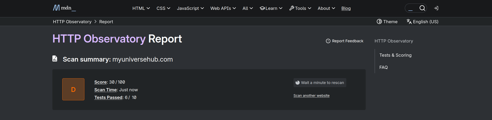
_Your server will receive a failing grade due to missing security headers._

Keep that tab open. Let's fix that score. Add the following blocks inside your `server` block.

#### HTTPS and transport

First, we want to ensure that browsers strictly use secure connections when talking to your server.

```nginx
    # HSTS (2 Years)
    add_header Strict-Transport-Security "max-age=63072000; includeSubDomains; preload" always;
```

**Strict-Transport-Security (HSTS)** forces the browser to always use HTTPS when talking to your site for the next two years (`max-age=63072000`).

> [!NOTE]
> This header is ignored by browsers over regular HTTP, so it will not do anything right now. It will automatically secure your site the moment you add [SSL](https://www.cloudflare.com/learning/ssl/what-is-ssl/).

#### Content and cross-origin protections

Next, you need to protect your website from malicious scripts and framing attacks.

```nginx
    # CORP (Allow sharing)
    add_header Cross-Origin-Resource-Policy "cross-origin" always;

    # Anti-Clickjacking
    add_header X-Frame-Options "SAMEORIGIN" always;

    # Stop MIME sniffing
    add_header X-Content-Type-Options "nosniff" always;
```

Here is what these three headers do:

**Cross-Origin-Resource-Policy (CORP)** controls whether other websites can load resources like images from your server. Setting it to `cross-origin` allows your public assets to be shared securely across the web.

> [!NOTE]
> If you don't want your images or other resources to be used on other sites, you can set this to `same-origin` instead.

**X-Frame-Options** prevents [clickjacking](https://en.wikipedia.org/wiki/Clickjacking). It stops attackers from putting your website inside an invisible `<iframe>` on their malicious site to trick users into clicking buttons they did not intend to click. By setting it to `SAMEORIGIN`, only your own domain can frame your content.

**X-Content-Type-Options** forces the browser to strictly trust the file type declared by the server. This prevents a common attack where a hacker uploads a malicious file (like a script) but disguises it as an image. With this header, the browser will refuse to execute it as code.

#### Privacy and hardware features

Finally, you need to protect your users' privacy and lock down access to their physical hardware.

```nginx
    # Privacy
    add_header Referrer-Policy "strict-origin-when-cross-origin" always;

    # Disable unused features
    add_header Permissions-Policy "camera=(), microphone=(), geolocation=(), payment=()" always;
```

These two headers give you strict control over data and devices:

**Referrer-Policy** acts as a privacy shield. When a user clicks a link on your site that goes to an external website, their browser sends a "Referer" header to the new site. The `strict-origin-when-cross-origin` setting protects user privacy by only sending your root domain name, not the full URL path, to external sites.

**Permissions-Policy** acts as a hardware lock. By setting camera, microphone, geolocation, and payment to `()`, you explicitly disable these features. If a hacker somehow manages to run malicious code on your site, they still cannot access your users' webcams or microphones.

#### Craft a content security policy (CSP)

The **Content-Security-Policy (CSP)** is your absolute strongest defense against [Cross-Site Scripting (XSS)](https://en.wikipedia.org/wiki/Cross-site_scripting).

It acts as a strict whitelist. By default, a browser will download and execute any script a web page asks for. A CSP tells the browser exactly which domains are allowed to load scripts, styles, images, or frames. If a resource is not on the list, the browser blocks it.

You do not just write a CSP from scratch. It is an iterative process. Here is how you do it:

1. You block everything by setting `default-src 'none';`.
2. You open your website in your browser. It will look terrible because all CSS, JS, and images will be blocked.
3. You open the developer tools console in your browser. You will see a sea of red errors telling you exactly what was blocked and where it came from.
4. You add exceptions one by one based on the errors until your website functions normally.

Let's apply this process to your website. Open [Google Chrome](https://www.google.com/chrome/) and open the developer tools console (`Ctrl+Shift+I` or `Cmd+Option+I` on Mac). Go to the "Network" tab.

> [!NOTE]
> This guide uses Google Chrome because you can update the CSP in real-time without having to change your Nginx configuration and refresh the page repeatedly.

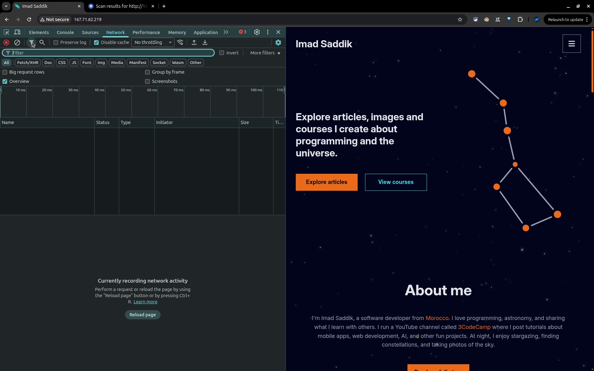
_On the left, you can see the Network tab. On the right, you can see the website._

The network tab is empty, refresh the page to see all the resources your website is trying to load.

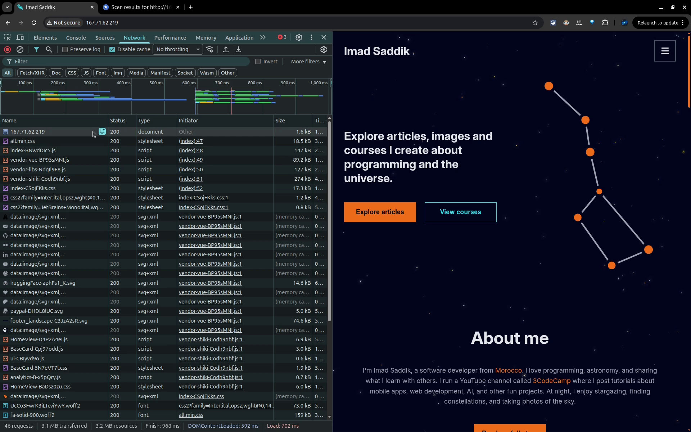
_The network tab is now populated with all the resources your website is trying to load._

Now, right click on the first resource in the list and select "Show all overrides".

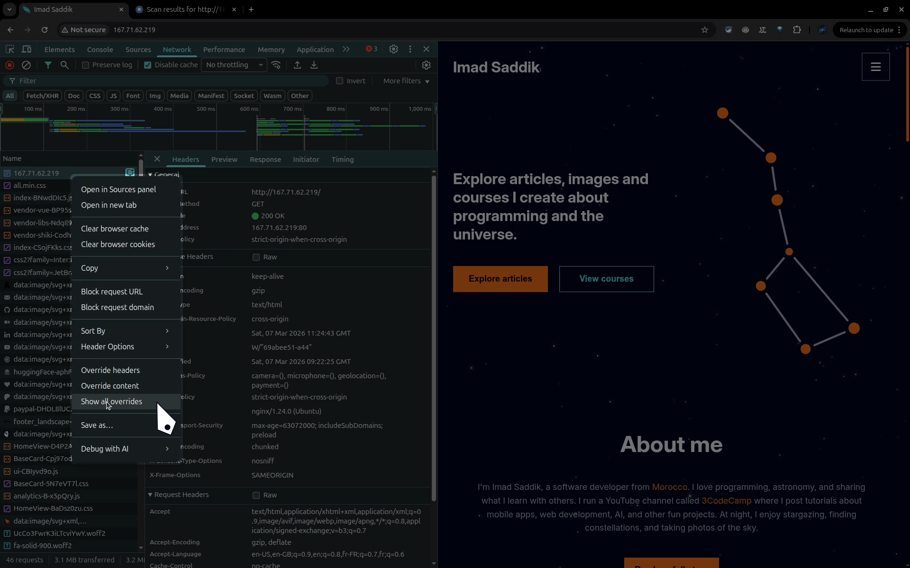
_Select "Show all overrides" in the menu._

This will open the "Overrides" tab, which allows you to edit the response headers in real-time. Click on "Select folder for overrides", create a new folder on your desktop, and select it.

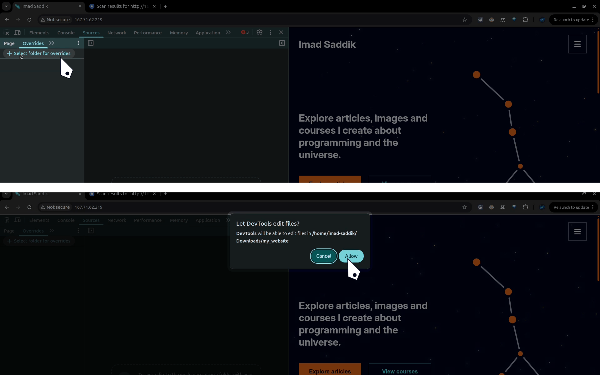
_Create a new folder on your desktop and select it for overrides._

Now, go back to the Network tab. Right click on the first resource again and click on "Override headers". After you do that, Google Chrome will create a file called `.headers` in the folder you selected.

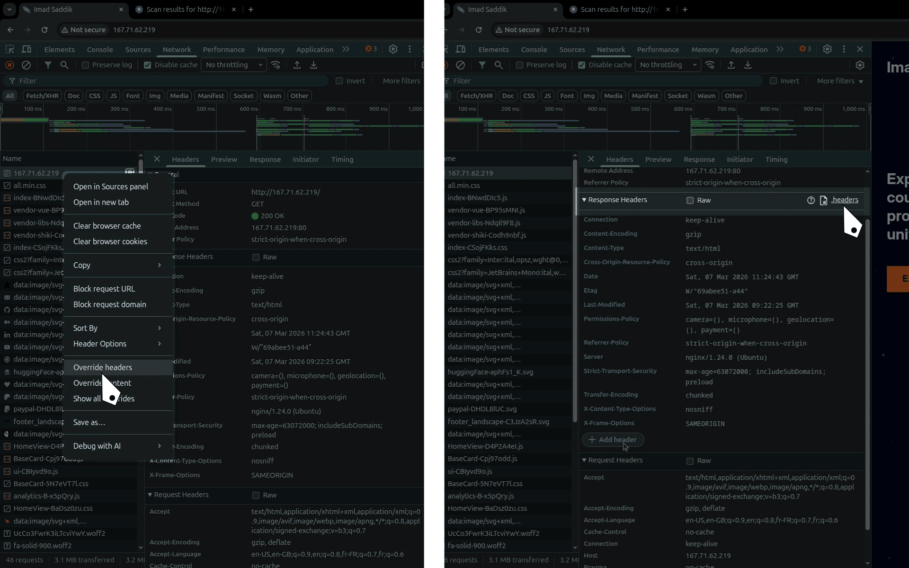
_Select "Override headers" in the menu and verify that a .headers file is created in your overrides folder._

Before opening the `.headers` file, click on "Add header" and type `Content-Security-Policy` as the header name and `default-src 'none';` as the value. This is your starting point: a policy that blocks everything.

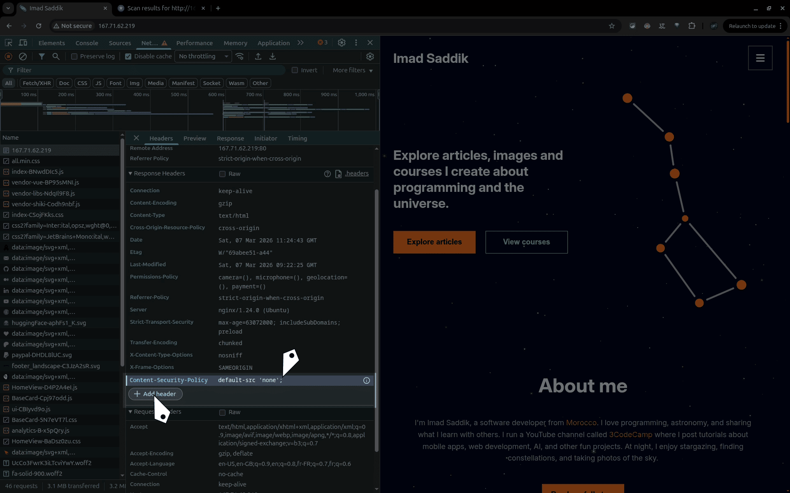
_Add a Content-Security-Policy header with the value `default-src 'none';`._

Now, click on the `.headers` file and change `Apply to` from whatever resource it is on to `*`. This tells Chrome to apply this CSP to every single resource on the page.

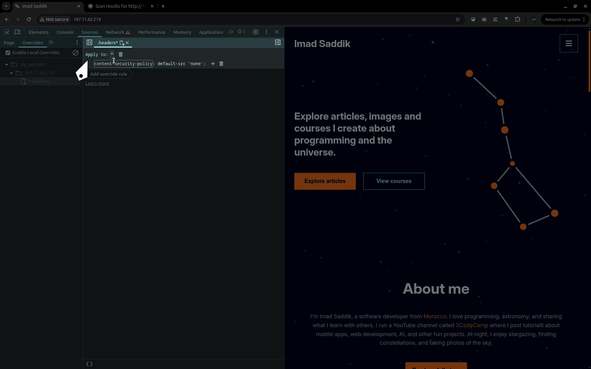
_Change the "Apply to" setting to `*` to apply the CSP to all resources on the page._

Refresh the page. It will look completely broken because all resources are blocked.

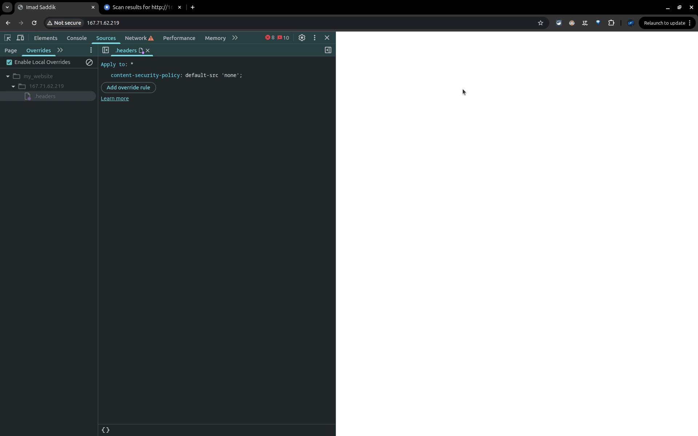
_The website looks completely broken because all resources are blocked by the strict CSP._

Open the console tab. You will see a sea of red errors. Each error tells you exactly what resource was blocked and where it came from.

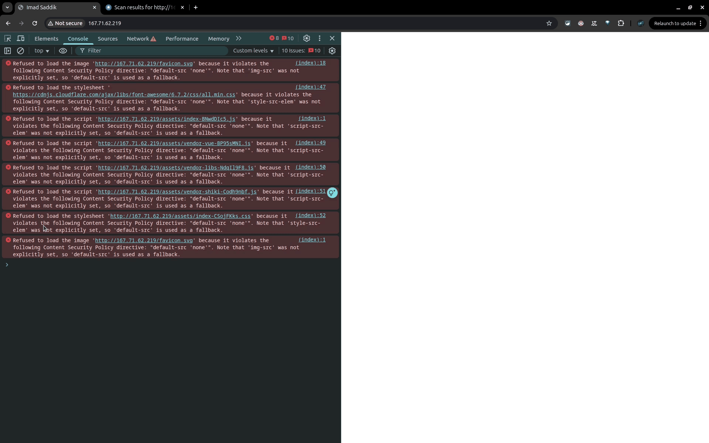
_The console is filled with CSP violation errors, each showing what was blocked and where it came from._

Let's start relaxing the policy by allowing everything from your own domain. This is done by adding `self` to the CSP.

```json
[
    {
        "applyTo": "*",
        "headers": [
            {
                "name": "Content-Security-Policy",
                "value": "default-src 'self';"
            }
        ]
    }
]
```

Now, refresh the page. You will see that some resources are now loading, but many are still blocked.

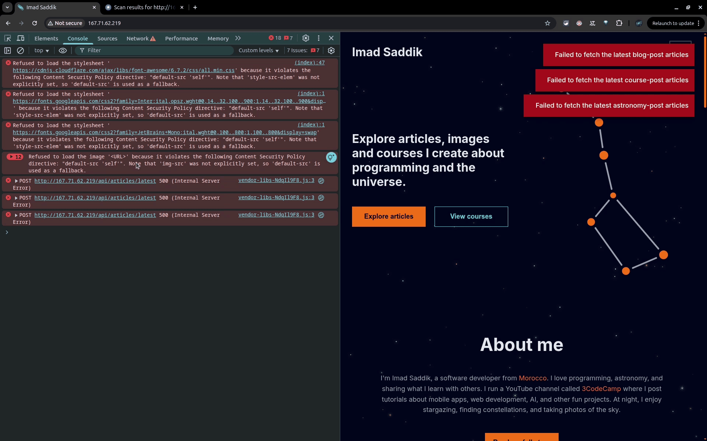
_The website is partially loading after allowing 'self' in the CSP, but many resources are still blocked._

You can also use `self` with font sources, image sources, and so on. Let's do that because that is an easy way to resolve many errors at once.

```json
[
    {
        "applyTo": "*",
        "headers": [
            {
                "name": "Content-Security-Policy",
                "value": "default-src 'self'; font-src 'self'; img-src 'self'; script-src 'self'; style-src 'self'; connect-src 'self'; frame-src 'self';"
            }
        ]
    }
]
```

> [!NOTE]
> To learn more about the different types of sources (like `font-src`, `img-src`, `script-src`, etc.) and what they do, check out the [MDN documentation on CSP](https://developer.mozilla.org/en-US/docs/Web/HTTP/CSP).

If you still see errors, this means you are using resources from third-party domains, like a CDN or an analytics provider. You need to add those domains to your CSP one by one until all errors are resolved and your website functions normally.

From the previous image we can see that the browser was trying to load stylesheets from these domains:

- `cdnjs.cloudflare.com`
- `fonts.googleapis.com`

To allow your external fonts and icons to load, you need to add their domains to your `style-src` directive.

```json
[
    {
        "applyTo": "*",
        "headers": [
            {
                "name": "Content-Security-Policy",
                "value": "default-src 'self'; font-src 'self'; img-src 'self'; script-src 'self'; style-src 'self' https://cdnjs.cloudflare.com https://fonts.googleapis.com; connect-src 'self'; frame-src 'self';"
            }
        ]
    }
]
```

> [!NOTE]
> When you allow stylesheets from `fonts.googleapis.com` and `cdnjs.cloudflare.com`, those stylesheets will try to download the actual font files from `fonts.gstatic.com` and `cdnjs.cloudflare.com`.
>
> You will see a new error for `font-src` after you apply this fix. You can get ahead of this by adding `https://fonts.gstatic.com` and `https://cdnjs.cloudflare.com` to your font-src directive right now.
>
> ```json
> [
>     {
>         "applyTo": "*",
>         "headers": [
>             {
>                 "name": "Content-Security-Policy",
>                 "value": "default-src 'self'; font-src 'self' https://fonts.gstatic.com https://cdnjs.cloudflare.com; img-src 'self'; script-src 'self'; style-src 'self' https://cdnjs.cloudflare.com https://fonts.googleapis.com; connect-src 'self'; frame-src 'self';"
>             }
>         ]
>     }
> ]
> ```

Reload the page again. The errors for stylesheets and fonts should be gone, and your icons and fonts should be loading correctly. We have one final error to fix: inline styles and `SVG` images.

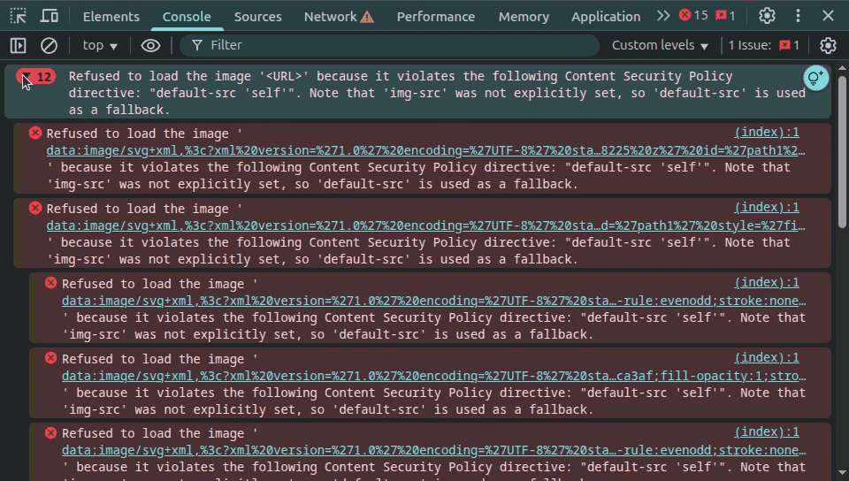
_The remaining CSP errors are for inline styles and SVG images._

To load `SVG` images, you need to add `data:` to your `img-src` directive. This allows images that are encoded directly in the HTML as base64 strings.

For inline styles, you need to add `'unsafe-inline'` to your `style-src` directive. This is not ideal but if your inline styles are not coming from user input, it is an acceptable risk.

> [!WARNING]
> You should avoid using `'unsafe-inline'` if your website has any form fields that allow users to submit data. If you allow inline styles and a hacker manages to inject malicious code into your database, that code could be executed in the browsers of every user that visits the infected page.
>
> Read more about this in the [Inline JavaScript](https://developer.mozilla.org/en-US/docs/Web/HTTP/Guides/CSP#inline_javascript) section on MDN.

Here is your final CSP:

```json
[
    {
        "applyTo": "*",
        "headers": [
            {
                "name": "Content-Security-Policy",
                "value": "default-src 'self'; font-src 'self' https://fonts.gstatic.com https://cdnjs.cloudflare.com; img-src 'self' data:; script-src 'self'; style-src 'self' 'unsafe-inline' https://cdnjs.cloudflare.com https://fonts.googleapis.com; connect-src 'self'; frame-src 'self';"
            }
        ]
    }
]
```

Now back to the VM, you need to add this header to your Nginx configuration. Open your Nginx config file again.

```bash
sudo nano /etc/nginx/sites-available/<your_project_name>
```

Add the `add_header Content-Security-Policy` line with the value of your final CSP inside the `server` block.

```nginx
add_header Content-Security-Policy "default-src 'self'; font-src 'self' https://fonts.gstatic.com https://cdnjs.cloudflare.com; img-src 'self' data:; script-src 'self'; style-src 'self' 'unsafe-inline' https://cdnjs.cloudflare.com https://fonts.googleapis.com; connect-src 'self'; frame-src 'self'; upgrade-insecure-requests;" always;
```

I have added `upgrade-insecure-requests` to the end of the CSP. This tells browsers to automatically upgrade any HTTP requests to HTTPS.

Save the file and exit nano (`Ctrl+O`, `Enter`, `Ctrl+X`).

Test the Nginx configuration and reload the server.

```bash
sudo nginx -t
sudo systemctl reload nginx
```

Now, if you refresh your website at `http://<your_droplet_ip>`, you should see zero errors in the console related to the CSP.

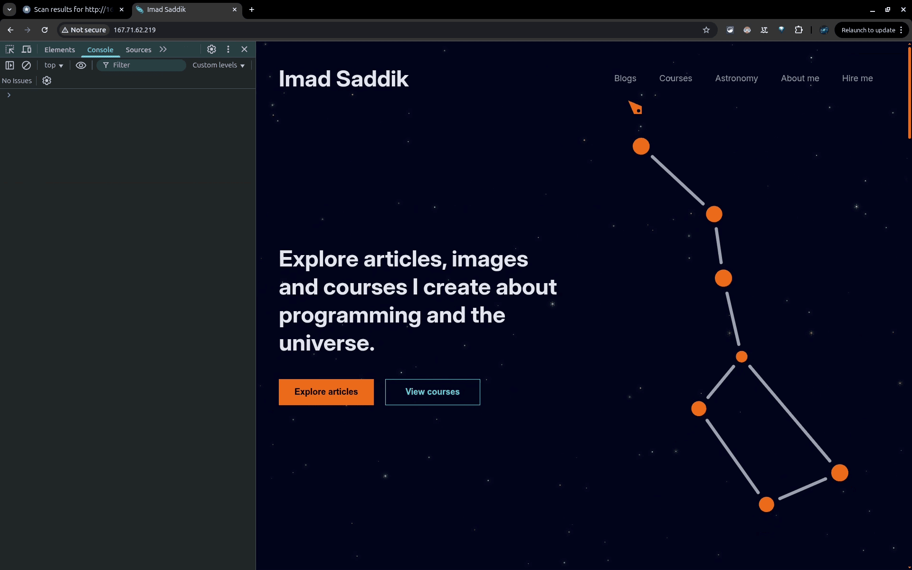
_The console is now clean with no CSP errors._

Visit [SecurityHeaders.com](https://securityheaders.com/) and enter your IP address again. Your grade should now be an A, the highest possible score.

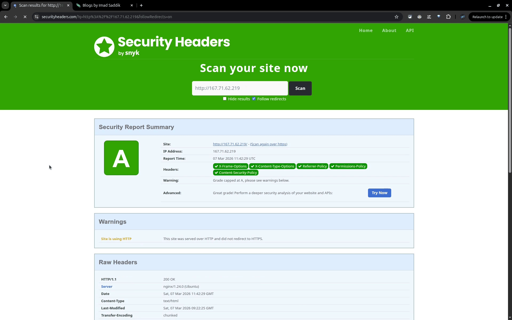
_Your server now receives an A grade after adding security headers._

#### The complete configuration

Your full Nginx configuration file should now look like this:

```nginx
upstream <your_project_name>_app_server {
    server unix:/web_app/backend/gunicorn.sock fail_timeout=0;
}

server {
    listen 80;
    server_name <your_droplet_ip>;

    access_log /var/log/nginx/<your_project_name>-access.log;
    error_log /var/log/nginx/<your_project_name>-error.log;

    # Security headers
    add_header Strict-Transport-Security "max-age=63072000; includeSubDomains; preload" always;
    add_header Cross-Origin-Resource-Policy "cross-origin" always;
    add_header X-Frame-Options "SAMEORIGIN" always;
    add_header X-Content-Type-Options "nosniff" always;
    add_header Referrer-Policy "strict-origin-when-cross-origin" always;
    add_header Permissions-Policy "camera=(), microphone=(), geolocation=(), payment=()" always;
    add_header Content-Security-Policy "default-src 'self'; font-src 'self' https://fonts.gstatic.com https://cdnjs.cloudflare.com; img-src 'self' data:; script-src 'self'; style-src 'self' 'unsafe-inline' https://cdnjs.cloudflare.com https://fonts.googleapis.com; connect-src 'self'; frame-src 'self'; upgrade-insecure-requests;" always;

    location / {
        root /web_app/frontend/dist;
        try_files $uri $uri/ /index.html;
    }

    location /api {
        proxy_pass http://<your_project_name>_app_server;
        proxy_set_header X-Forwarded-For $proxy_add_x_forwarded_for;
        proxy_set_header Host $http_host;
        proxy_redirect off;
    }
}
```

Save the file and exit nano (`Ctrl+O`, `Enter`, `Ctrl+X`).
