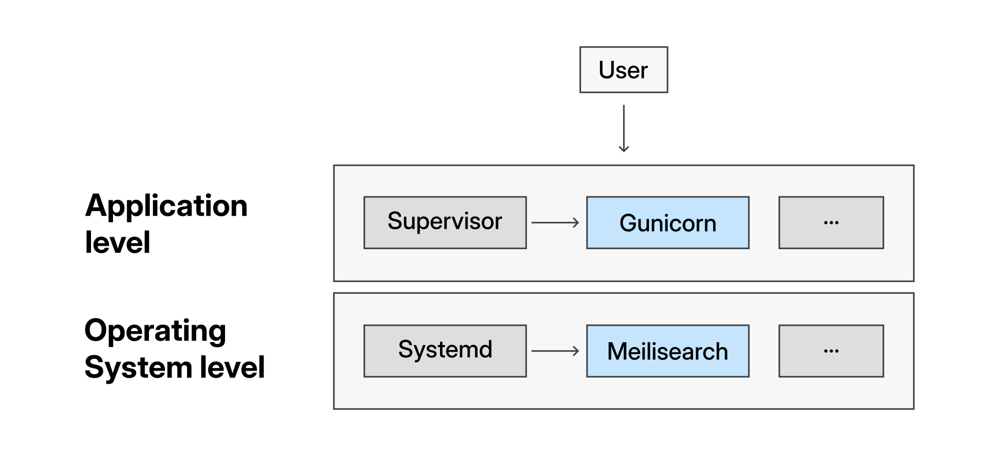
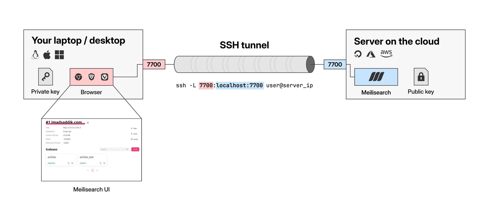
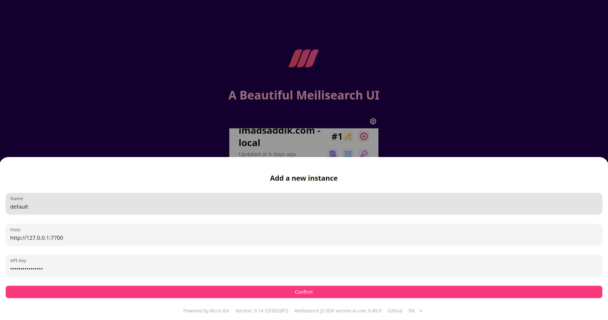
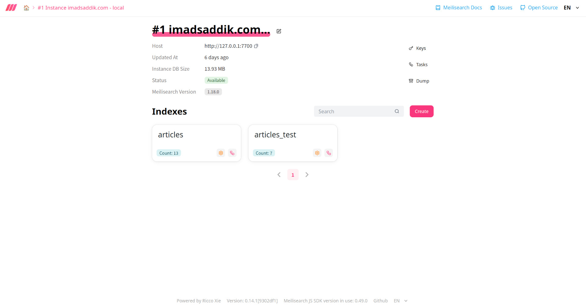

# Module 3: Data and search

## Self-hosting Meilisearch

### Introduction

With your frontend and backend securely communicating through Nginx, your core application is online. For many basic websites, this setup is enough.

However, modern applications often require fast, typo-tolerant search features. A standard SQL database struggles with this. It is too slow for full-text search and does not handle spelling mistakes well. To solve this, you need a dedicated search engine.

If you are deploying your own project and do not need search, you can technically skip this chapter. But I highly recommend following along. You will learn an important server skill: how to securely deploy an internal database or background service that is completely hidden from the internet.

If you are using my reference repository to practice, we need this engine to make the website fully functional. For this guide, we use [Meilisearch](https://www.meilisearch.com/). It is an open-source, lightning-fast search engine built in Rust.

Hosting your own search engine on the same server as your backend has massive advantages:

- **Zero network latency:** Your API communicates with the search engine over `localhost`, meaning queries resolve in milliseconds.
- **Cost-effective:** You do not have to pay for an expensive managed search SaaS.
- **Maximum security:** Because Meilisearch runs behind your UFW firewall, it is completely invisible to the public internet.

In this chapter, you will export your local search data, install the Meilisearch binary on your server, isolate it using a highly secure "system user," and import your data dumps.

> [!IMPORTANT]
> Throughout this chapter, you will see placeholders inside angle brackets like `<YOUR_LOCAL_MASTER_KEY>`, `<YOUR_STRONG_MASTER_KEY>`, etc. You must replace these with your actual keys and remove the brackets when running the commands.

### Export your local data

You have two options for getting data into your production search engine.

**Option 1: Export existing data.** If you built your application on your computer, I assume you have a local Meilisearch instance running with your test data. You need to export this data so you can migrate it to the new server.

**Option 2: Seed from scratch.** If you are using my reference repository and do not have a local database running, you can skip this entire section! I have included a Python script ([backend/scripts/seed_meilisearch.py](https://github.com/ImadSaddik/ImadSaddikWebsite/blob/master/backend/scripts/seed_meilisearch.py)) in the codebase that will automatically configure the settings and inject sample documents into your production server later.

> [!TIP]
> If you chose **Option 2**, jump straight to the next section: **Install Meilisearch on the server**.

If you chose **Option 1**, continue reading. Meilisearch offers two ways to back up data: [Snapshots](https://www.meilisearch.com/docs/learn/data_backup/snapshots_vs_dumps#snapshots) and [Dumps](https://www.meilisearch.com/docs/learn/data_backup/snapshots_vs_dumps#dumps).

- Snapshots are exact copies of the database files, meant for quick backups on the exact same Meilisearch version.
- Dumps are essentially a set of instructions used to recreate the database from scratch. Dumps are the safest way to migrate data across different machines or versions.

Because your local computer and your production server might not have the exact same setup, you must use a dump.

Run this command on your **local machine** (while your local Meilisearch instance is running):

```bash
curl -X POST 'http://localhost:7700/dumps' \
  -H 'Authorization: Bearer <YOUR_LOCAL_MASTER_KEY>'
```

You will get a JSON response back that looks like this:

```json
{
  "taskUid": 1,
  "indexUid": null,
  "status": "enqueued",
  "type": "dumpCreation",
  "enqueuedAt": "2026-03-18T10:00:00.000000Z"
}
```

Take note of the `taskUid` number. Creating a dump is an asynchronous operation, which means Meilisearch does it in the background. You can check the status to see when it finishes by using that ID:

```bash
curl -X GET 'http://localhost:7700/tasks/<YOUR_TASK_UID>' \
  -H 'Authorization: Bearer <YOUR_LOCAL_MASTER_KEY>'
```

Once the status in the response says `succeeded`, your dump file (which looks something like `20260318-100000.dump`) will appear in your local `dumps/` directory.

If you prefer using Python instead of the terminal, you can use the official SDK to do all of this automatically.

First, install the SDK:

> [!IMPORTANT]
> Make sure your local Python virtual environment is active before running the install command. The exact command depends on your local setup (e.g., `source venv/bin/activate`, `conda activate`, or `uv venv`).

```bash
pip install meilisearch
```

Then, run this Python code to create the dump and wait for it to finish:

```python
import meilisearch

meilisearch_client = meilisearch.Client("http://localhost:7700", "<YOUR_LOCAL_MASTER_KEY>")
task = meilisearch_client.create_dump()

meilisearch_client.wait_for_task(task.task_uid)
print("Dump created successfully!")
```

### Install Meilisearch on the server

Now, it is time to set up the engine on your production VM.

SSH into your server using your shortcut:

```bash
ssh my-website
```

Download the latest stable Meilisearch binary using their official installation script.

```bash
curl -L https://install.meilisearch.com | sh
```

This script downloads a single, compiled file named `meilisearch` into your current directory. It is completely self-contained, meaning you don't need to install Rust or any other dependencies.

Make the binary executable and move it to the global `/usr/local/bin/` directory. This ensures the command can be run from anywhere on the system, which is required when we turn it into a background service later.

```bash
chmod +x ./meilisearch
sudo mv ./meilisearch /usr/local/bin/
```

Verify the installation was successful by checking the version:

```bash
meilisearch --version
```

If it prints the version number, you are ready to proceed.

### Create a dedicated system user

In [Chapter 1](./01_foundation.md), you learned that running applications as `root` is a massive security risk. You created a standard user for yourself. Now, you are going to take security one step further by creating a [system user](https://wiki.archlinux.org/title/Users_and_groups#Example_adding_a_system_user) specifically for Meilisearch.

System users are "dummy" accounts. They exist purely to own files and run specific background processes. They have no password and cannot accept login attempts, making them immune to SSH brute-force attacks.

Run this command to create the user:

```bash
sudo useradd -d /var/lib/meilisearch -s /bin/false -m -r meilisearch
```

This command looks complex, so let's break down exactly what each flag does:

- `sudo useradd`: This is the command to add a user. It's different from `adduser` (which you used in Chapter 1), as it does not prompt you for a password or full name.
- `-d /var/lib/meilisearch`: This flag sets the user's **home directory**. Instead of the default `/home/meilisearch`, you set it to `/var/lib/meilisearch`, which is the standard Linux directory path for a background service's data.
- `-s /bin/false`: This flag sets the user's **shell**. `/bin/false` is a dummy shell that immediately exits and does nothing. This is what makes it **impossible for anyone to log in** as this user.
- `-m`: This flag tells `useradd` to physically **create the home directory** you specified with the `-d` flag.
- `-r`: This flag creates the **system user**.

Next, create a specific folder inside that home directory for the actual database files, and ensure the new system user owns everything inside its home directory.

```bash
sudo mkdir -p /var/lib/meilisearch/data
sudo chown -R meilisearch:meilisearch /var/lib/meilisearch
```

### Transfer and import the dump

> [!NOTE]
> If you chose **Option 2** (seeding from scratch), you do not have a dump file to transfer. You can skip this section and go straight to **Run Meilisearch as a service**.

You need to get the dump file from your computer over to the server.

First, log out of your active SSH session by typing `exit` or pressing `Ctrl+D`. Once you are back in your local terminal, use the `scp` command to upload the file.

You are going to send it to the `/tmp/` directory for now. We do this because `/tmp/` is openly writable by any user, whereas our final destination (`/var/lib/meilisearch`) is strictly locked down.

```bash
scp /path/to/your/local/dumps/<YOUR_DUMP_FILE.dump> my-website:/tmp/
```

**SSH back in** to the machine.

```bash
ssh my-website
```

Move the dump file from the temporary folder to the Meilisearch directory, and immediately transfer the file ownership to the `meilisearch` user. If you skip the `chown` command, the Meilisearch service will crash because it won't have permission to read the file uploaded by your user account.

```bash
sudo mv /tmp/<YOUR_DUMP_FILE.dump> /var/lib/meilisearch/
sudo chown meilisearch:meilisearch /var/lib/meilisearch/<YOUR_DUMP_FILE.dump>
```

### Run Meilisearch as a service

Just like with Gunicorn, you do not want to run Meilisearch manually in a terminal. You want it to run in the background, start automatically when the server boots, and restart if it crashes.

For your FastAPI backend, you used Supervisor. For Meilisearch, you will use [systemd](https://systemd.io/), which is the built-in service manager that comes with Ubuntu.

> [!NOTE]
> Why use systemd instead of Supervisor here? It is generally best practice to manage low-level infrastructure (like databases, Redis, or Meilisearch) with the OS's native tool (`systemd`).
>
> Meanwhile, application-level code (like your Python API) is managed by higher-level tools like Supervisor, which are easier to restart during [CI/CD](https://www.redhat.com/en/topics/devops/what-is-ci-cd) deployments.


_The server stack: systemd manages low-level infrastructure, while Supervisor manages high-level application code._

#### Create the environment file

You must secure your search engine with a strong Master Key. Instead of hardcoding this sensitive information directly into the service file, you will create a secure environment file. This keeps your secrets hidden from anyone viewing the server's process list via commands like `ps`.

First, create a directory for the configuration and create the environment file:

```bash
sudo mkdir -p /etc/meilisearch
sudo nano /etc/meilisearch/env
```

Paste the following configuration into the file. Meilisearch automatically detects environment variables that start with `MEILI_`.

```ini
MEILI_ENV=production
MEILI_MASTER_KEY=<YOUR_STRONG_MASTER_KEY>
```

> [!IMPORTANT]
> Replace `<YOUR_STRONG_MASTER_KEY>` with a long, randomized string (at least 16 bytes). Do not use spaces or quotes.

Secure the file so that only the `meilisearch` user and `root` can read it:

```bash
sudo chown meilisearch:meilisearch /etc/meilisearch/env
sudo chmod 600 /etc/meilisearch/env
```

#### Create the systemd service file

Now, create the service file that tells Ubuntu how to manage Meilisearch:

```bash
sudo nano /etc/systemd/system/meilisearch.service
```

Paste the configuration below, but pay close attention to the `ExecStart` command depending on your setup.

> [!IMPORTANT]
> **If you chose Option 1 (Export existing data):** Leave the code exactly as it is below, but replace `<YOUR_DUMP_FILE.dump>` with the actual filename you uploaded earlier.
>
> **If you chose Option 2 (Seed from scratch):** Delete the two lines starting with `--import-dump` and `--ignore-dump-if-db-exists` entirely. You are starting with a fresh database.

```ini
[Unit]
Description=Meilisearch search engine
After=network.target

[Service]
Type=simple
User=meilisearch
Group=meilisearch

# Load environment variables from the secure file
EnvironmentFile=/etc/meilisearch/env

WorkingDirectory=/var/lib/meilisearch

ExecStart=/usr/local/bin/meilisearch \
  --db-path "/var/lib/meilisearch/data" \
  --dump-dir "/var/lib/meilisearch/dumps" \
  --import-dump "/var/lib/meilisearch/<YOUR_DUMP_FILE.dump>" \
  --ignore-dump-if-db-exists

Restart=on-failure

[Install]
WantedBy=multi-user.target
```

Let's explain this configuration file:

- `After=network.target`: This tells Linux: "Do not attempt to start this service until the server's networking stack is fully active."
- `EnvironmentFile=...`: This securely loads the `MEILI_ENV` and `MEILI_MASTER_KEY` variables from the file you just created.
- `ExecStart=...`: This is the exact command that runs. It points to the binary, specifies where the database should be stored (`--db-path`), and tells Meilisearch where to save future dumps (`--dump-dir`).
- `--import-dump`: This tells Meilisearch to load your local data from the specified file on its first start.
- `--ignore-dump-if-db-exists`: This is a safety feature. It tells Meilisearch to skip the dump import entirely if a database already exists in the `data` folder.
- `Restart=on-failure`: If the process crashes or gets killed due to low memory, `systemd` will automatically spin it back up.

Save the file and exit (`Ctrl+O`, `Enter`, `Ctrl+X`).

#### Enable and start the service

Now, tell `systemd` to recognize your new file, enable it to start on boot, and start it immediately:

```bash
sudo systemctl daemon-reload
sudo systemctl enable meilisearch
sudo systemctl start meilisearch
```

Check the status to ensure it did not crash during the import or startup process:

```bash
sudo systemctl status meilisearch
```

You should see `active (running)` in the output.

```text
● meilisearch.service - Meilisearch
    Loaded: loaded (/etc/systemd/system/meilisearch.service; enabled; preset: enabled)
    Active: active (running) since Sat 2026-11-01 07:13:50 UTC; 21s ago
  Main PID: 44061 (meilisearch)
    Tasks: 46 (limit: 503)
    Memory: 164.8M (peak: 165.0M)
      CPU: 505ms
```

> [!NOTE]
> If you chose **Option 2**, skip the following verification step and the cleanup step. Your database is currently empty and will be seeded later.

If you imported a dump, you can explicitly verify that your data was imported by asking Meilisearch for index statistics. Use `127.0.0.1` because the engine is running locally on the server.

```bash
curl -X GET 'http://127.0.0.1:7700/indexes/<YOUR_INDEX_NAME>/stats' \
  -H 'Authorization: Bearer <YOUR_STRONG_MASTER_KEY>'
```

If the import worked, you will see a JSON response detailing your documents:

```json
{
  "numberOfDocuments": 10,
  "rawDocumentDbSize": 434176,
  "avgDocumentSize": 43409,
  "isIndexing": false,
  "numberOfEmbeddings": 0,
  "numberOfEmbeddedDocuments": 0,
  "fieldDistribution": {
    "...": "..."
  }
}
```

#### Clean up the service file

Once your service is running and the data is imported, you should clean up the service file.

Leaving the `--import-dump` flag in your configuration permanently is a hidden risk. If you (or an automated script) ever delete that `.dump` file to clean up your directory, Meilisearch will fatally crash on the next server reboot because it will hunt for a file that no longer exists.

Open the service file again:

```bash
sudo nano /etc/systemd/system/meilisearch.service
```

Remove these two lines from the `ExecStart` command:

```ini
--import-dump "/var/lib/meilisearch/<YOUR_DUMP_FILE.dump>" \
--ignore-dump-if-db-exists
```

Save the file, then reload systemd and restart the service to apply the clean configuration:

```bash
sudo systemctl daemon-reload
sudo systemctl restart meilisearch
```

### Connect the backend

Now that Meilisearch is running with a production Master Key, your Python backend needs to know what that key is so it can communicate.

Navigate to your backend directory and edit your `.env` file.

```bash
cd /web_app/backend
nano .env
```

Update or add the `MEILISEARCH_MASTER_KEY` variable to match the exact key you defined in `/etc/meilisearch/env`.

```ini
MEILISEARCH_MASTER_KEY=<YOUR_STRONG_MASTER_KEY>
```

Save and exit. Restart your backend service via Supervisor to force FastAPI to load the new environment variables.

```bash
sudo supervisorctl restart <your_project_name>
```

To prove everything is connected, you can perform a search on your live website (via your browser) while simultaneously watching the Meilisearch logs in real-time on your server:

```bash
sudo journalctl -u meilisearch.service -f
```

The `-f` flag "follows" the log output. As you type a query on your website, you should see logs stream by indicating successful HTTP search requests!

```text
Nov 01 07:34:15 <YOUR_HOSTNAME> meilisearch[44061]: [2026-11-01T07:34:15Z INFO  actix_web::middleware::logger] 127.0.0.1 "POST /indexes/<YOUR_INDEX_NAME>/search HTTP/1.1" 200 451 "-" "python-requests/2.31.0" 0.002345
```

Press `Ctrl+C` to stop watching the logs when you are done.

### What is next?

You now have a blazing-fast search engine running in production, isolated from the outside world, and connected to your Python backend.

In the next chapter, **Secure management**, you will learn how to maintain this database. You will set up automated daily backups to protect your data and use SSH tunneling to safely access a visual dashboard without opening any firewall ports.

## Secure management

### Schedule automatic backups

You have cleaned up the temporary import flags, but your data is currently living on the edge. If your server crashes or your database gets corrupted, you could lose everything.

To prevent this, you should tell Meilisearch to automatically create [Snapshots](https://www.meilisearch.com/docs/learn/data_backup/snapshots) in the background. Snapshots are exact copies of your database that act as a safety net.

Open your service file one more time:

```bash
sudo nano /etc/systemd/system/meilisearch.service
```

Add two new flags to your `ExecStart` command: `--schedule-snapshot` and `--snapshot-dir`. Your final `ExecStart` block should look like this:

```ini
ExecStart=/usr/local/bin/meilisearch \
  --db-path "/var/lib/meilisearch/data" \
  --dump-dir "/var/lib/meilisearch/dumps" \
  --schedule-snapshot 86400 \
  --snapshot-dir "/var/lib/meilisearch/snapshots"
```

Here is what these new lines do:

- `--schedule-snapshot 86400`: This tells Meilisearch to take a snapshot every 86,400 seconds (which is exactly 24 hours). If your data changes very frequently, you can lower this to `3600` to take a backup every hour.
- `--snapshot-dir ...`: This tells Meilisearch exactly where to save the backup files so they stay safely contained in the system user's directory.

Save the file and exit (`Ctrl+O`, `Enter`, `Ctrl+X`).

Create the new snapshots directory and give ownership to the `meilisearch` user so the service has permission to write the files there:

```bash
sudo mkdir -p /var/lib/meilisearch/snapshots
sudo chown -R meilisearch:meilisearch /var/lib/meilisearch/snapshots
```

Finally, reload systemd and restart the service to apply your new backup policy:

```bash
sudo systemctl daemon-reload
sudo systemctl restart meilisearch
```

Now, Meilisearch will quietly save a safe copy of your database every single day. Only the most recent snapshot is kept, so it will not fill up your hard drive over time.

### Manage Meilisearch securely with a GUI

Because you properly configured your UFW firewall in Chapter 1, port `7700` is blocked. No one on the internet can access your Meilisearch instance directly.

This is fantastic for security, but terrible for usability if you need to manually inspect a document or tweak ranking rules. Opening the port to the public just to use an admin dashboard is a bad idea.

Instead, you will use **SSH Tunneling** again, exactly like you did when previewing the frontend build. This creates a secure, temporary bridge between your local laptop and the locked-down server port.


_Using an SSH tunnel to securely connect to the Meilisearch server running on the production VM._

Run this command on your **local computer** (not inside the server). Keep the terminal window open.

```bash
ssh -L 7700:127.0.0.1:7700 my-website
```

> [!NOTE]
> If you skipped setting up an SSH config file in Chapter 1, you will need to use your full connection string instead of the alias:
>
> `ssh -L 7700:127.0.0.1:7700 -i ~/.ssh/<YOUR_KEY_NAME> <YOUR_USERNAME>@<YOUR_DROPLET_IP>`

This command tells SSH: "Listen to port 7700 on my laptop, and forward any traffic through the secure connection to port 7700 on the server."

Now, you can use a great open-source tool called [meilisearch-ui](https://github.com/eyeix/meilisearch-ui) to manage your indexes visually, without installing anything on your server.

Go to [https://meilisearch-ui.vercel.app/](https://meilisearch-ui.vercel.app/) in your browser. On that page, click the "Add Instance" button to connect to your production Meilisearch.


_Add a new instance in the meilisearch-ui app._

A modal will pop up asking for connection details. Fill it out like this:

- **Name**: Give it a descriptive name (e.g., `Production DB`).
- **Host**: Enter `http://127.0.0.1:7700`. (This hits your local tunnel, which forwards to the server).
- **API Key**: Enter your production master key.


_Add a new instance in the meilisearch-ui app by providing your local tunnel host and production key._

> [!NOTE]
> Are you wondering how a secure `https://` website can connect to an insecure `http://` host without your browser blocking it? Modern web browsers have a built-in security exception for `127.0.0.1` and `localhost`. This allows local development and tunneling to work perfectly without SSL errors.

After connecting, you can browse your production indexes, test searches, and modify settings securely.


_The meilisearch-ui dashboard connected to the production instance through the SSH tunnel._

When you are finished managing your data, simply close the terminal window where the SSH command is running or press `Ctrl+C`.

This immediately breaks the tunnel and cuts off access. Since the entire session happened inside an encrypted SSH pipe, your data remained 100% secure and was never exposed to the public internet.

### What is next?

Your server now has a fully functioning frontend, backend, and database. Everything is running smoothly as background services. However, users currently have to access your website using a raw IP address, and their connection is not encrypted.

In **Module 4: Global delivery and app security**, you will fix this. The next chapter, **Domains and SSL**, will guide you through connecting a custom domain, configuring [DNS records](https://www.cloudflare.com/learning/dns/dns-records/), and using [Certbot](https://certbot.eff.org/) to generate free, auto-renewing [SSL certificates](https://www.cloudflare.com/learning/ssl/what-is-an-ssl-certificate/) to secure your user's traffic.
