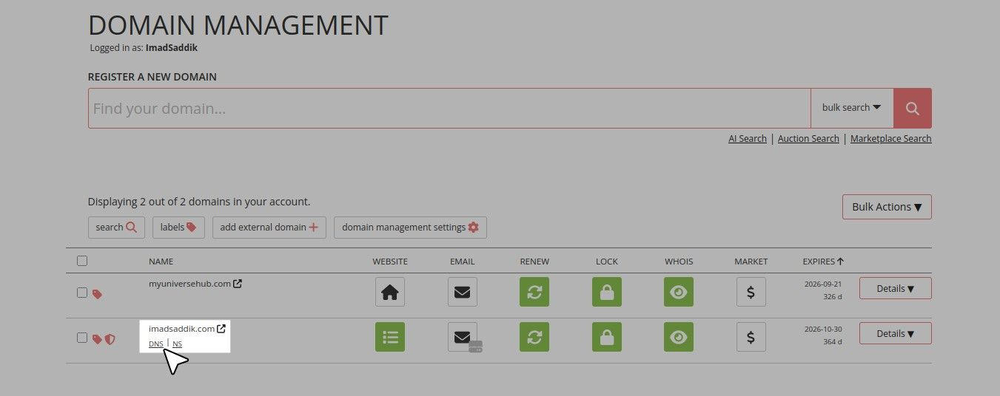
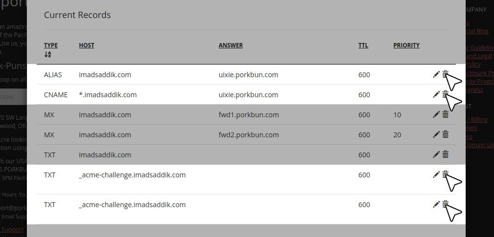

# Module 4: Global delivery & Security

## Domains and SSL

### Introduction

Up until now, your application has been accessible via a raw IP address. While this proves your server works, it is not user-friendly, and more importantly, it is not secure. Browsers will flag your website as "Not Secure" because traffic is sent in plain text using [HTTP](https://en.wikipedia.org/wiki/HTTP).

In this chapter, you will purchase a custom domain name, connect it to your DigitalOcean droplet using [DNS records](https://www.cloudflare.com/learning/dns/dns-records/), and secure all traffic with free, auto-renewing [SSL certificates](https://www.cloudflare.com/learning/ssl/what-is-an-ssl-certificate/) via [Let's Encrypt](https://letsencrypt.org/).

### Register a domain

To give your website a recognizable name, you need to register a domain. There are many domain registrars available, such as [Namecheap](https://www.namecheap.com/), or [GoDaddy](https://www.godaddy.com/fr). For this guide, I will use [Porkbun](https://porkbun.com/) as the example because of its transparent pricing, but the concepts apply everywhere.

Go to your registrar of choice and type your desired domain into the search bar.

Analyze the results. Pay close attention to the **renewal price**. Registrars often provide a steep discount for the first year, but the subsequent years might be surprisingly expensive. Always choose a domain with a sustainable renewal cost (around $10–$15 per year for a `.com`).

Once you find a domain that fits your budget, add it to your cart and proceed to checkout.

_Type your desired domain into the search bar to see if it's available. Add it to your cart if it is._

_Review the renewal price before purchasing. You only need the domain name itself, so skip any extra features that are not necessary._

> [!NOTE]
> During checkout, companies will try to upsell you on extra features like email hosting, website builders, or premium DNS. You do not need any of these. You only need the domain name itself.

You should see this success message after completing the purchase.

_You should see this success message after purchasing your domain._

Now, navigate to your registrar's **Domain Management** dashboard.

_Click on "Account" and then "Domain Management" to access the dashboard where you can manage your domains._

You should see your new domain listed there.

_Your newly purchased domain should be listed in the dashboard._

### Configure DNS

Now that you own a domain, you must tell the rest of the internet where to find your server when someone types that name into their browser. This is achieved using the [Domain Name System (DNS)](https://en.wikipedia.org/wiki/Domain_Name_System).

Think of DNS as the phonebook of the internet. It translates human-readable names (like `imadsaddik.com`) into machine-readable IP addresses (like `142.93.130.134`).

<!-- TODO: Don't forget to add the illustration -->
[ILLUSTRATION NEEDED HERE](A diagram showing a user typing a domain into a browser, the browser asking a DNS server "Where is this domain?", the DNS server replying with the droplet's IP address, and the browser making the connection to the Ubuntu server.)

Go to your domain provider’s dashboard and locate the **DNS records** section for your domain. If you are using **Porkbun**, locate your domain in the list. You need to hover over the domain row to reveal the options. Click on the **DNS** link to open the configuration panel.

_Hover over your domain and click on the "DNS" link to access the DNS records configuration._

Scroll down to the “Current Records” section. You will see some default records created by the registrar, such as `ALIAS`, `CNAME`, or `_acme-challenge` records. **Delete these default records** to ensure they do not conflict with your real server.

_Delete the default records to avoid conflicts with your real server._

You need to create two specific records to point your traffic to DigitalOcean:

#### The A record

An [A record](https://www.cloudflare.com/learning/dns/dns-records/dns-a-record/) (Address Record) maps a domain name directly to an [IPv4 address](https://en.wikipedia.org/wiki/IPv4).

Fill in the form with the following values:

- **Type:** `A`
- **Host/Name:** Leave this blank.
- **Answer/Value:** Paste the IP address of your DigitalOcean droplet.
- **TTL (Time To Live):** `600` (or leave as default).

_Create an A record that points your domain to the IP address of your DigitalOcean droplet._

Click **Add** to save the record.

#### The CNAME record

A [CNAME record](https://www.cloudflare.com/learning/dns/dns-records/dns-cname-record/) (Canonical Name Record) maps one domain name to another domain name. You use this to ensure that users who type `www` in front of your domain still reach your website.

Fill in the form with the following values:

- **Type:** `CNAME`
- **Host/Name:** `www`
- **Answer/Value:** `<your_domain>.com`

_Create a CNAME record that points the `www` subdomain to the root domain._

Click **Add** to save the record.

By the end, your DNS configuration should look like this:

_Your DNS configuration should have an A record pointing to your droplet's IP and a CNAME record pointing `www` to the root domain._

> [!NOTE]
> DNS changes can take anywhere from a few minutes to 48 hours to propagate globally. Usually, it takes less than 15 minutes. You can use a tool like [whatsmydns.net](https://www.whatsmydns.net/) to verify if the world can see your new A record.

Once the DNS has propagated, you should be able to type `http://<your_domain>.com` in your browser and see your Vue.js application load.
