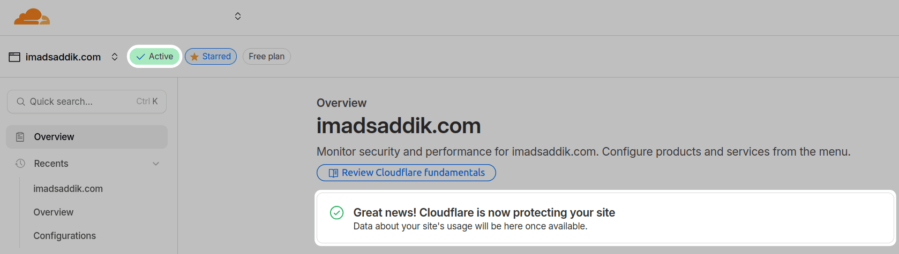
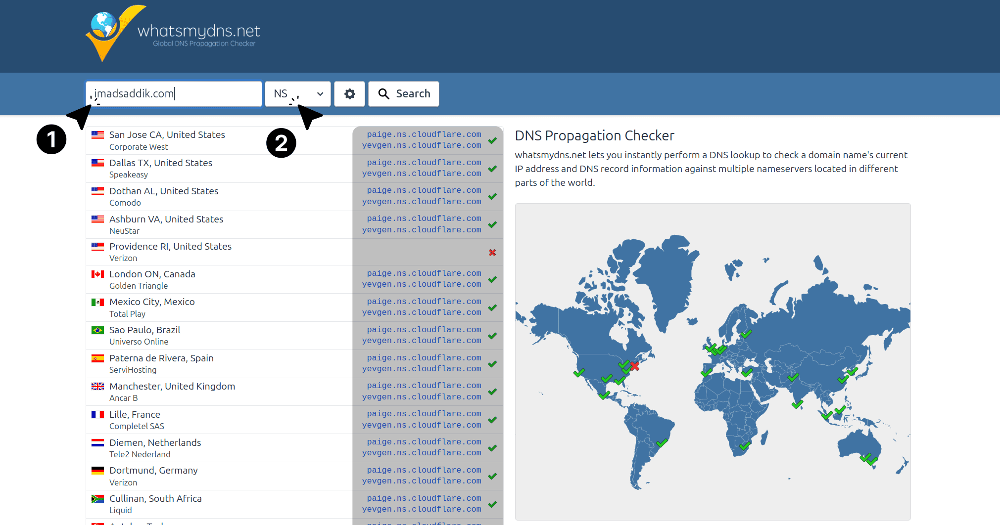
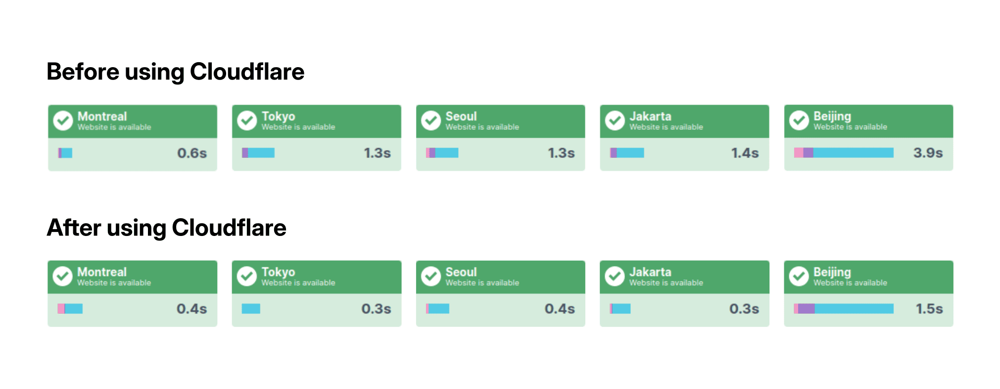
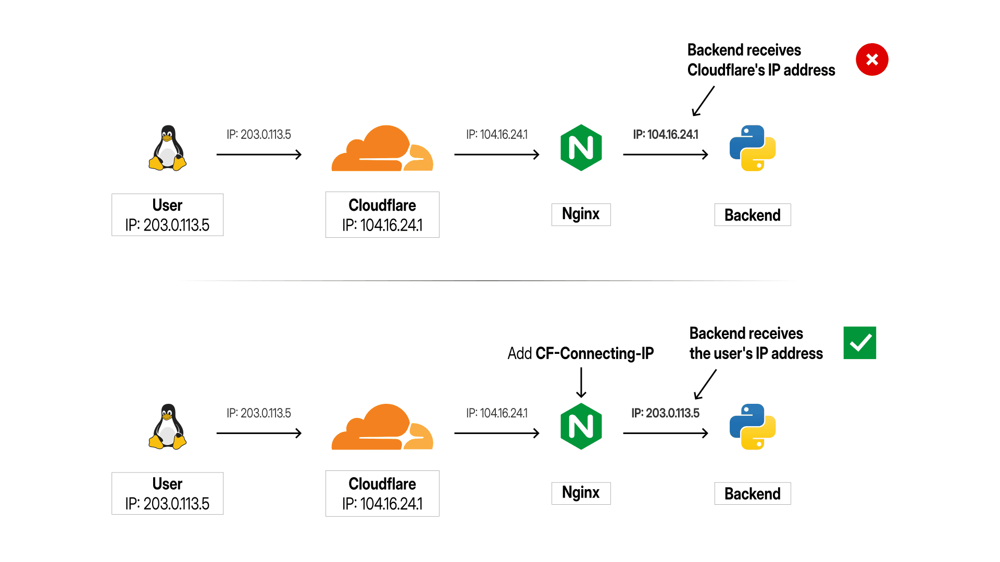
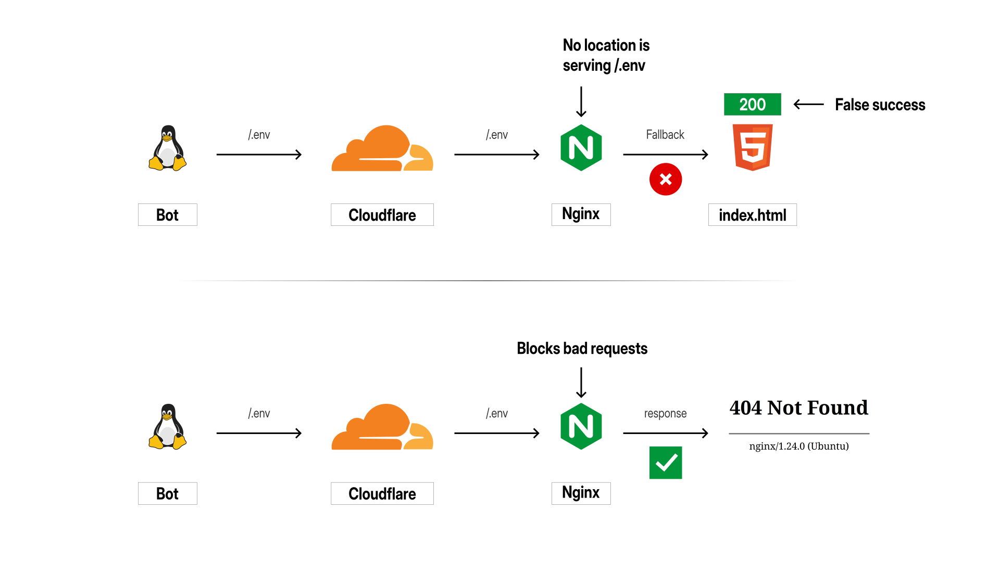
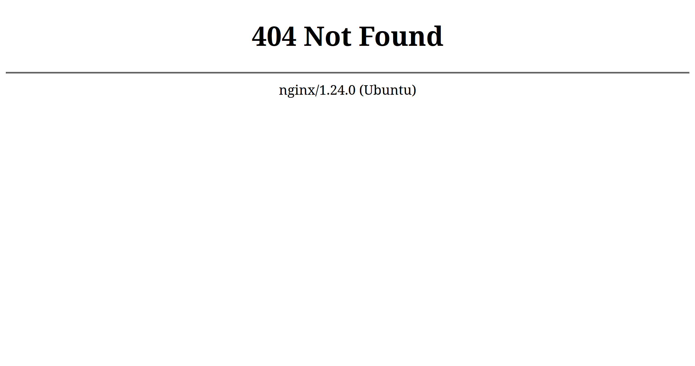
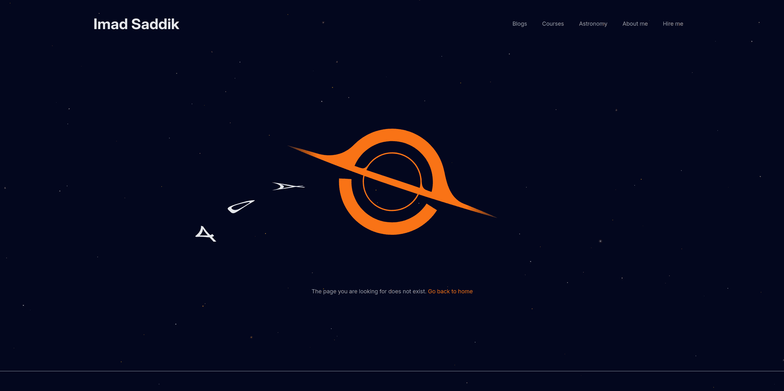

# Module 4: Global delivery and security

## Domains and SSL

### Introduction

Up until now, your application has been accessible via a raw IP address. While this proves your server works, it is not user-friendly, and more importantly, it is not secure. Browsers will flag your website as "Not Secure" because traffic is sent in plain text using [HTTP](https://en.wikipedia.org/wiki/HTTP).

In this chapter, you will purchase a custom domain name, connect it to your DigitalOcean droplet using [DNS records](https://www.cloudflare.com/learning/dns/dns-records/), and secure all traffic with free, auto-renewing [SSL certificates](https://www.cloudflare.com/learning/ssl/what-is-an-ssl-certificate/) via [Let's Encrypt](https://letsencrypt.org/).

### Register a domain

To give your website a recognizable name, you need to register a domain. There are many domain registrars available, such as [Namecheap](https://www.namecheap.com/), or [GoDaddy](https://www.godaddy.com/fr). For this guide, I will use [Porkbun](https://porkbun.com/) as the example because of its transparent pricing, but the concepts apply everywhere.

Go to your registrar of choice and type your desired domain into the search bar.

Analyze the results. Pay close attention to the **renewal price**. Registrars often provide a steep discount for the first year, but the subsequent years might be surprisingly expensive. Always choose a domain with a sustainable renewal cost (around $10–$15 per year for a `.com`).

Once you find a domain that fits your budget, add it to your cart and proceed to checkout.


_Type your desired domain into the search bar to see if it's available. Add it to your cart if it is._


_Review the renewal price before purchasing. You only need the domain name itself, so skip any extra features that are not necessary._

> [!NOTE]
> During checkout, companies will try to upsell you on extra features like email hosting, website builders, or premium DNS. You do not need any of these. You only need the domain name itself.

You should see this success message after completing the purchase.


_You should see this success message after purchasing your domain._

Now, navigate to your registrar's **Domain Management** dashboard.


_Click on "Account" and then "Domain Management" to access the dashboard where you can manage your domains._

You should see your new domain listed there.


_Your newly purchased domain should be listed in the dashboard._

### Configure DNS

Now that you own a domain, you must tell the rest of the internet where to find your server when someone types that name into their browser. This is achieved using the [Domain Name System (DNS)](https://en.wikipedia.org/wiki/Domain_Name_System).

Think of DNS as the phonebook of the internet. It translates human-readable names (like `imadsaddik.com`) into machine-readable IP addresses (like `142.93.130.134`).


_DNS resolution process: The user types a domain, the browser queries the DNS server, the DNS server returns the IP address, and the browser connects to the server._

Go to your domain provider’s dashboard and locate the **DNS records** section for your domain. If you are using **Porkbun**, locate your domain in the list. You need to hover over the domain row to reveal the options. Click on the **DNS** link to open the configuration panel.


_Hover over your domain and click on the "DNS" link to access the DNS records configuration._

Scroll down to the “Current Records” section. You will see some default records created by the registrar, such as `ALIAS`, `CNAME`, or `_acme-challenge` records. **Delete these default records** to ensure they do not conflict with your real server.


_Delete the default records to avoid conflicts with your real server._

You need to create two specific records to point your traffic to DigitalOcean:

#### The A record

An [A record](https://www.cloudflare.com/learning/dns/dns-records/dns-a-record/) (Address Record) maps a domain name directly to an [IPv4 address](https://en.wikipedia.org/wiki/IPv4).

Fill in the form with the following values:

- **Type:** `A`
- **Host/Name:** Leave this blank.
- **Answer/Value:** Paste the IP address of your DigitalOcean droplet.
- **TTL (Time To Live):** `600` (or leave as default).


_Create an A record that points your domain to the IP address of your DigitalOcean droplet._

Click **Add** to save the record.

#### The CNAME record

A [CNAME record](https://www.cloudflare.com/learning/dns/dns-records/dns-cname-record/) (Canonical Name Record) maps one domain name to another domain name. You use this to ensure that users who type `www` in front of your domain still reach your website.

Fill in the form with the following values:

- **Type:** `CNAME`
- **Host/Name:** `www`
- **Answer/Value:** `<your_domain>.com`


_Create a CNAME record that points the `www` subdomain to the root domain._

Click **Add** to save the record.

By the end, your DNS configuration should look like this:


_Your DNS configuration should have an A record pointing to your droplet's IP and a CNAME record pointing `www` to the root domain._

> [!NOTE]
> DNS changes can take anywhere from a few minutes to 48 hours to propagate globally. Usually, it takes less than 15 minutes. You can use a tool like [whatsmydns.net](https://www.whatsmydns.net/) to verify if the world can see your new A record.

Once the DNS has propagated, you should be able to type `http://<your_domain>.com` in your browser and see your Vue.js application load.

### Secure the server with SSL (Certbot)

Your site is accessible via your domain, but it is currently running over unencrypted HTTP. You will use [Certbot](https://certbot.eff.org/) to obtain an SSL certificate from [Let's Encrypt](https://letsencrypt.org/).

Certbot is fantastic because it completely automates the complex parts: it proves you own the domain, downloads the certificate, and safely edits your Nginx configuration to enable HTTPS.

#### Install Certbot

SSH into your server:

```bash
ssh my-website
```

Install the Certbot client and its dedicated Nginx plugin using `apt`:

```bash
sudo apt install certbot python3-certbot-nginx -y
```

#### Prepare Nginx

Before you run Certbot, you need to tell Nginx about your new domain. Certbot reads your Nginx configuration files and looks for the `server_name` directive to know which file to secure. If it cannot find your domain, it will fall back to the default file and mess up your setup.

Open the Nginx configuration file you created in Chapter 2.2:

```bash
sudo nano /etc/nginx/sites-available/<your_project_name>
```

Find the `server_name` line. Change the IP address to match your new root domain and `www` subdomain:

```nginx
server_name <your_domain>.com www.<your_domain>.com;
```

Save and exit the file. Then, test the configuration to make sure there are no typos, and reload Nginx so it registers your new domain:

```bash
sudo nginx -t
sudo systemctl reload nginx
```

#### Obtain the certificate

Run the following command, making sure to replace the placeholders with your actual domain names. This command requests certificates for both your root domain and the `www` subdomain.

```bash
sudo certbot --nginx -d <your_domain>.com -d www.<your_domain>.com
```

Certbot will guide you through a quick interactive setup:

1. It will ask for an email address. This is used strictly for urgent security notices and renewal warnings if automation fails.
2. It will ask you to agree to the Terms of Service.
3. It will ask if you want to share your email with the Electronic Frontier Foundation (EFF) for news and research. Skip this if you want, it is not required.

Certbot will then communicate with the Let's Encrypt servers to complete a challenge verifying you control the domain. Once verified, you will see a success message:

```text
Deploying certificate
Successfully deployed certificate for <your_domain>.com to /etc/nginx/sites-enabled/<your_project_name>
Successfully deployed certificate for www.<your_domain>.com to /etc/nginx/sites-enabled/<your_project_name>
Congratulations! You have successfully enabled HTTPS on https://<your_domain>.com and https://www.<your_domain>.com
```

### Understand the Nginx changes

Certbot does more than just download your certificate. It opened the Nginx configuration file you created in Chapter 2.2 and updated the code automatically.

I highly recommend taking a moment to understand exactly what Certbot changed. Open your configuration file to see the new layout:

```bash
sudo nano /etc/nginx/sites-available/<your_project_name>
```

You will notice two big changes:

#### The HTTPS upgrade

Your original `server` block, which used to `listen 80;`, has been upgraded. Certbot changed it to `listen 443 ssl;` and injected several lines pointing to the newly downloaded cryptographic keys.

```nginx
server {
    server_name <your_domain>.com www.<your_domain>.com;

    # ... (Your location blocks for / and /api remain untouched) ...

    # Certbot added these lines to handle SSL encryption
    listen 443 ssl;
    ssl_certificate /etc/letsencrypt/live/<your_domain>.com/fullchain.pem;
    ssl_certificate_key /etc/letsencrypt/live/<your_domain>.com/privkey.pem;
    include /etc/letsencrypt/options-ssl-nginx.conf;
    ssl_dhparam /etc/letsencrypt/ssl-dhparams.pem;
}
```

#### The HTTP redirect

Because the block above now only listens on secure port 443, what happens if a user types `http://`?

Certbot anticipated this and created a brand new, separate `server` block at the bottom of the file specifically to catch insecure port 80 traffic and permanently redirect it ([HTTP status 301](https://developer.mozilla.org/en-US/docs/Web/HTTP/Reference/Status/301)) to the secure version.

```nginx
server {
    if ($host = www.<your_domain>.com) {
        return 301 https://$host$request_uri;
    }

    if ($host = <your_domain>.com) {
        return 301 https://$host$request_uri;
    }

    listen 80;
    server_name <your_domain>.com www.<your_domain>.com;
    return 404;
}
```

Exit the file (`Ctrl+X`).

> [!TIP]
> In Chapter 2.2, you configured your frontend Axios `baseURL` to just `/`. Because you used relative routing, you do not need to update your application code to handle HTTPS!
>
> When the browser loads the page securely over `https://`, Axios automatically inherits that secure origin for all `/api` requests.
>
> Furthermore, because both the frontend and backend are served from the exact same domain through Nginx, you do not have to mess with Python CORS settings. Your architecture gracefully absorbed this major security upgrade with zero code changes.

### Automate certificate renewal

Let's Encrypt certificates are highly secure, but they [expire every 90 days](https://letsencrypt.org/docs/faq/#what-is-the-lifetime-for-let-s-encrypt-certificates-for-how-long-are-they-valid). This short lifespan minimizes damage if a key is ever compromised.

Certbot automatically installs a background timer to check for renewals, but it is best practice to test this system and set up explicit automation so you never wake up to an expired certificate warning.

First, test that the renewal system works without modifying your live certificates:

```bash
sudo certbot renew --dry-run
```

If it works, you will see:

```text
Congratulations, all simulated renewals succeeded:
/etc/letsencrypt/live/<your_domain>.com/fullchain.pem (success)
```

#### Explicit cron job

To guarantee you have control over the renewal schedule, you will use [cron](https://en.wikipedia.org/wiki/Cron), the Linux job scheduler.

Run this command to edit the `cron` file for the `root` user:

```bash
sudo crontab -e
```

If this is your first time, it will ask you to select an editor. Press `1` for [nano](https://www.nano-editor.org/). Add the following line to the very bottom of the file:

```text
0 0 * * 0 certbot renew --quiet
```

Here is how to read this cron expression: "At exactly midnight (`0 0`), every Sunday (`* * 0`), run the `certbot renew` command."

> [!TIP]
> You can use an online tool like [crontab.guru](https://crontab.guru/) to visualize and verify your cron schedule.

The `--quiet` flag ensures it does not spam your system logs unless a critical error occurs. Certbot is smart; even though it checks every Sunday, it will only request a new certificate if your current one is expiring within the next 30 days.

#### Create a post-renewal hook

There is one minor flaw in this automation. When Certbot downloads a fresh certificate, Nginx does not automatically notice. Nginx loads certificates into memory when it starts, so it will continue using the old, soon to be expired certificate until the service is reloaded.

You can fix this by creating a "post-renewal hook". This is a script that Certbot will automatically trigger immediately after a successful renewal.

Create the script file:

```bash
sudo nano /etc/letsencrypt/renewal-hooks/post/reload-nginx.sh
```

Paste this bash command inside:

```bash
#!/bin/bash
systemctl reload nginx
```

Save and exit `nano`. Make the script executable so Certbot has permission to run it:

```bash
sudo chmod +x /etc/letsencrypt/renewal-hooks/post/reload-nginx.sh
```

Now, your server is entirely self-sustaining. It will fetch a new certificate before the 90 days are up, and it will instantly reload the web server to apply the new encryption keys. You can just kick back and enjoy your sleep.

### What is next?

Your website is now live on your custom domain and fully secure.

However, there is one problem you cannot fix with code: physical distance. Right now, if your server is in Germany, a user in Australia will experience a delay because the data has to travel across the globe.

In the next chapter, **Chapter 4.2: The CDN layer**, you will learn how to solve this. You will integrate [Cloudflare](https://www.cloudflare.com/) to cache your files on servers all around the world, making your site load quickly everywhere. You will also learn how to configure Nginx to correctly log your visitors' real IP addresses.

## The CDN layer and caching

### Introduction

At the end of the previous subchapter, we talked about how physical distance creates unavoidable latency. If your server is located in [Meknès](https://fr.wikipedia.org/wiki/Mekn%C3%A8s), Morocco, a user in [Oujda](https://en.wikipedia.org/wiki/Oujda) will see your site load in milliseconds. But when a user in Sydney, Australia, or Beijing, China, tries to access it, the request has to travel through [fiber-optic cables](https://en.wikipedia.org/wiki/Fiber-optic_cable) across oceans and continents.

To visualize this, I used the [Free Website Uptime Test](https://www.uptrends.com/tools/uptime) by [Uptrends](https://www.uptrends.com/) to check how fast different cities can connect to the server. The results clearly show the impact of physical distance.


_Latency test results showing fast connections nearby (0.1s) but high delays in Beijing (3.9s) and other places._

Since the server is local, a nearby user sees the site load almost instantly. However, a user in Beijing has to wait for the signal to travel halfway around the world, which takes over 3.9 seconds. This makes the site feel sluggish for them.

To solve this, you need a [Content Delivery Network (CDN)](https://www.cloudflare.com/learning/cdn/what-is-a-cdn/). A CDN sits between your users and your server. It caches your static files (like your built HTML, CSS, and images) on thousands of [edge servers](https://www.akamai.com/glossary/what-is-an-edge-server) (servers placed on the outer edges of the network, physically close to the users) worldwide. When a user in Sydney visits your site, they download the frontend from a server in Australia or nearby, not all the way from Morocco.


_Notice how the edge servers intercept the traffic. By serving files locally, the long 3.9-second trip across the globe is bypassed, dropping the user's wait time down to just a fraction of a second._

In this subchapter, you will integrate [Cloudflare](https://www.cloudflare.com/) to globally distribute your frontend. You will also configure Nginx to implement aggressive caching strategies for your [Single Page Application (SPA)](https://developer.mozilla.org/en-US/docs/Glossary/SPA).

### Set up Cloudflare

Cloudflare is one of the most popular CDNs in the world. It acts as both a CDN and a highly secure DNS provider. Best of all, it offers a generous free tier that is perfect for personal websites and side projects.

Start by creating a free account on Cloudflare. After registration, you should land on a page prompting you to add your domain. If you do not see this page, click on the **Add** button in the dashboard and select **Connect a domain**.


_After logging in, click on the "Add" button and select "Connect a domain" to start the setup process._

On this screen, follow these steps:

1. **Enter your domain:** Type your domain name (e.g., `<your_domain>.com`) into the input box.
2. **DNS scan:** Leave "Quick scan for DNS records" checked. Cloudflare will automatically fetch the A and CNAME records you created earlier in Porkbun.
3. **AI crawlers:** You have the option to block AI companies from scraping your site. This is a personal choice and does not impact your site's performance.
4. **Click Continue:** This will take you to the plan selection screen.


_Add your domain name, block AI training bots, and allow Cloudflare to scan common DNS records._

In the plan selection page, choose the **Free** plan. It includes everything you need for a personal website.


_Select the Free plan, which is sufficient for personal websites and side projects._

#### Review and proxy your DNS records

The next screen is very important. Cloudflare will list the DNS records it found. You need to verify their proxy status.

- **Web traffic (A and CNAME records):** Ensure the proxy status is toggled on. You should see an **orange cloud**. This tells Cloudflare to intercept the traffic, cache your files, and hide your server's real IP address from the public.
- **Email traffic (MX and TXT records):** If you have records for email, they must be set to "DNS only". Cloudflare proxies HTTP and HTTPS web traffic, not email traffic. If you proxy your mail records, your email will stop working.

Finally, look for the **NS (Nameserver)** records pointing to `porkbun.com`. You must delete these from the list because you are about to replace them.


_Review the DNS records. Make sure your A and CNAME records are proxied (orange cloud), and delete any NS records pointing to your old registrar._

#### Hand over DNS authority

To make Cloudflare your CDN, you must hand over control of your DNS routing. Cloudflare will provide you with two new nameservers (for example, `paige.ns.cloudflare.com` and `yevgen.ns.cloudflare.com`).

To do this, head over to your Porkbun dashboard and locate your domain. Hover over it and click the **NS** label to open your nameserver settings. A popup will appear showing the default Porkbun nameservers. Go ahead and delete all of them.

Next, paste the two new Cloudflare nameservers you just received, making sure you put each one on a separate line. Finally, hit **Submit** to apply your changes.


_Delete the old nameservers and replace them with the new ones provided by Cloudflare._

Return to the Cloudflare dashboard and click **Continue**.


_After updating the nameservers, click "Continue" to let Cloudflare verify the changes._

You will arrive at the overview page. Click the **Check nameservers now** button. DNS changes take time to propagate across the internet. This process usually finishes in a few minutes, but it can occasionally take up to an hour.


_Click "Check nameservers now" to verify that Cloudflare has taken control of your DNS. This may take a few minutes to complete._

### Configure SSL/TLS encryption mode

While you wait for the nameservers to propagate, you must configure Cloudflare's encryption mode. **Do not skip this step!** If you forget to do this, your website will get stuck in an infinite loop and crash with a [Too Many Redirects](https://developers.cloudflare.com/ssl/troubleshooting/too-many-redirects/) error.

In the Cloudflare dashboard, locate **SSL/TLS** in the left sidebar and click on **Overview**.


_Click on "SSL/TLS" in the left sidebar, then select "Overview" to access the encryption settings._

On this page, you will see a few different encryption modes. Select the **Full (strict)** option.


_Choose the "Full (strict)" encryption mode to ensure end-to-end encryption between users, Cloudflare, and your origin server._

**Why Full (strict)?** Because in the previous chapter, you already went through the effort of installing a valid Let's Encrypt certificate on your Nginx server.

This strict setting tells Cloudflare to encrypt the connection from the user's browser to Cloudflare, and then strictly verify your Let's Encrypt certificate before passing the traffic to your server. It guarantees true end-to-end encryption.

### Verify the DNS switch

Before moving on, you should confirm that the internet actually sees your new nameservers. You can verify this directly from your local terminal using the [dig](https://en.wikipedia.org/wiki/Dig_(command)) command.

```bash
dig +short NS <your_domain>.com
```

If the propagation is complete, you will see your new Cloudflare nameservers in the output:

```text
paige.ns.cloudflare.com.
yevgen.ns.cloudflare.com.
```

If you still see the old Porkbun nameservers, wait a few more minutes and try again. Once you see the Cloudflare addresses, your traffic is officially flowing through their network.

Refresh the Cloudflare dashboard. You should see a green **Active** badge next to your domain, along with a "Great news!" message.


_Once the nameservers have propagated, you should see an "Active" status in the Cloudflare dashboard, confirming that your domain is now using Cloudflare's DNS and CDN services._

If you want an extra check, you can also use the [whatsmydns.net](https://www.whatsmydns.net/) website to verify that the new nameservers are active globally. After visiting the website, enter your domain, select **NS** from the dropdown, and hit search. You should see your new Cloudflare nameservers appearing on the map.


_Use whatsmydns.net to verify that your new Cloudflare nameservers are active globally. You should see them appearing in multiple locations around the world._

### Verify the speed

Now for the best part. Once everything is set, run the global speed test again to see the difference.


_The latency test results after enabling Cloudflare show a huge improvement, especially in distant locations like Beijing, which dropped from 3.9s to 1.5s._

The improvement is massive:

- **Montreal:** Dropped from 0.6s to **0.4s**.
- **Tokyo:** Dropped from 1.3s to **0.3s**.
- **Seoul:** Dropped from 1.3s to **0.4s**.
- **Jakarta:** Dropped from 1.4s to **0.3s**.
- **Beijing:** Dropped from 3.9s to **1.5s**.

Your website now loads almost instantly for users all over the world.

### Restore visitor IPs at the server level

Now that traffic is routing through Cloudflare, a hidden issue arises. Both your Nginx logs and your Python application will see Cloudflare's IP address instead of the actual visitor's IP. This breaks your analytics and ruins any geolocation tracking.

Instead of writing complex Python code to extract the real IP from request headers, you can configure Nginx to unwrap the connection globally at the server level.


_By default, your backend only sees Cloudflare's IP. Configuring Nginx to read the CF-Connecting-IP header restores the true visitor IP._

Create a new configuration file in Nginx's `conf.d` directory. Nginx automatically loads any file placed in this folder.

```bash
sudo nano /etc/nginx/conf.d/cloudflare.conf
```

Paste the following configuration. This tells Nginx to trust requests originating from Cloudflare's known IP ranges and to extract the real visitor's IP from the [CF-Connecting-IP](https://developers.cloudflare.com/fundamentals/reference/http-headers/#cf-connecting-ip) header.

```nginx
# Cloudflare IPv4 Ranges
set_real_ip_from 173.245.48.0/20;
set_real_ip_from 103.21.244.0/22;
set_real_ip_from 103.22.200.0/22;
set_real_ip_from 103.31.4.0/22;
set_real_ip_from 141.101.64.0/18;
set_real_ip_from 108.162.192.0/18;
set_real_ip_from 190.93.240.0/20;
set_real_ip_from 188.114.96.0/20;
set_real_ip_from 197.234.240.0/22;
set_real_ip_from 198.41.128.0/17;
set_real_ip_from 162.158.0.0/15;
set_real_ip_from 104.16.0.0/13;
set_real_ip_from 104.24.0.0/14;
set_real_ip_from 172.64.0.0/13;
set_real_ip_from 131.0.72.0/22;

# Cloudflare IPv6 Ranges
set_real_ip_from 2400:cb00::/32;
set_real_ip_from 2606:4700::/32;
set_real_ip_from 2803:f800::/32;
set_real_ip_from 2405:b500::/32;
set_real_ip_from 2405:8100::/32;
set_real_ip_from 2a06:98c0::/29;
set_real_ip_from 2c0f:f248::/32;

# Use the 'CF-Connecting-IP' header to get the real IP
real_ip_header CF-Connecting-IP;
```

> [!NOTE]
> Cloudflare occasionally updates their IP ranges. You can always find the most up-to-date lists at [https://www.cloudflare.com/ips/](https://www.cloudflare.com/ips/).

#### Verify the fix

To see the change in action, test and reload Nginx first:

```bash
sudo nginx -t
sudo systemctl reload nginx
```

Now, open your terminal and watch your access logs in real-time. Replace the placeholder with your domain name:

```bash
sudo tail -f /var/log/nginx/<your_domain>.com-access.log
```

While this command is running, open your website in your browser. Look at the first column of the logs that appear:

- **Before the fix:** You would see a Cloudflare IP address (like `172.70.240.61`) for every single request.
- **After the fix:** You should now see your own [ISP](https://en.wikipedia.org/wiki/Internet_service_provider)'s IP address.

Your Nginx logs and your FastAPI application will now see the actual IP addresses of your users.

### Optimize Nginx caching for SPAs

Your CDN is active, but you need to tell it how to cache your files. By default, browsers and CDNs try to cache static assets to improve performance. However, for a Single Page Application (SPA) built with Vue or some other frontend framework, default caching behavior can cause massive headaches when you deploy updates.

If a browser caches your `index.html` file, a user visiting your site tomorrow might load the old version of the app. That old `index.html` will try to load old JavaScript files that you may have already deleted from the server during a deployment, resulting in a blank white screen.

To fix this, you must explicitly separate your caching logic into two rules:

1. **Never cache the entry point (`index.html`).**
2. **Cache the assets (`/assets/`) forever.**

Open your site's Nginx configuration:

```bash
sudo nano /etc/nginx/sites-available/<your_domain>.com
```

Find your existing `location /` block. You are going to replace it and expand it. Add the following blocks inside your secure (port 443) `server` block:

```nginx
# 1. Never cache the entry point
# The browser must always check the server for the latest version of the app.
location = /index.html {
    root /web_app/frontend/dist;
    add_header Cache-Control "no-cache, no-store, must-revalidate";
}

# 2. Cache assets forever
# Vite adds a unique hash to filenames in the /assets directory.
# If the code changes, the filename changes. Therefore, we can cache these heavily.
location /assets/ {
    root /web_app/frontend/dist;
    add_header Cache-Control "public, max-age=31536000, immutable";
}

# 3. Handle SPA routing (Fallback)
# If the request is not for a specific asset or index.html, fall back to index.html
location / {
    root /web_app/frontend/dist;
    try_files $uri $uri/ /index.html;
}
```

Here is what those specific caching headers mean:

```nginx
add_header Cache-Control "no-cache, no-store, must-revalidate";
```

- **no-cache, no-store:** Tells the browser and Cloudflare to never save a permanent copy of this file.
- **must-revalidate:** Forces the browser to connect to your server every single time to verify it has the absolute latest version before showing the page to the user.

```nginx
add_header Cache-Control "public, max-age=31536000, immutable";
```

- **public:** Allows anyone, including Cloudflare's edge servers, to cache the files.
- **max-age=31536000:** Tells the browser to keep the file in its cache for exactly one year (31,536,000 seconds).
- **immutable:** An instruction that tells the browser the file will never change. This stops the browser from even asking the server if the file is up to date, resulting in instant load times.

With this configuration, your users will always fetch the freshest `index.html` file upon navigating to your site, ensuring they get your latest features immediately, while the heavy lifting (downloading Vue, your compiled components, and images) is cached efficiently at the edge.

### Pros and cons

Before wrapping up, let's summarize what you gained and what you risked by adding this CDN layer.

The benefits:

- **Speed:** Your frontend loads instantly for users everywhere.
- **Security:** Cloudflare hides your real server IP and provides basic [DDoS](https://en.wikipedia.org/wiki/Denial-of-service_attack) protection.
- **Bandwidth:** It saves you money by serving images and scripts from their cache instead of your server.

The downsides:

- **Complexity:** You have introduced a middleman. If your site goes down, you now have to check if the issue is with DigitalOcean or Cloudflare.
- **Dynamic latency:** While your frontend is fast, your backend API requests still need to travel the full distance to your server. Cloudflare cannot speed up the database query itself, only the network path to reach it.

### What is next?

Your website is now globally distributed, fast, and protected by Cloudflare's network. You have successfully finished the performance setup.

However, before we move on to automating your deployments, we need to ensure your server is completely locked down against hackers and automated scanners.

In the next subchapter, **Chapter 4.3: Vulnerability Scanning**, you will learn how to test your own defenses. You will use [OWASP ZAP](https://www.zaproxy.org/) to perform [Dynamic Application Security Testing (DAST)](https://en.wikipedia.org/wiki/Dynamic_application_security_testing) on your web application, and you will configure Nginx to explicitly block malicious bots from hunting for sensitive system files like `.env` and `.git`.

## Vulnerability scanning

### Introduction

In the previous sections, you secured your server with a firewall, SSH keys, and HTTP headers. But how do you know if your defenses actually work? The best way to find out is to attack your own server.

In this section, you will learn how to block malicious bots from reading sensitive files, use [nmap](https://nmap.org/) to verify your firewall rules, and perform Dynamic Application Security Testing (DAST) using [OWASP ZAP](https://www.zaproxy.org/) to find vulnerabilities in your running application.

### Fix soft 404 vulnerabilities and block bots

Because of how the SPA fallback block (`location /`) works, any request to a non-existent file on your server gets redirected to `index.html`.

If a hacker or a malicious bot scans your server looking for sensitive files like `/.env`, `/.git/config`, or `/wp-login.php`, Nginx does not block them. Instead, it serves them your Vue `index.html` file and returns a successful [HTTP 200 OK status](https://developer.mozilla.org/en-US/docs/Web/HTTP/Reference/Status/200).

To a human, it looks like a "Page Not Found" screen rendered by Vue Router. To a bot or Google's search crawler, your server just said, "Yes, this `.env` file exists and here is the content!". This is known as a [Soft 404](https://developers.google.com/search/blog/2008/08/farewell-to-soft-404s), and it wastes your server's resources while severely confusing search engines.


_The Soft 404 trap: Nginx fails to serve `.env` but takes the bot to `index.html`, resolving with a 200 HTTP status code. Bots will think they got access to the file and will keep hammering your web server._

You need to set a strict boundary. Nginx should block known malicious requests instantly, returning a hard `404 Not Found` or `403 Forbidden`, preventing them from ever reaching your Vue application.

Add these security blocks to your configuration, placing them right above your `location /` blocks:

```nginx
# Deny access to files starting with a dot (like .env or .git)
# EXCEPTION: Allow .well-known for Certbot SSL renewals!
location ~ /\.(?!well-known).* {
    deny all;
    access_log off;
    log_not_found off;
    return 404;
}

# Immediately drop requests for PHP, backups, or CMS admin panels
location ~* \.(php|pl|py|jsp|asp|sh|cgi|bak|old|sql|conf|ini|zip|tar|gz)$|/(wp-admin|wp-includes|node_modules) {
    access_log off;
    log_not_found off;
    return 404;
}
```

You might notice the `access_log off;` and `log_not_found off;` lines inside those blocks. These are there to keep your server logs clean. Since bots scan these common URLs thousands of times a day, recording every single blocked attempt would just waste your disk space.

> [!WARNING]
> The regex `\.(?!well-known).*` is important. If you block all dot-files, you will block the `/.well-known/acme-challenge/` directory. If you do that, Certbot will not be able to verify your domain, and your SSL certificates will fail to renew, breaking your site after 90 days.

> [!NOTE]
> Learn more about the [/.well-known](https://en.wikipedia.org/wiki/Well-known_URI) directory and its role in SSL certificate verification.

Save the file and test your Nginx configuration:

```bash
sudo nginx -t
sudo systemctl reload nginx
```

Now, if you try to visit `https://<your_domain>.com/.env`, Nginx will instantly step in and return a raw server 404 error page.


_The raw Nginx 404 response. Notice there is no Vue styling, proving the server blocked the request before it ever reached the frontend code._

But if a user visits a broken link like `https://<your_domain>.com/broken-article`, Nginx will gracefully pass it to Vue Router, providing a good user experience.


_The fallback Vue Router 404 page. Because the file is not blocked by Nginx, the frontend application loads and handles the missing route gracefully._

### Scan the server from the outside

Checking your firewall rules from inside the server is a good start, but scanning it from the outside is the only way to know the truth. This process simulates an attacker's perspective, revealing exactly which ports are exposed to the public internet.

To do this, use [nmap](https://nmap.org/), an industry-standard network scanning tool.

> [!IMPORTANT]
> Run this command **from your local machine**, not from your DigitalOcean droplet. If you do not have it installed, you can get it via `sudo apt install nmap`.

```bash
nmap -F <your_domain>.com
```

The `-F` flag runs a "Fast" scan, checking only the 100 most common network ports instead of all 65,535.

If your server is properly secured, the output should look exactly like this:

```text
Starting Nmap 7.95 ( https://nmap.org ) at 2025-10-31 21:39 +01
Nmap scan report for <your_domain>.com (<your_droplet_ip>)
Host is up (0.051s latency).
Not shown: 97 filtered tcp ports (no-response)
PORT      STATE SERVICE
22/tcp    open  ssh
80/tcp    open  http
443/tcp   open  https

Nmap done: 1 IP address (1 host up) scanned in 2.38 seconds
```

Here is how to interpret your security report:

- **`Host is up`**: Your server is online and responding to basic network routing.
- **`PORT 22, 80, 443`**: Only the absolute minimum required ports are openSSH for your access, and HTTP/HTTPS for web traffic.
- **`Not shown: 97 filtered tcp ports`**: This is the proof that your setup works. It means UFW successfully blocked connection attempts to every other port on the list.

This result confirms that even though your FastAPI backend is listening on port `8000` and your Meilisearch instance is running on port `7700`, no one can access them directly from the internet. They are perfectly insulated behind the firewall.

### What is next?

Your manual deployment is now complete, optimized, and thoroughly tested against vulnerabilities. You have a rock-solid foundation.

However, deploying manually every time you write new code is tedious and error-prone. In **Module 5: The automation pipeline**, you will shift focus from manual server management to [continuous integration and delivery (CI/CD)](https://about.gitlab.com/topics/ci-cd/).

In the next chapter, **Chapter 5.1: Local hygiene**, you will learn how to enforce code quality at the source. You will configure **Branch protection rules** to protect your master branch from accidental pushes, and you will set up **Pre-commit hooks** (using [Ruff](https://docs.astral.sh/ruff/) for Python and [ESLint](https://eslint.org/) for JavaScript/Vue) to automatically format your code and catch linting errors before a commit is even created.
