# Module 4: Global delivery and security

## Domains and SSL

### Introduction

Up until now, your application has been accessible via a raw IP address. While this proves your server works, it is not user-friendly, and more importantly, it is not secure. Browsers will flag your website as "Not Secure" because traffic is sent in plain text using [HTTP](https://en.wikipedia.org/wiki/HTTP).

In this chapter, you will purchase a custom domain name, connect it to your DigitalOcean droplet using [DNS records](https://www.cloudflare.com/learning/dns/dns-records/), and secure all traffic with free, auto-renewing [SSL certificates](https://www.cloudflare.com/learning/ssl/what-is-an-ssl-certificate/) via [Let's Encrypt](https://letsencrypt.org/).

### Register a domain

To give your website a recognizable name, you need to register a domain. There are many domain registrars available, such as [Namecheap](https://www.namecheap.com/), or [GoDaddy](https://www.godaddy.com/fr). For this guide, I will use [Porkbun](https://porkbun.com/) as the example because of its transparent pricing, but the concepts apply everywhere.

Go to your registrar of choice and type your desired domain into the search bar.

Analyze the results. Pay close attention to the **renewal price**. Registrars often provide a steep discount for the first year, but the subsequent years might be surprisingly expensive. Always choose a domain with a sustainable renewal cost (around $10–$15 per year for a `.com`).

Once you find a domain that fits your budget, add it to your cart and proceed to checkout.

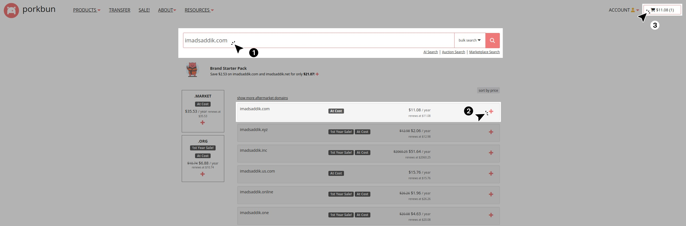
_Type your desired domain into the search bar to see if it's available. Add it to your cart if it is._

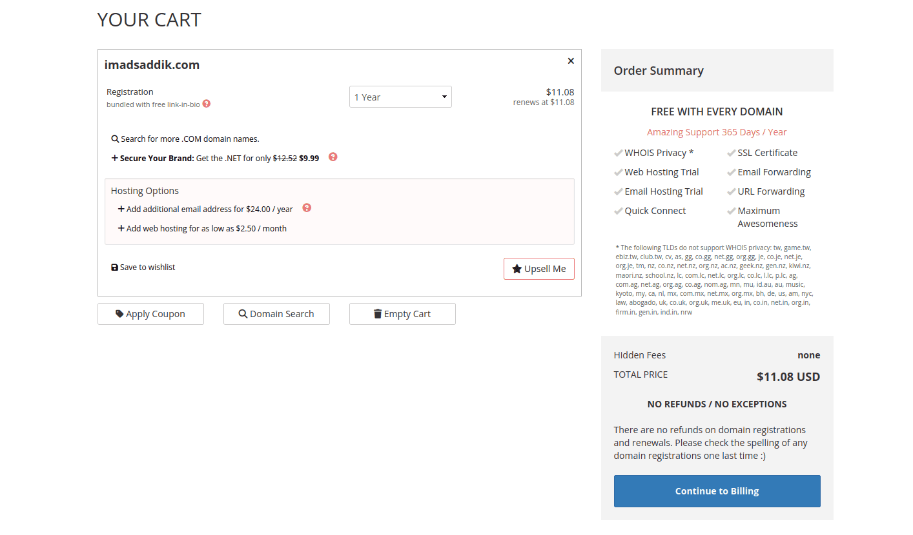
_Review the renewal price before purchasing. You only need the domain name itself, so skip any extra features that are not necessary._

> [!NOTE]
> During checkout, companies will try to upsell you on extra features like email hosting, website builders, or premium DNS. You do not need any of these. You only need the domain name itself.

You should see this success message after completing the purchase.

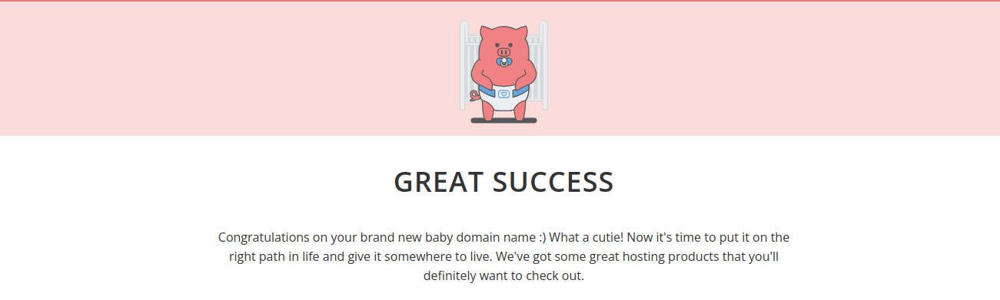
_You should see this success message after purchasing your domain._

Now, navigate to your registrar's **Domain Management** dashboard.

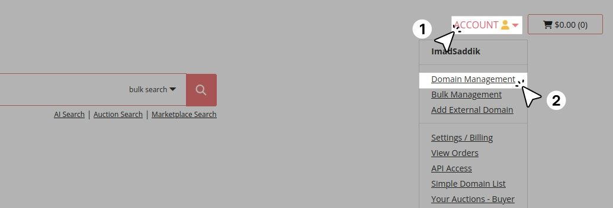
_Click on "Account" and then "Domain Management" to access the dashboard where you can manage your domains._

You should see your new domain listed there.

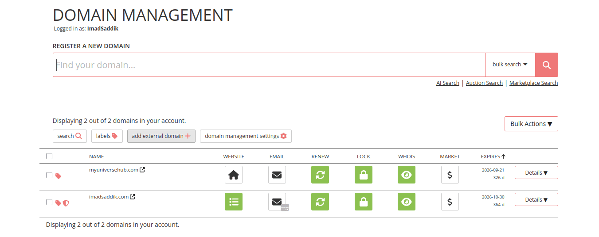
_Your newly purchased domain should be listed in the dashboard._

### Configure DNS

Now that you own a domain, you must tell the rest of the internet where to find your server when someone types that name into their browser. This is achieved using the [Domain Name System (DNS)](https://en.wikipedia.org/wiki/Domain_Name_System).

Think of DNS as the phonebook of the internet. It translates human-readable names (like `imadsaddik.com`) into machine-readable IP addresses (like `142.93.130.134`).

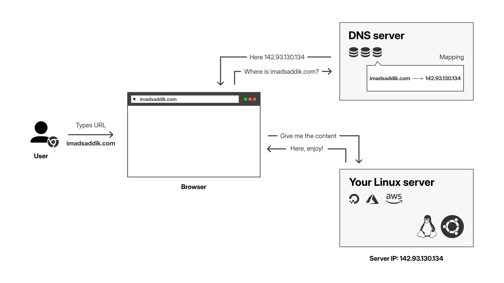
_DNS resolution process: The user types a domain, the browser queries the DNS server, the DNS server returns the IP address, and the browser connects to the server._

Go to your domain provider’s dashboard and locate the **DNS records** section for your domain. If you are using **Porkbun**, locate your domain in the list. You need to hover over the domain row to reveal the options. Click on the **DNS** link to open the configuration panel.


_Hover over your domain and click on the "DNS" link to access the DNS records configuration._

Scroll down to the “Current Records” section. You will see some default records created by the registrar, such as `ALIAS`, `CNAME`, or `_acme-challenge` records. **Delete these default records** to ensure they do not conflict with your real server.


_Delete the default records to avoid conflicts with your real server._

You need to create two specific records to point your traffic to DigitalOcean:

#### The A record

An [A record](https://www.cloudflare.com/learning/dns/dns-records/dns-a-record/) (Address Record) maps a domain name directly to an [IPv4 address](https://en.wikipedia.org/wiki/IPv4).

Fill in the form with the following values:

- **Type:** `A`
- **Host/Name:** Leave this blank.
- **Answer/Value:** Paste the IP address of your DigitalOcean droplet.
- **TTL (Time To Live):** `600` (or leave as default).

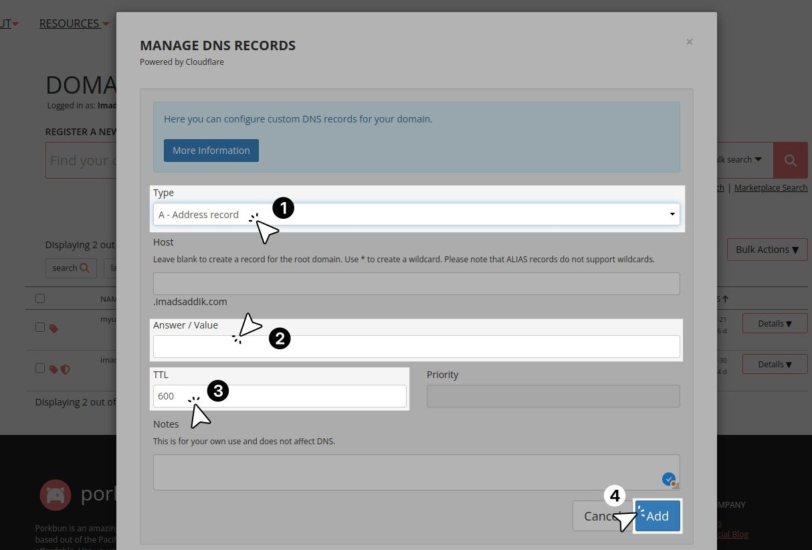
_Create an A record that points your domain to the IP address of your DigitalOcean droplet._

Click **Add** to save the record.

#### The CNAME record

A [CNAME record](https://www.cloudflare.com/learning/dns/dns-records/dns-cname-record/) (Canonical Name Record) maps one domain name to another domain name. You use this to ensure that users who type `www` in front of your domain still reach your website.

Fill in the form with the following values:

- **Type:** `CNAME`
- **Host/Name:** `www`
- **Answer/Value:** `<your_domain>.com`

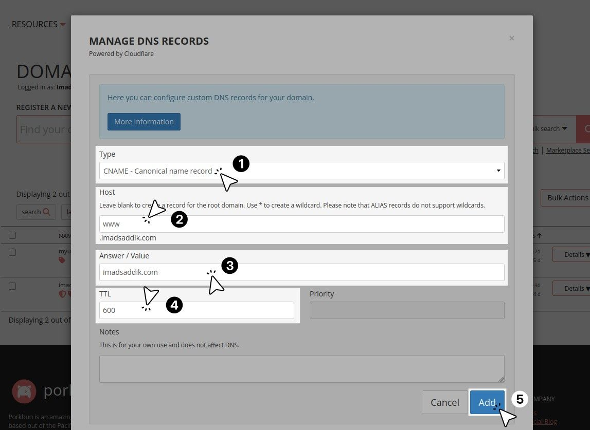
_Create a CNAME record that points the `www` subdomain to the root domain._

Click **Add** to save the record.

By the end, your DNS configuration should look like this:

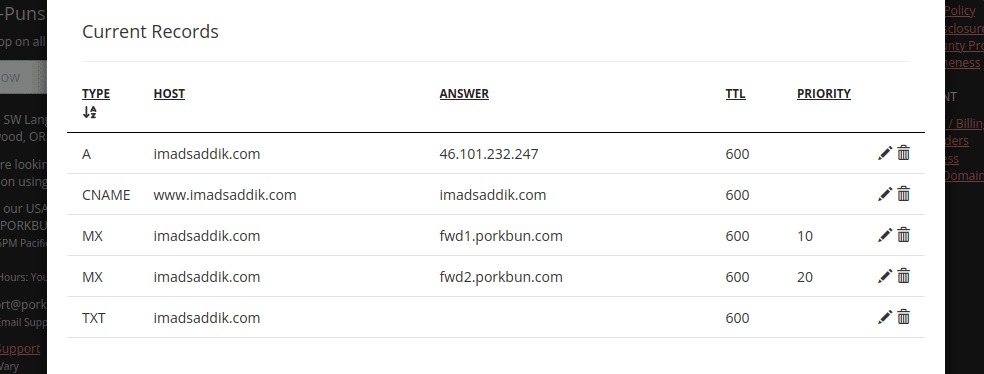
_Your DNS configuration should have an A record pointing to your droplet's IP and a CNAME record pointing `www` to the root domain._

> [!NOTE]
> DNS changes can take anywhere from a few minutes to 48 hours to propagate globally. Usually, it takes less than 15 minutes. You can use a tool like [whatsmydns.net](https://www.whatsmydns.net/) to verify if the world can see your new A record.

Once the DNS has propagated, you should be able to type `http://<your_domain>.com` in your browser and see your Vue.js application load.

### Secure the server with SSL (Certbot)

Your site is accessible via your domain, but it is currently running over unencrypted HTTP. You will use [Certbot](https://certbot.eff.org/) to obtain an SSL certificate from [Let's Encrypt](https://letsencrypt.org/).

Certbot is fantastic because it completely automates the complex parts: it proves you own the domain, downloads the certificate, and safely edits your Nginx configuration to enable HTTPS.

#### Install Certbot

SSH into your server:

```bash
ssh my-website
```

Install the Certbot client and its dedicated Nginx plugin using `apt`:

```bash
sudo apt install certbot python3-certbot-nginx -y
```

#### Prepare Nginx

Before you run Certbot, you need to tell Nginx about your new domain. Certbot reads your Nginx configuration files and looks for the `server_name` directive to know which file to secure. If it cannot find your domain, it will fall back to the default file and mess up your setup.

Open the Nginx configuration file you created in Chapter 2.2:

```bash
sudo nano /etc/nginx/sites-available/<your_project_name>
```

Find the `server_name` line. Change the IP address to match your new root domain and `www` subdomain:

```nginx
server_name <your_domain>.com www.<your_domain>.com;
```

Save and exit the file. Then, test the configuration to make sure there are no typos, and reload Nginx so it registers your new domain:

```bash
sudo nginx -t
sudo systemctl reload nginx
```

#### Obtain the certificate

Run the following command, making sure to replace the placeholders with your actual domain names. This command requests certificates for both your root domain and the `www` subdomain.

```bash
sudo certbot --nginx -d <your_domain>.com -d www.<your_domain>.com
```

Certbot will guide you through a quick interactive setup:

1. It will ask for an email address. This is used strictly for urgent security notices and renewal warnings if automation fails.
2. It will ask you to agree to the Terms of Service.
3. It will ask if you want to share your email with the Electronic Frontier Foundation (EFF) for news and research. Skip this if you want, it is not required.

Certbot will then communicate with the Let's Encrypt servers to complete a challenge verifying you control the domain. Once verified, you will see a success message:

```text
Deploying certificate
Successfully deployed certificate for <your_domain>.com to /etc/nginx/sites-enabled/<your_project_name>
Successfully deployed certificate for www.<your_domain>.com to /etc/nginx/sites-enabled/<your_project_name>
Congratulations! You have successfully enabled HTTPS on https://<your_domain>.com and https://www.<your_domain>.com
```

### Understand the Nginx changes

Certbot does more than just download your certificate. It opened the Nginx configuration file you created in Chapter 2.2 and updated the code automatically.

I highly recommend taking a moment to understand exactly what Certbot changed. Open your configuration file to see the new layout:

```bash
sudo nano /etc/nginx/sites-available/<your_project_name>
```

You will notice two big changes:

#### The HTTPS upgrade

Your original `server` block, which used to `listen 80;`, has been upgraded. Certbot changed it to `listen 443 ssl;` and injected several lines pointing to the newly downloaded cryptographic keys.

```nginx
server {
    server_name <your_domain>.com www.<your_domain>.com;

    # ... (Your location blocks for / and /api remain untouched) ...

    # Certbot added these lines to handle SSL encryption
    listen 443 ssl;
    ssl_certificate /etc/letsencrypt/live/<your_domain>.com/fullchain.pem;
    ssl_certificate_key /etc/letsencrypt/live/<your_domain>.com/privkey.pem;
    include /etc/letsencrypt/options-ssl-nginx.conf;
    ssl_dhparam /etc/letsencrypt/ssl-dhparams.pem;
}
```

#### The HTTP redirect

Because the block above now only listens on secure port 443, what happens if a user types `http://`?

Certbot anticipated this and created a brand new, separate `server` block at the bottom of the file specifically to catch insecure port 80 traffic and permanently redirect it ([HTTP status 301](https://developer.mozilla.org/en-US/docs/Web/HTTP/Reference/Status/301)) to the secure version.

```nginx
server {
    if ($host = www.<your_domain>.com) {
        return 301 https://$host$request_uri;
    }

    if ($host = <your_domain>.com) {
        return 301 https://$host$request_uri;
    }

    listen 80;
    server_name <your_domain>.com www.<your_domain>.com;
    return 404;
}
```

Exit the file (`Ctrl+X`).

> [!TIP]
> In Chapter 2.2, you configured your frontend Axios `baseURL` to just `/`. Because you used relative routing, you do not need to update your application code to handle HTTPS!
>
> When the browser loads the page securely over `https://`, Axios automatically inherits that secure origin for all `/api` requests.
>
> Furthermore, because both the frontend and backend are served from the exact same domain through Nginx, you do not have to mess with Python CORS settings. Your architecture gracefully absorbed this major security upgrade with zero code changes.

### Automate certificate renewal

Let's Encrypt certificates are highly secure, but they [expire every 90 days](https://letsencrypt.org/docs/faq/#what-is-the-lifetime-for-let-s-encrypt-certificates-for-how-long-are-they-valid). This short lifespan minimizes damage if a key is ever compromised.

Certbot automatically installs a background timer to check for renewals, but it is best practice to test this system and set up explicit automation so you never wake up to an expired certificate warning.

First, test that the renewal system works without modifying your live certificates:

```bash
sudo certbot renew --dry-run
```

If it works, you will see:

```text
Congratulations, all simulated renewals succeeded:
/etc/letsencrypt/live/<your_domain>.com/fullchain.pem (success)
```

#### Explicit cron job

To guarantee you have control over the renewal schedule, you will use [cron](https://en.wikipedia.org/wiki/Cron), the Linux job scheduler.

Run this command to edit the `cron` file for the `root` user:

```bash
sudo crontab -e
```

If this is your first time, it will ask you to select an editor. Press `1` for [nano](https://www.nano-editor.org/). Add the following line to the very bottom of the file:

```text
0 0 * * 0 certbot renew --quiet
```

Here is how to read this cron expression: "At exactly midnight (`0 0`), every Sunday (`* * 0`), run the `certbot renew` command."

> [!TIP]
> You can use an online tool like [crontab.guru](https://crontab.guru/) to visualize and verify your cron schedule.

The `--quiet` flag ensures it does not spam your system logs unless a critical error occurs. Certbot is smart; even though it checks every Sunday, it will only request a new certificate if your current one is expiring within the next 30 days.

#### Create a post-renewal hook

There is one minor flaw in this automation. When Certbot downloads a fresh certificate, Nginx does not automatically notice. Nginx loads certificates into memory when it starts, so it will continue using the old, soon to be expired certificate until the service is reloaded.

You can fix this by creating a "post-renewal hook". This is a script that Certbot will automatically trigger immediately after a successful renewal.

Create the script file:

```bash
sudo nano /etc/letsencrypt/renewal-hooks/post/reload-nginx.sh
```

Paste this bash command inside:

```bash
#!/bin/bash
systemctl reload nginx
```

Save and exit `nano`. Make the script executable so Certbot has permission to run it:

```bash
sudo chmod +x /etc/letsencrypt/renewal-hooks/post/reload-nginx.sh
```

Now, your server is entirely self-sustaining. It will fetch a new certificate before the 90 days are up, and it will instantly reload the web server to apply the new encryption keys. You can just kick back and enjoy your sleep.

### What is next?

Your website is now live on your custom domain and fully secure.

However, there is one problem you cannot fix with code: physical distance. Right now, if your server is in Germany, a user in Australia will experience a delay because the data has to travel across the globe.

In the next chapter, **Chapter 4.2: The CDN layer**, you will learn how to solve this. You will integrate [Cloudflare](https://www.cloudflare.com/) to cache your files on servers all around the world, making your site load quickly everywhere. You will also learn how to configure Nginx to correctly log your visitors' real IP addresses.

## The CDN layer and caching

### Introduction

At the end of the previous subchapter, we talked about how physical distance creates unavoidable latency. If your server is located in [Meknès](https://fr.wikipedia.org/wiki/Mekn%C3%A8s), Morocco, a user in [Oujda](https://en.wikipedia.org/wiki/Oujda) will see your site load in milliseconds. But when a user in Sydney, Australia, or Beijing, China, tries to access it, the request has to travel through [fiber-optic cables](https://en.wikipedia.org/wiki/Fiber-optic_cable) across oceans and continents.

To visualize this, I used the [Free Website Uptime Test](https://www.uptrends.com/tools/uptime) by [Uptrends](https://www.uptrends.com/) to check how fast different cities can connect to the server. The results clearly show the impact of physical distance.

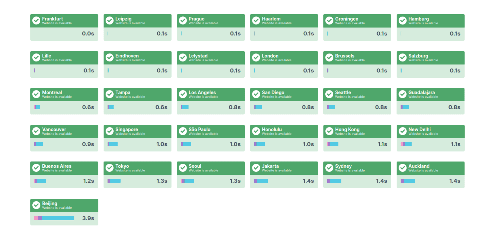
_Latency test results showing fast connections nearby (0.1s) but high delays in Beijing (3.9s) and other places._

Since the server is local, a nearby user sees the site load almost instantly. However, a user in Beijing has to wait for the signal to travel halfway around the world, which takes over 3.9 seconds. This makes the site feel sluggish for them.

To solve this, you need a [Content Delivery Network (CDN)](https://www.cloudflare.com/learning/cdn/what-is-a-cdn/). A CDN sits between your users and your server. It caches your static files (like your built HTML, CSS, and images) on thousands of [edge servers](https://www.akamai.com/glossary/what-is-an-edge-server) (servers placed on the outer edges of the network, physically close to the users) worldwide. When a user in Sydney visits your site, they download the frontend from a server in Australia or nearby, not all the way from Morocco.

<!-- TODO -->
<!-- [ILLUSTRATION NEEDED HERE] (A world map showing a user in Sydney connecting to a nearby edge node, while the edge node communicates with the origin server in Meknes. Use arrows and maybe a stopwatch icon to visually contrast the short distance to the edge node versus the long distance to the origin server.) -->

In this subchapter, you will integrate [Cloudflare](https://www.cloudflare.com/) to globally distribute your frontend. You will also configure Nginx to implement aggressive caching strategies for your [Single Page Application (SPA)](https://developer.mozilla.org/en-US/docs/Glossary/SPA) and fix a common [SEO](https://en.wikipedia.org/wiki/Search_engine_optimization) and performance issue known as [Soft 404s](https://developers.google.com/search/blog/2008/08/farewell-to-soft-404s).

### Set up Cloudflare

Cloudflare is one of the most popular CDNs in the world. It acts as both a CDN and a highly secure DNS provider. Best of all, it offers a generous free tier that is perfect for personal websites and side projects.

Start by creating a free account on Cloudflare. After registration, you should land on a page prompting you to add your domain. If you do not see this page, click on the **Add** button in the dashboard and select **Connect a domain**.

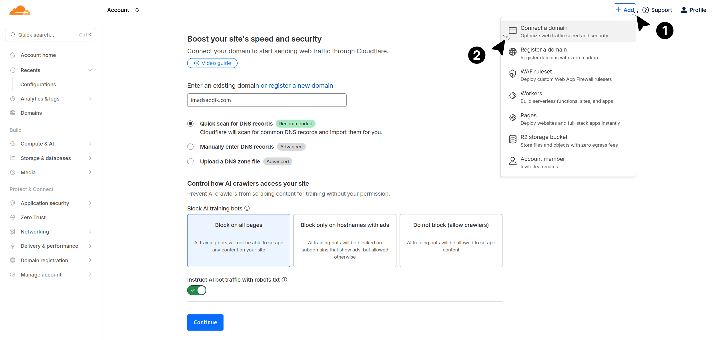
_After logging in, click on the "Add" button and select "Connect a domain" to start the setup process._

On this screen, follow these steps:

1. **Enter your domain:** Type your domain name (e.g., `<your_domain>.com`) into the input box.
2. **DNS scan:** Leave "Quick scan for DNS records" checked. Cloudflare will automatically fetch the A and CNAME records you created earlier in Porkbun.
3. **AI crawlers:** You have the option to block AI companies from scraping your site. This is a personal choice and does not impact your site's performance.
4. **Click Continue:** This will take you to the plan selection screen.

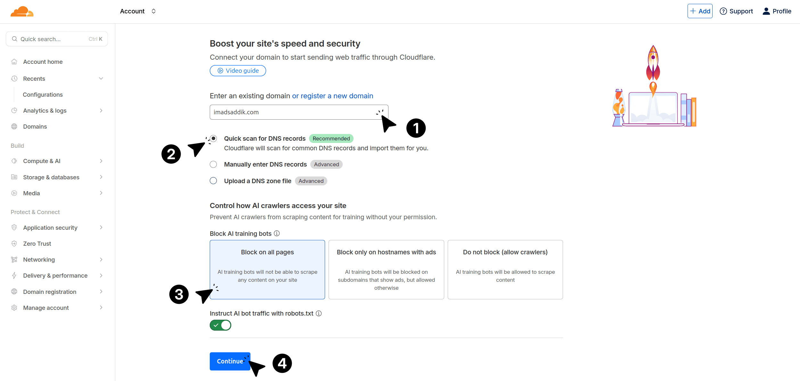
_Add your domain name, block AI training bots, and allow Cloudflare to scan common DNS records._

In the plan selection page, choose the **Free** plan. It includes everything you need for a personal website.

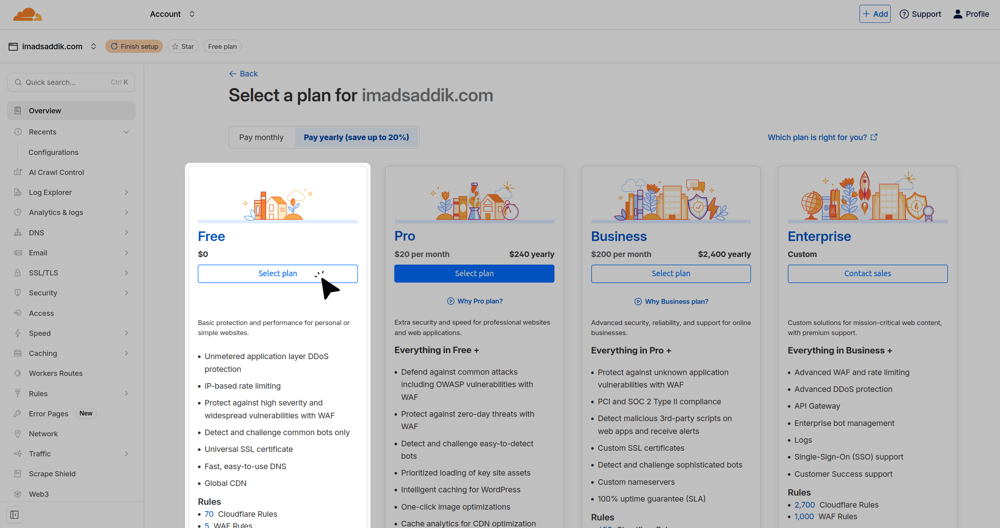
_Select the Free plan, which is sufficient for personal websites and side projects._

#### Review and proxy your DNS records

The next screen is very important. Cloudflare will list the DNS records it found. You need to verify their proxy status.

- **Web traffic (A and CNAME records):** Ensure the proxy status is toggled on. You should see an **orange cloud**. This tells Cloudflare to intercept the traffic, cache your files, and hide your server's real IP address from the public.
- **Email traffic (MX and TXT records):** If you have records for email, they must be set to "DNS only" with a **gray cloud**. Cloudflare proxies HTTP and HTTPS web traffic, not email traffic. If you proxy your mail records, your email will stop working.

Finally, look for the **NS (Nameserver)** records pointing to `porkbun.com`. You must delete these from the list because you are about to replace them.

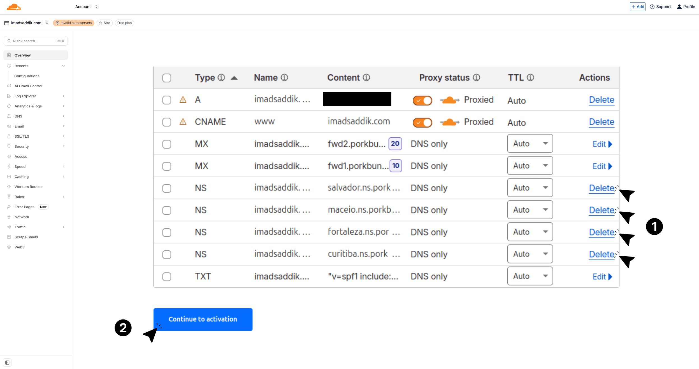
_Review the DNS records. Make sure your A and CNAME records are proxied (orange cloud), and delete any NS records pointing to your old registrar._

#### Hand over DNS authority

To make Cloudflare your CDN, you must hand over control of your DNS routing. Cloudflare will provide you with two new nameservers (for example, `paige.ns.cloudflare.com` and `yevgen.ns.cloudflare.com`).

To do this, head over to your Porkbun dashboard and locate your domain. Hover over it and click the **NS** label to open your nameserver settings. A popup will appear showing the default Porkbun nameservers. Go ahead and delete all of them.

Next, paste the two new Cloudflare nameservers you just received, making sure you put each one on a separate line. Finally, hit **Submit** to apply your changes.

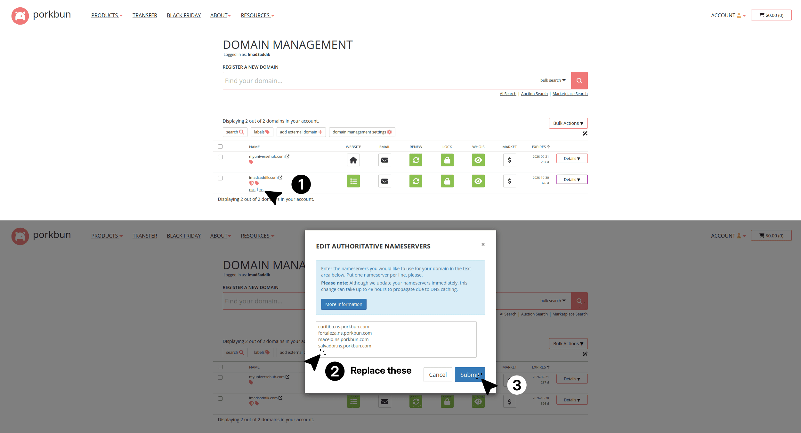
_Delete the old nameservers and replace them with the new ones provided by Cloudflare._

Return to the Cloudflare dashboard and click **Continue**.

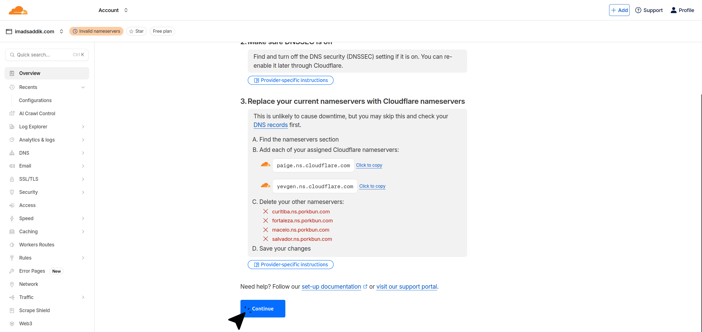
_After updating the nameservers, click "Continue" to let Cloudflare verify the changes._

You will arrive at the overview page. Click the **Check nameservers now** button. DNS changes take time to propagate across the internet. This process usually finishes in a few minutes, but it can occasionally take up to an hour.

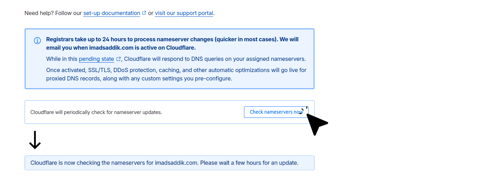
_Click "Check nameservers now" to verify that Cloudflare has taken control of your DNS. This may take a few minutes to complete._

### Configure SSL/TLS encryption mode

While you wait for the nameservers to propagate, you must configure Cloudflare's encryption mode. **Do not skip this step!** If you forget to do this, your website will get stuck in an infinite loop and crash with a [Too Many Redirects](https://developers.cloudflare.com/ssl/troubleshooting/too-many-redirects/) error.

In the Cloudflare dashboard, locate **SSL/TLS** in the left sidebar and click on **Overview**.

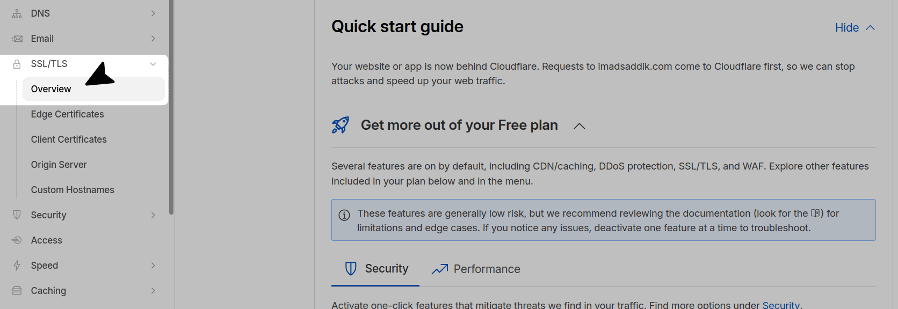
_Click on "SSL/TLS" in the left sidebar, then select "Overview" to access the encryption settings._

On this page, you will see a few different encryption modes. Select the **Full (strict)** option.

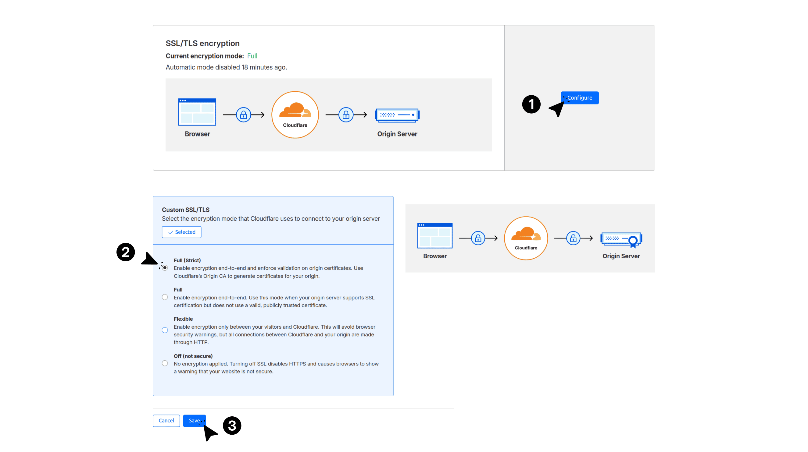
_Choose the "Full (strict)" encryption mode to ensure end-to-end encryption between users, Cloudflare, and your origin server._

**Why Full (strict)?** Because in the previous chapter, you already went through the effort of installing a valid Let's Encrypt certificate on your Nginx server.

This strict setting tells Cloudflare to encrypt the connection from the user's browser to Cloudflare, and then strictly verify your Let's Encrypt certificate before passing the traffic to your server. It guarantees true end-to-end encryption.
