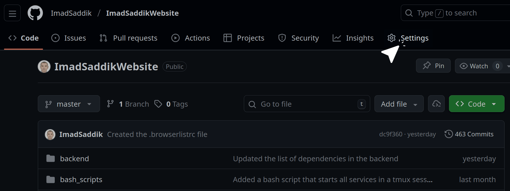
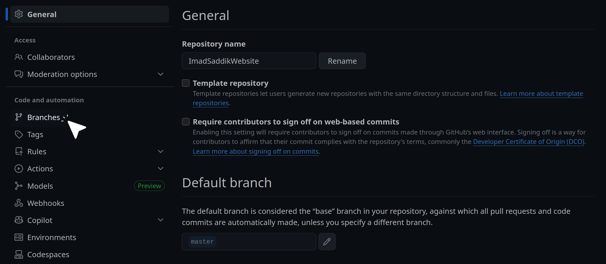
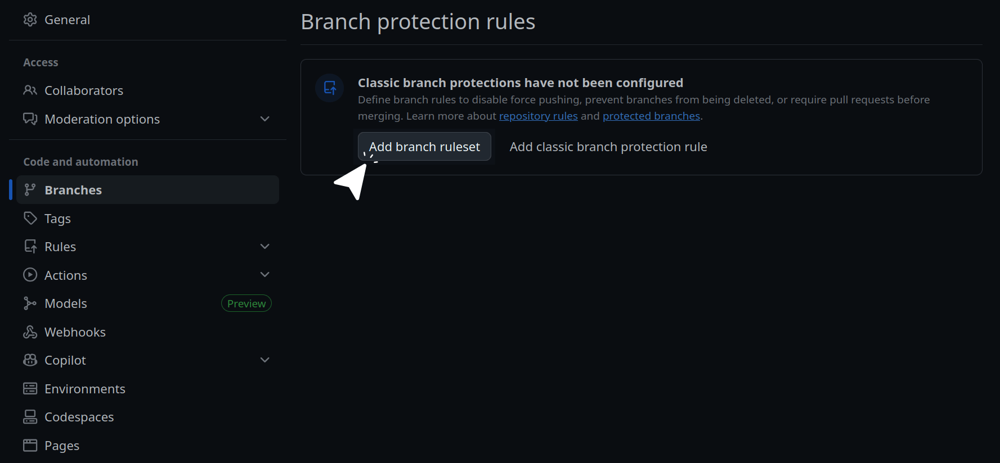
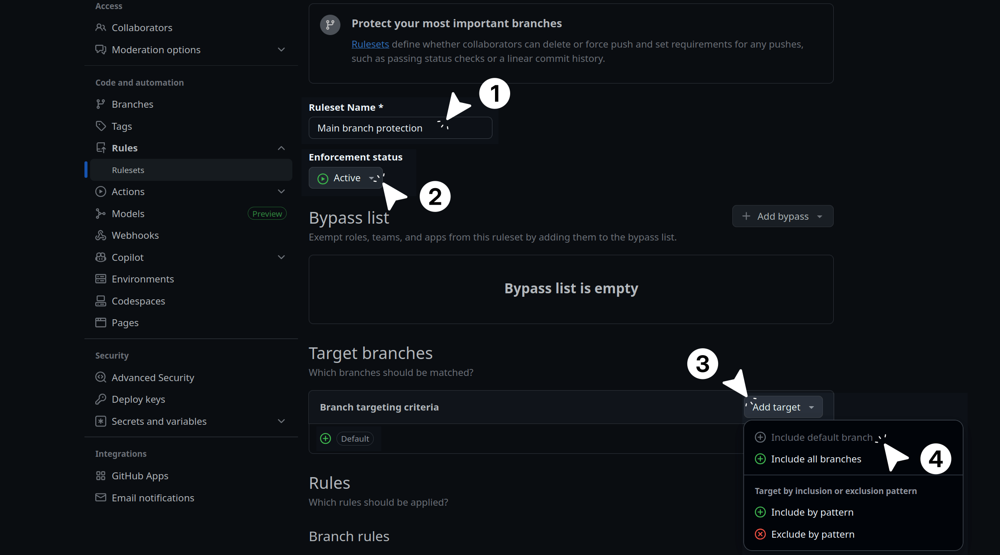
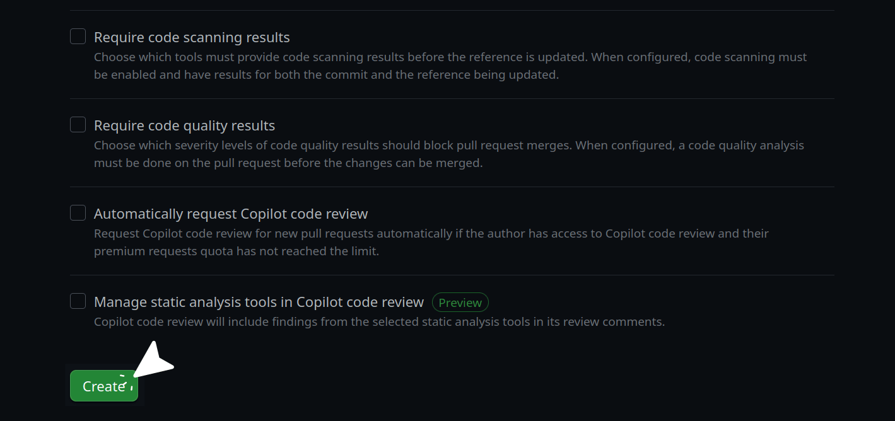

# Module 5: The automation pipeline

## Local hygiene

### Introduction

In the previous modules, you deployed your application manually. While this is a perfect way to understand how a Linux server works under the hood, doing it every time you write new code is tedious and risky. In this module, you will shift from manual server management to a continuous integration and continuous delivery (CI/CD) pipeline.

However, before you automate anything in the cloud, you must secure your local workflow. Catching a bug or a formatting error on your laptop takes seconds; catching it after it has been deployed to a server can take much longer to fix.

In this subchapter, we will focus on enforcing code quality at the source. This starts with protecting your primary branches and setting up [pre-commit hooks](https://pre-commit.com/) to automatically format your code before a commit is even created.

### Protect the default branch

Since you will be pushing code from your `main` or `master` branch, you should set up branch protection. This is an important practice to ensure broken code doesn't make its way into production by mistake.

If your repository is public, you can secure a branch on GitHub for free. To begin, open your repository and click the **Settings** tab.


_Click the **Settings** tab in your GitHub repository._

Look for the "Code and automation" section in the left sidebar and click **Branches**.


_Click the **Branches** option under the **Code and automation** section._

Click **Add branch ruleset**. This feature allows you to define safety rules for your important branches. It controls how code is merged, ensuring you cannot accidentally delete the branch or push unreviewed code.


_Click the **Add branch ruleset** button._

Give your ruleset a descriptive name like `Main branch protection` and set the **Enforcement status** to **Active**. Under the **Target branches** section, click **Add target** and select **Include default branch**. This ensures the rules apply specifically to your `main` or `master` branch.


_Give your ruleset a name, activate it, and select the default branch as the target._

In the **Branch rules** section, enable the following settings:

- **Restrict deletions**: Prevents anyone (including you) from accidentally deleting the `main` branch.
- **Block force pushes**: Disables `git push --force`. This is critical, as force pushing rewrites history and can permanently erase past commits.
- **Require a pull request before merging**: Set the **Required approvals** to `0`.

> [!NOTE]
> Setting required approvals to `0` is a good strategy for solo developers. It forces you to open a pull request, which builds a great habit and documents your project history, but it lets you merge it yourself immediately without waiting for a second person to approve it. If you are working on a team, you would set this to 1 or 2.

Click the **Create** button to save your ruleset.


_Select the essential protection rules and click **Create**._

To test if the ruleset is active, try to push a commit directly to your main branch from your terminal. You should get a rejection error from GitHub that looks something like this:

```text
remote: error: GH013: Repository rule violations found for refs/heads/master.
remote:
remote: - Changes must be made through a pull request.
remote:
To https://github.com/ImadSaddik/ImadSaddikWebsite.git
! [remote rejected] master -> master (push declined due to repository rule violations)
error: failed to push some refs to 'https://github.com/ImadSaddik/ImadSaddikWebsite.git'
```

This means your lock is working perfectly. From now on, you will create a new branch for your features, commit your work there, and open a pull request to merge it into the main branch.

### Catch errors early with pre-commit hooks

You have locked the door to your main branch, but you still need a gatekeeper to check what goes into your local commits.

Git has a built-in feature called [hooks](https://git-scm.com/book/en/v2/Customizing-Git-Git-Hooks). These are hidden scripts that run automatically when you perform actions like committing or pushing code. However, writing and managing custom shell scripts for every single developer on a project is a nightmare.

This is where the [pre-commit](https://pre-commit.com/) framework comes in. It is a tool that manages these hooks for you. Instead of writing complex bash scripts, you just create a simple YAML configuration file. The framework reads this file, downloads the necessary tools, and runs them against your code right before a commit is created.

If your code has syntax errors, messy formatting, or unused variables, the hook blocks the commit entirely. This forces you to fix the issues locally, keeping your Git history clean and saving your cloud CI/CD pipeline from wasting time on simple typos.

### Configure the hooks

Create a file named `.pre-commit-config.yaml` in the root directory of your project. You are going to build this configuration step by step to cover both the Python backend and the Vue.js frontend.

First, let's configure the backend hooks. You will use a tool called [Ruff](https://docs.astral.sh/ruff/). Ruff is a modern, blazingly fast Python linter and formatter. It replaces older tools like Flake8, Black, and isort.

> [!TIP]
> The `rev` value in the configuration specifies the exact version of the tool you are installing. By the time you read this guide, newer versions of Ruff or ESLint will likely be available. It is always best practice to check their respective GitHub repositories and use the latest stable releases instead of strictly copying the version numbers shown below.

Add this block to your file:

```yaml
repos:
  - repo: https://github.com/astral-sh/ruff-pre-commit
    rev: "v0.15.12"
    hooks:
      - id: ruff
        name: ruff (lint)
        args: [--fix]
        files: ^backend/
      - id: ruff-format
        name: ruff (format)
        files: ^backend/
```

Here is what is happening:

- The `ruff` hook acts as a linter. By passing the `--fix` argument, you are telling Ruff not just to find errors, but to actively fix the ones it knows how to solve (like removing unused imports).
- The `ruff-format` hook enforces a strict visual style, ensuring your spacing and line lengths are perfectly consistent.
- The `files: ^backend/` line is important. It tells the framework to only run these Python tools on files inside your backend folder.

Next, you need to handle the frontend. You will use **ESLint** to catch logic bugs in your JavaScript and Vue files, and **Prettier** to handle the visual formatting.

Append this configuration to the same file:

```yaml
  - repo: https://github.com/pre-commit/mirrors-eslint
    rev: "v9.39.1"
    hooks:
      - id: eslint
        name: eslint (frontend)
        files: ^frontend/.*\.(js|vue)$
        types: [file]
        args: [--fix, --config, frontend/eslint.config.js]
        additional_dependencies:
          - eslint@9.39.1
          - eslint-plugin-vue@10.6.2
          - eslint-config-prettier@10.1.8
          - globals@16.5.0
          - vue-eslint-parser@10.2.0

  - repo: local
    hooks:
      - id: prettier-frontend
        name: prettier (frontend)
        entry: npx prettier --write
        language: node
        language_version: system
        files: ^frontend/.*\.(js|vue|css|scss|html|json)$
        types_or: [javascript, vue, css, scss, html, json]
```

This section introduces a few advanced concepts:

- **Targeted arguments**: The ESLint hook uses the `--config` argument to point directly to your frontend's specific ESLint configuration file.
- **Additional dependencies**: Because ESLint needs to understand Vue's custom `.vue` file structure, you must explicitly provide plugins like `eslint-plugin-vue` and `vue-eslint-parser` so the hook runs correctly in its isolated environment.
- **The local repository**: Notice that Prettier is listed as a `local` repository instead of a GitHub URL. Sometimes, relying on the Node.js tools already installed on your system is much faster and more reliable than making the framework download a fresh copy. This hook simply runs `npx prettier --write` directly on your frontend assets.

Your complete `.pre-commit-config.yaml` file should now contain both the Python and JavaScript blocks perfectly integrated.
