# Module 5: The automation pipeline

## Local hygiene

### Introduction

In the previous modules, you deployed your application manually. While this is a perfect way to understand how a Linux server works under the hood, doing it every time you write new code is tedious and risky. In this module, you will shift from manual server management to a continuous integration and continuous delivery (CI/CD) pipeline.

However, before you automate anything in the cloud, you must secure your local workflow. Catching a bug or a formatting error on your laptop takes seconds; catching it after it has been deployed to a server can take much longer to fix.

In this subchapter, we will focus on enforcing code quality at the source. This starts with protecting your primary branches and setting up [pre-commit hooks](https://pre-commit.com/) to automatically format your code before a commit is even created.

### Protect the default branch

Since you will be pushing code from your `main` or `master` branch, you should set up branch protection. This is an important practice to prevent broken code from making its way into production by mistake.

If your repository is public, you can secure a branch on GitHub for free. To begin, open your repository and click the **Settings** tab.


_Click the **Settings** tab in your GitHub repository._

Look for the "Code and automation" section in the left sidebar and click **Branches**.


_Click the **Branches** option under the **Code and automation** section._

Click **Add branch ruleset**. This feature allows you to define safety rules for your important branches. It controls how code is merged, ensuring you cannot accidentally delete the branch or push unreviewed code.


_Click the **Add branch ruleset** button._

Give your ruleset a descriptive name like `Main branch protection` and set the **Enforcement status** to **Active**. Under the **Target branches** section, click **Add target** and select **Include default branch**. This ensures the rules apply specifically to your `main` or `master` branch.


_Give your ruleset a name, activate it, and select the default branch as the target._

In the **Branch rules** section, enable the following settings:

- **Restrict deletions**: Prevents anyone (including you) from accidentally deleting the `main` branch.
- **Block force pushes**: Disables `git push --force`. This is critical, as force pushing rewrites history and can permanently erase past commits.
- **Require a pull request before merging**: Set the **Required approvals** to `0`.

> [!NOTE]
> Setting required approvals to `0` is a good strategy for solo developers. It forces you to open a pull request, which builds a great habit and documents your project history, but it lets you merge it yourself immediately without waiting for a second person to approve it. If you are working on a team, you would set this to 1 or 2.

Click the **Create** button to save your ruleset.


_Select the essential protection rules and click **Create**._

To test if the ruleset is active, try to push a commit directly to your main branch from your terminal. You should get a rejection error from GitHub that looks something like this:

```text
remote: error: GH013: Repository rule violations found for refs/heads/master.
remote:
remote: - Changes must be made through a pull request.
remote:
To https://github.com/ImadSaddik/ImadSaddikWebsite.git
! [remote rejected] master -> master (push declined due to repository rule violations)
error: failed to push some refs to 'https://github.com/ImadSaddik/ImadSaddikWebsite.git'
```

This means your lock is working perfectly. From now on, you will create a new branch for your features, commit your work there, and open a pull request to merge it into the main branch.

### Catch errors early with pre-commit hooks

You have locked the door to your main branch, but you still need a gatekeeper to check what goes into your local commits.

Git has a built-in feature called [hooks](https://git-scm.com/book/en/v2/Customizing-Git-Git-Hooks). These are hidden scripts that run automatically when you perform actions like committing or pushing code. However, writing and managing custom shell scripts for every single developer on a project is a nightmare.

This is where the [pre-commit](https://pre-commit.com/) framework comes in. It is a tool that manages these hooks for you. Instead of writing complex bash scripts, you just create a simple YAML configuration file. The framework reads this file, downloads the necessary tools, and runs them against your code right before a commit is created.

If your code has syntax errors, messy formatting, or unused variables, the hook blocks the commit entirely. This forces you to fix the issues locally, keeping your Git history clean and saving your cloud CI/CD pipeline from wasting time on simple typos.

### Configure the hooks

Create a file named `.pre-commit-config.yaml` in the root directory of your project. You are going to build this configuration step by step to cover both the Python backend and the Vue.js frontend.

First, let's configure the backend hooks. You will use a tool called [Ruff](https://docs.astral.sh/ruff/). Ruff is a modern, blazingly fast Python linter and formatter. It replaces older tools like Flake8, Black, and isort.

> [!TIP]
> The `rev` value in the configuration specifies the exact version of the tool you are installing. By the time you read this guide, newer versions of Ruff or ESLint will likely be available. It is always best practice to check their respective GitHub repositories and use the latest stable releases instead of strictly copying the version numbers shown below.

Add this block to your file:

```yaml
repos:
  - repo: https://github.com/astral-sh/ruff-pre-commit
    rev: "v0.15.12"
    hooks:
      - id: ruff
        name: ruff (lint)
        args: [--fix]
        files: ^backend/
      - id: ruff-format
        name: ruff (format)
        files: ^backend/
```

Here is what is happening:

- The `ruff` hook acts as a linter. By passing the `--fix` argument, you are telling Ruff not just to find errors, but to actively fix the ones it knows how to solve (like removing unused imports).
- The `ruff-format` hook enforces a strict visual style, ensuring your spacing and line lengths are perfectly consistent.
- The `files: ^backend/` line is important. It tells the framework to only run these Python tools on files inside your backend folder.

Next, you need to handle the frontend. You will use **ESLint** to catch logic bugs in your JavaScript and Vue files, and **Prettier** to handle the visual formatting.

Append this configuration to the same file:

```yaml
  - repo: https://github.com/pre-commit/mirrors-eslint
    rev: "v9.39.1"
    hooks:
      - id: eslint
        name: eslint (frontend)
        files: ^frontend/.*\.(js|vue)$
        types: [file]
        args: [--fix, --config, frontend/eslint.config.js]
        additional_dependencies:
          - eslint@9.39.1
          - eslint-plugin-vue@10.6.2
          - eslint-config-prettier@10.1.8
          - globals@16.5.0
          - vue-eslint-parser@10.2.0

  - repo: local
    hooks:
      - id: prettier-frontend
        name: prettier (frontend)
        entry: npx prettier --write
        language: node
        language_version: system
        files: ^frontend/.*\.(js|vue|css|scss|html|json)$
        types_or: [javascript, vue, css, scss, html, json]
```

This section introduces a few advanced concepts:

- **Targeted arguments**: The ESLint hook uses the `--config` argument to point directly to your frontend's specific ESLint configuration file.
- **Additional dependencies**: Because ESLint needs to understand Vue's custom `.vue` file structure, you must explicitly provide plugins like `eslint-plugin-vue` and `vue-eslint-parser` so the hook runs correctly in its isolated environment.
- **The local repository**: Notice that Prettier is listed as a `local` repository instead of a GitHub URL. Sometimes, relying on the Node.js tools already installed on your system is much faster and more reliable than making the framework download a fresh copy. This hook simply runs `npx prettier --write` directly on your frontend assets.

Your complete `.pre-commit-config.yaml` file should now contain both the Python and JavaScript blocks perfectly integrated.

### Install and test the hooks

Your configuration file is complete, but right now, it is just a plain text file. You need to install the pre-commit framework so it can read your YAML file and link those tools to your Git repository.

Open your terminal on your **local computer** (do not SSH into your DigitalOcean droplet for this step). Ensure you are in the root directory of your project and activate your Python virtual environment.

```bash
# Create a virtual environment if you haven't already
python3 -m venv venv

# Activate it
source venv/bin/activate
```

Install the pre-commit package using `pip`.

```bash
pip install pre-commit
```

Next, tell the framework to read your `.pre-commit-config.yaml` file and install the hooks into your hidden `.git` directory.

```bash
pre-commit install
```

When you run this, the framework places a small script inside `.git/hooks/pre-commit`. This script acts as a trigger: from now on, whenever you type `git commit`, this script will intercept the commit process and run your linters and formatters first.

To verify that everything is working properly, you should manually trigger the hooks across your entire project right now.

```bash
pre-commit run --all-files
```

The first time you run this, it will take a minute or two because the framework has to download Ruff, ESLint, and the Node.js dependencies. Once it finishes, it will scan your files and output a checklist.

The output in your terminal should look similar to this:

```text
ruff (lint)........................................................Passed
ruff (format)......................................................Passed
eslint (frontend)..................................................Passed
prettier (frontend)................................................Passed
```

If a check fails, the framework will block the commit. It will often fix the formatting automatically for you, but you still need to stage the new changes (`git add .`) and run the commit command again.

### The emergency bypass

Pre-commit hooks are strict, which keeps your codebase clean. However, there might be a rare emergency where you absolutely must commit your code immediately, even if a linter is failing (for example, if you need to save a broken, work-in-progress state to a separate branch before switching tasks).

You can bypass the hooks entirely by adding the `--no-verify` flag to your commit command.

```bash
git commit -m "WIP: saving a broken state" --no-verify
```

Use this flag sparingly. Bypassing your local hygiene means those errors will be caught later by your cloud CI/CD pipeline, forcing you to fix them anyway.

### What is next?

Your local environment is now fully secure. By protecting your main branch and enforcing local pre-commit hooks, you have guaranteed that messy formatting and basic syntax errors never make it into your permanent Git history.

However, local checks only run on your specific laptop. To ensure absolute code quality, you need an isolated environment to verify the code automatically.

In the next subchapter, **Chapter 5.2: Continuous Integration**, you will take this automation to the cloud. You will configure [GitHub Actions](https://github.com/features/actions) to run these exact linting checks, alongside your unit tests, ensuring that no pull request can be merged unless the code passes all checks.

## Continuous integration & unit tests

### Introduction

In the previous subchapter, you locked down your local workflow. You set up branch protection and pre-commit hooks to catch formatting issues and simple bugs before they even leave your computer.

However, local checks have a limitation. They only run on your specific machine. If a teammate bypasses the hooks, or if your laptop has a different software version than your production server, broken code can still make its way into your repository.

[Continuous Integration (CI)](https://en.wikipedia.org/wiki/Continuous_integration) solves this problem. A CI pipeline automatically spins up a fresh, isolated computer in the cloud every time you push code. It downloads your repository, installs the exact dependencies required, and runs your quality checks from scratch. If any check fails, the pipeline blocks the pull request and prevents the bad code from merging into your master branch.

In this subchapter and the upcoming ones, you will learn how to implement these CI workflows using [GitHub Actions](https://github.com/features/actions).

### Building a modular architecture

Before writing the pipeline, we need to design a solid structure.

Many developers make the mistake of putting their entire CI/CD process into one massive file. When a step fails in a giant file, finding the exact error in the logs is frustrating.

Instead, you will use [reusable workflows](https://docs.github.com/en/actions/how-tos/reuse-automations/reuse-workflows). GitHub Actions allows you to write small, focused configuration files that handle one specific job (like linting the frontend). You can then use the `workflow_call` trigger to allow a main orchestrator file to call these smaller files when needed.

This keeps your code organized, makes your logs highly readable, and allows you to easily plug new jobs into your pipeline later.

### Linting and formatting in the cloud

First, you will mirror the same checks you configured in your local pre-commit hooks. This guarantees that the cloud environment holds your code to the same strict standards as your local machine.

#### The frontend workflow

Create a new file at `.github/workflows/frontend-lint-format-check.yml` and paste the following configuration:

```yaml
name: Frontend lint & format

on:
  workflow_call:

jobs:
  lint-format:
    name: Lint & format
    runs-on: ubuntu-latest
    defaults:
      run:
        working-directory: ./frontend
    steps:
      - name: Check out repository
        uses: actions/checkout@v6

      - name: Set up pnpm
        uses: pnpm/action-setup@v6
        with:
          version: "11"

      - name: Set up Node.js
        uses: actions/setup-node@v6
        with:
          node-version: "22"
          cache: "pnpm"
          cache-dependency-path: frontend/pnpm-lock.yaml

      - name: Install dependencies
        run: pnpm install

      - name: Run ESLint
        run: pnpm run lint

      - name: Check Prettier formatting
        run: pnpm run format:check
```

If you have never written a GitHub Actions workflow before, the syntax might look a bit unfamiliar. Let's break down the anatomy of this file so you understand exactly what it is doing.

```yaml
name: Frontend lint & format
```

This is the name of the workflow. It will appear in your GitHub repository's Actions tab, and it will be displayed in the logs when this workflow runs.

```yaml
on:
  workflow_call:
```

This tells GitHub that this file is a reusable template, not a standalone script. It will sit quietly until your main CI pipeline explicitly calls it to run.

```yaml
jobs:
  lint-format:
    name: Lint & format
```

This defines a job named `lint-format`. A workflow can have multiple jobs, and each job can run on a different machine with different configurations. By giving it a descriptive name, you can easily identify it in the logs.

```yaml
runs-on: ubuntu-latest
defaults:
  run:
    working-directory: ./frontend
```

GitHub spins up a fresh, isolated Linux machine (`ubuntu-latest`) just for this job. The `defaults` block tells the server to automatically run all subsequent commands inside the `./frontend` directory. This saves you from having to type `cd frontend` before every single step.

```yaml
steps:
  - name: Check out repository
  - name: Set up pnpm
  - name: Set up Node.js
  - name: Install dependencies
  - name: Run ESLint
  - name: Check Prettier formatting
```

A job is a series of steps. Each step is a single task that contributes to the overall job. The steps are executed in order, and if any step fails, the entire job fails.

```yaml
- name: Check out repository
  uses: actions/checkout@v6

- name: Install dependencies
  run: pnpm install
```

Notice that we use two keywords in the `steps` list: `uses` and `run`.

- `uses`: This tells the server to execute a pre-built community script. Instead of writing custom code to download your repository, you use the official `actions/checkout@v6` action. We also use community actions to safely install `Node.js` and `pnpm`.
- `run`: This acts exactly like typing a command into your own terminal.

```yaml
- name: Set up Node.js
  uses: actions/setup-node@v6
  with:
    node-version: "22"
    cache: "pnpm"
    cache-dependency-path: frontend/pnpm-lock.yaml
```

Notice the caching configuration inside the Node.js setup block. By telling GitHub to cache `pnpm`, the runner saves a hidden copy of your downloaded packages.

On future runs, it will reuse those packages instead of downloading them from scratch over the internet. This significantly cuts your pipeline execution time.

#### The backend workflow

Next, create the backend equivalent at `.github/workflows/backend-lint-format-check.yml`:

```yaml
name: Backend lint & format

on:
  workflow_call:

jobs:
  lint-format:
    name: Lint & format
    runs-on: ubuntu-latest
    defaults:
      run:
        working-directory: ./backend
    steps:
      - name: Check out repository
        uses: actions/checkout@v6

      - name: Set up Python
        uses: actions/setup-python@v6
        with:
          python-version: "3.13"
          cache: "pip"

      - name: Install Ruff
        run: pip install ruff==0.14.6

      - name: Run Ruff linter
        run: ruff check .

      - name: Run Ruff formatter check
        run: ruff format . --check
```

Because you already understand the anatomy of a workflow, reading this file is straightforward. It uses the same structure as the frontend, but swaps out the tools:

- **Python setup:** It uses `actions/setup-python@v6` to install Python 3.13.
- **Pip caching:** Instead of caching `pnpm`, it tells GitHub to cache `pip`. This stores your downloaded Python packages to speed up future runs.
- **Ruff execution:** Instead of installing dependencies from a `requirements.txt` file, it installs the Ruff package directly and runs the linting and formatting checks using the `run` command.

### Running unit tests

When you add tests to a CI pipeline, you can treat them like a black box. GitHub Actions does not care if you use Vitest, Jest, or Pytest. It only cares about the final exit code.

When the runner executes your test command, your testing framework reports back to the operating system. If every test passes, it returns a `0` (Success). If a single test fails, it returns a `1` (Error), which instantly stops the pipeline and prevents the broken code from merging.

> [!NOTE]
> This handbook will not teach you how to write unit tests for your specific application. Our focus is strictly on the infrastructure and the deployment pipeline. You only need to know how to plug your testing suite into the orchestrator.

#### The frontend workflow

Create a new file at `.github/workflows/frontend-unit-tests.yml` and paste the following configuration:

```yaml
name: Frontend unit tests

on:
  workflow_call:

jobs:
  tests:
    name: Run unit tests
    runs-on: ubuntu-latest
    defaults:
      run:
        working-directory: ./frontend
    steps:
      - name: Check out repository
        uses: actions/checkout@v6

      - name: Set up pnpm
        uses: pnpm/action-setup@v6
        with:
          version: "11"

      - name: Set up Node.js
        uses: actions/setup-node@v6
        with:
          node-version: "22"
          cache: "pnpm"
          cache-dependency-path: frontend/pnpm-lock.yaml

      - name: Install dependencies
        run: pnpm install

      - name: Run unit tests
        run: pnpm run test:coverage
```

This workflow checks out the code, sets up the Node.js environment with `pnpm` caching, and installs your dependencies.

The only new step is the final command: `run: pnpm run test:coverage`. This executes the testing script defined in your `package.json` file. If the tests pass, GitHub Actions moves on to the next job in your pipeline. If they fail, the pipeline stops immediately.

#### The backend workflow

Create the backend equivalent at `.github/workflows/backend-unit-tests.yml`:

```yaml
name: Backend unit tests

on:
  workflow_call:

jobs:
  tests:
    name: Run unit tests
    runs-on: ubuntu-latest
    defaults:
      run:
        working-directory: ./backend
    steps:
      - name: Check out repository
        uses: actions/checkout@v6

      - name: Set up Python
        uses: actions/setup-python@v6
        with:
          python-version: "3.13"
          cache: "pip"

      - name: Install dependencies
        run: pip install -r requirements.txt

      - name: Run unit tests
        run: pytest tests/unit --tb=short
```

Like the frontend file, this workflow checks out the code, sets up Python with `pip` caching, and installs your dependencies from `requirements.txt`.

The most important part is the final step: `run: pytest tests/unit --tb=short`. This executes your Python test suite. We use the `--tb=short` flag because default Python error tracebacks can be massive.

When a test fails in the cloud, scrolling through hundreds of lines of logs in the GitHub Actions interface is frustrating. This flag shortens the output, highlighting exactly which line of code failed so you can fix it and get the pipeline moving again.

### The orchestrator

You now have four isolated, reusable workflows. It is time to tie them all together using a master file.

Create a file named `ci.yml` directly inside `.github/workflows/` (this is the file GitHub will monitor).

```yaml
name: CI pipeline

on:
  push:
    branches: [master]
  pull_request:
    branches: [master]
  workflow_dispatch:

jobs:
  frontend-lint-format-check:
    name: Frontend lint
    uses: ./.github/workflows/frontend-lint-format-check.yml

  backend-lint-format-check:
    name: Backend lint
    uses: ./.github/workflows/backend-lint-format-check.yml

  frontend-unit-tests:
    name: Frontend tests
    needs: frontend-lint-format-check
    uses: ./.github/workflows/frontend-unit-tests.yml

  backend-unit-tests:
    name: Backend tests
    needs: backend-lint-format-check
    uses: ./.github/workflows/backend-unit-tests.yml

  pipeline-success:
    name: Pipeline success
    needs:
      [
        frontend-lint-format-check,
        backend-lint-format-check,
        frontend-unit-tests,
        backend-unit-tests,
      ]
    runs-on: ubuntu-latest
    if: always()
    steps:
      - name: Pipeline succeeded
        if: "!contains(needs.*.result, 'failure') && !contains(needs.*.result, 'cancelled')"
        run: echo "All checks passed successfully!"
      - name: Pipeline failed
        if: contains(needs.*.result, 'failure') || contains(needs.*.result, 'cancelled')
        run: |
          echo "Some checks failed or were cancelled."
          exit 1
```

Let's break down how this master file orchestrates your pipeline.

```yaml
on:
  push:
    branches: [master]
  pull_request:
    branches: [master]
  workflow_dispatch:
```

This tells GitHub to run the pipeline automatically when you open a pull request against the `master` branch, or when code is successfully merged into it.

The `workflow_dispatch` line is a handy addition; it adds a manual "Run" button to the GitHub Actions interface so you can trigger the pipeline yourself if needed.

```yaml
frontend-lint-format-check:
  name: Frontend lint
  uses: ./.github/workflows/frontend-lint-format-check.yml
```

Instead of writing all the installation and testing steps here, you use the `uses` keyword to point to the local YAML files you created earlier. This keeps your orchestrator clean and easy to read.

```yaml
frontend-unit-tests:
  name: Frontend tests
  needs: frontend-lint-format-check
  uses: ./.github/workflows/frontend-unit-tests.yml
```

By default, GitHub Actions runs all jobs at the exact same time in parallel. The `needs` keyword forces an order of operations.

For example, `frontend-unit-tests` requires `frontend-lint-format-check` to pass first. If the linting step fails, the pipeline immediately cancels the testing step. This saves computing time and gives you faster feedback.

```yaml
pipeline-success:
  name: Pipeline success
  needs: [frontend-lint-format-check, backend-lint-format-check, frontend-unit-tests, backend-unit-tests]
  runs-on: ubuntu-latest
  if: always()
```

This is the most important part of the file. It acts as an aggregator for all the previous jobs. The `if: always()` command forces this final job to run even if the previous jobs crashed.

But how does it actually know if those previous jobs crashed? We check the `needs.*.result` variable, which contains the final status of every job listed in the `needs` array.

```yaml
steps:
  - name: Pipeline succeeded
    if: "!contains(needs.*.result, 'failure') && !contains(needs.*.result, 'cancelled')"
    run: echo "All checks passed successfully!"
  - name: Pipeline failed
    if: contains(needs.*.result, 'failure') || contains(needs.*.result, 'cancelled')
    run: |
      echo "Some checks failed or were cancelled."
      exit 1
```

Let's understand those GitHub Actions expressions:

- `needs.*.result`: The asterisk (`*`) is a wildcard. It grabs the final status (like `success`, `failure`, or `cancelled`) of every single job you listed in the `needs` array.
- `contains(...)`: This scans that list of results. If it finds a `failure` or a `cancelled` job anywhere in the list, the "Pipeline failed" step is triggered.
- `exit 1`: Tells the Linux machine to fail this step, which turns the final check mark red on your GitHub pull request. If it does not find any failures, it echoes the success message.

Make sure to commit all these YAML files and push them to your repository before moving to the final step.

### Seeing the pipeline in action

You have written a lot of YAML. Let's prove that this orchestration actually works.

Create a new branch, make a deliberate mistake in your code, and open a pull request against your `master` branch.

#### The failed pipeline

Because you pushed broken code, your linting or testing job will crash. Watch how the pipeline reacts:

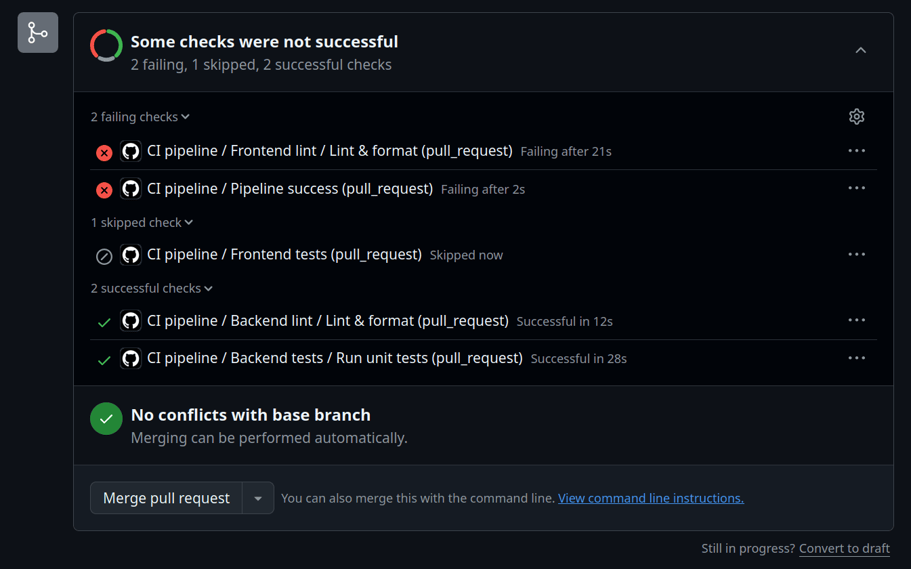
_The pipeline caught the error, but the merge button is still active._

This screenshot proves our logic works perfectly. Notice two things:

- The **Frontend tests** job was skipped entirely. Because it "needs" the linting job to pass first, GitHub saved computing time by stopping the branch early.
- The **Pipeline success** job saw that a previous step failed, so it intentionally triggered an error to clearly mark the whole run as a failure.

However, look closely at the bottom of the pull request. Even though the pipeline failed, the **Merge pull request** button is still active and clickable! This defeats the entire purpose of Continuous Integration. Right now, the pipeline is just giving you a suggestion; it is not actually protecting your code.

#### The successful pipeline

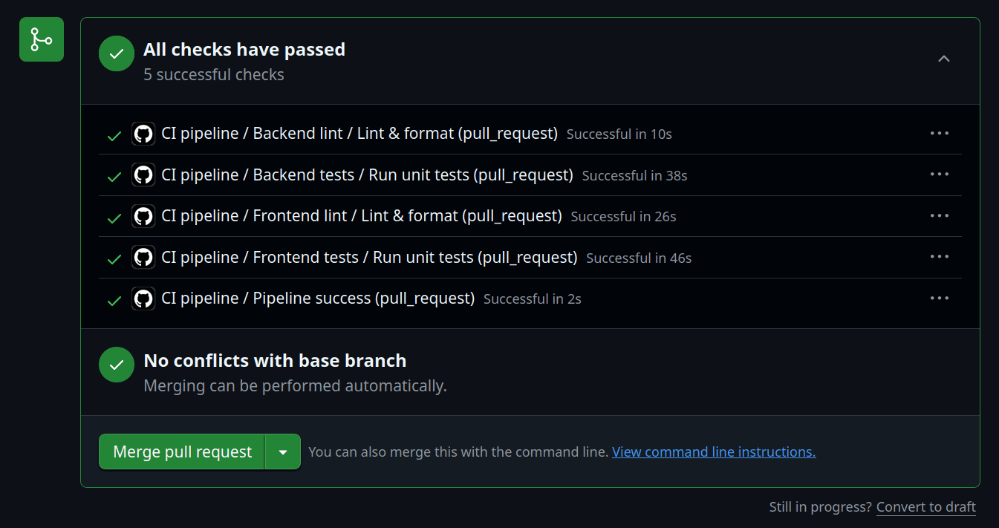
_When the code is fixed, all checks pass successfully._

Now that the code is clean, the pipeline passes. Let's fix that dangerous merge button so that the failed pipeline scenario can never happen again.

### Enforcing status checks on GitHub

Right now, your pipeline reports a green checkmark or a red cross, but you have to tell GitHub to actively block the pull request if that final check fails.

Go to your repository on GitHub and click on the **Settings** tab. In the left sidebar, click on **Rulesets**, then select the branch protection ruleset you created in Chapter 5.1.

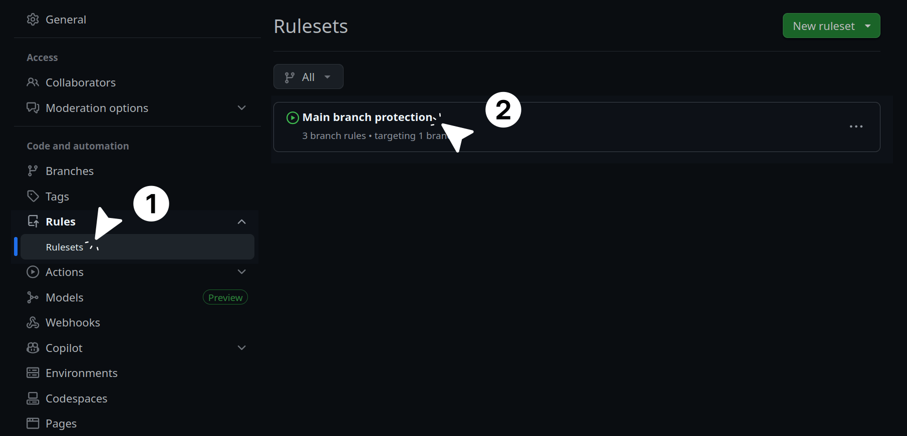
_Navigate to your branch protection ruleset in the GitHub settings._

Scroll down to the **Branch rules** section and check the box that says **Require status checks to pass**.

Click the **Add checks** button and search for **Pipeline success**. Add it to the required list.

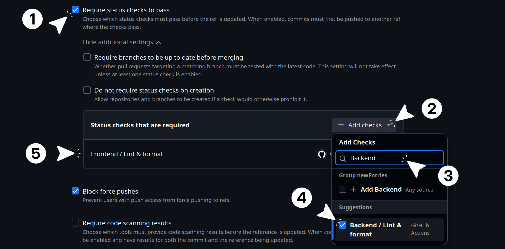
_Enable status checks and add the final pipeline success job as the mandatory requirement._

Click **Save changes** at the bottom of the page.

If you go back to a failed pull request now, you will see that the merge button is grayed out and completely blocked. You cannot merge the code until the pipeline turns green.

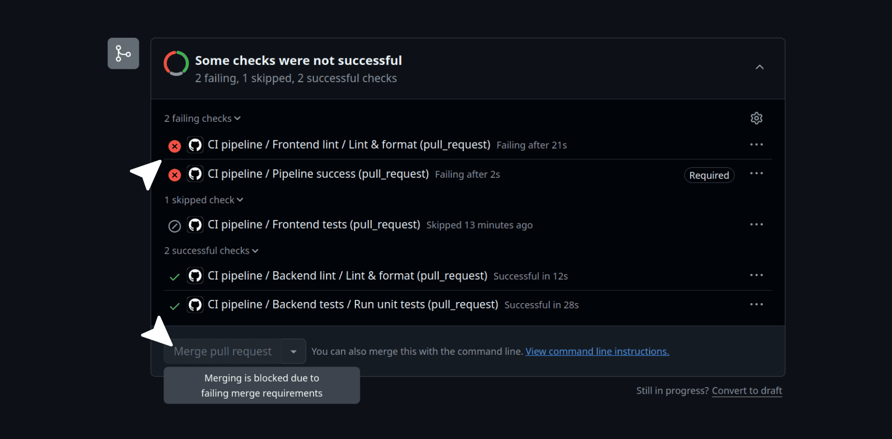
_The pipeline is now actively blocking the merge button when it fails._

By using the `pipeline-success` job as your only required check, you have saved yourself future headaches. As you add new jobs to your CI pipeline in the next chapters (like security scanning or end-to-end tests), you only need to update your `ci.yml` file. You will never have to come back to these GitHub settings to update this list again.

### What is next?

Your pipeline is now actively defending your codebase against formatting errors and broken logic.

In the next subchapter, **Chapter 5.3: Automated security scanning**, you will add security guardrails to your pipeline. You will configure automated tools to audit your third-party dependencies for known vulnerabilities and scan your source code for unsafe practices using [Static Application Security Testing](https://en.wikipedia.org/wiki/Static_application_security_testing) (SAST).

## Automated security scanning

### Introduction

In the previous subchapter, you built a pipeline that guarantees your code is formatted correctly and your logic works as expected. But what happens if your code is perfectly formatted, but fundamentally insecure?

In traditional software development, security testing often happened at the very end of the cycle, right before release. If a critical vulnerability was found, developers had to scramble to rewrite major parts of the application. Today, the industry standard is to **"Shift Left"**. This means moving security checks to the earliest possible point in the development process: the Continuous Integration pipeline.

By shifting left, you catch vulnerabilities within minutes of writing the code, long before it ever reaches a production server. In this subchapter, you will implement two important security guardrails:

- **Software Composition Analysis (SCA):** Auditing the third-party libraries you install for known vulnerabilities.
- **Static Application Security Testing (SAST):** Scanning the code you write yourself for dangerous patterns and security flaws.

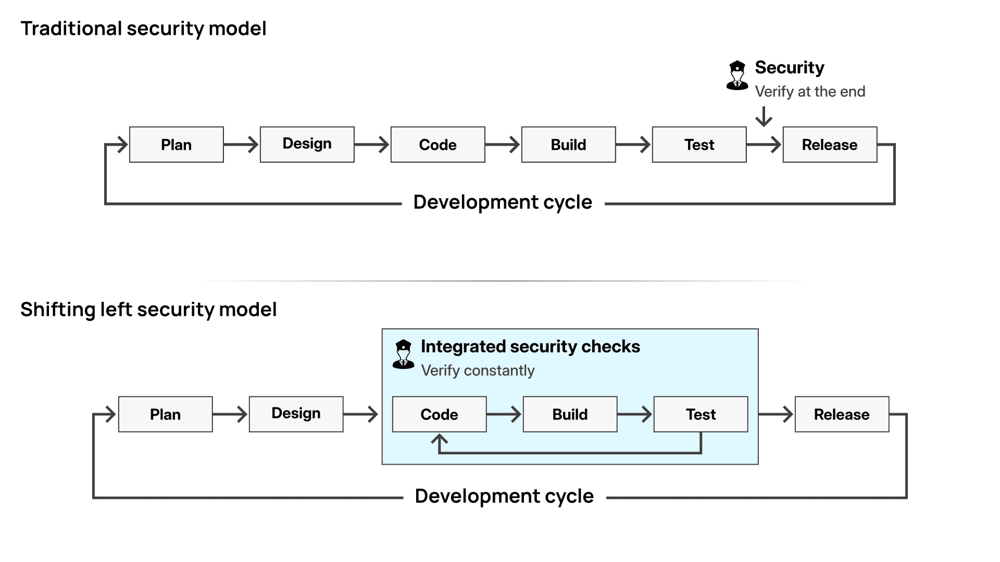
_Shifting security left means finding vulnerabilities during the coding and testing phases, rather than waiting until release._

### Auditing third-party dependencies (SCA)

Modern applications are rarely built entirely from scratch. When you run `pnpm install` or `pip install`, you are downloading hundreds of thousands of lines of code written by other people.

Hackers know this. Instead of trying to break into your specific website, they look for vulnerabilities in popular open-source packages. If they find one, they can compromise thousands of websites at once. Software Composition Analysis (SCA) protects you from this by checking your `package.json` and `requirements.txt` against databases of known vulnerabilities (CVEs).

#### The frontend audit

For the Vue.js frontend, `pnpm` has a built-in audit command. Create a new file at `.github/workflows/frontend-vulnerability-check.yml`:

```yaml
name: Frontend vulnerability check

on:
  workflow_call:

jobs:
  vulnerability-check:
    name: Audit dependencies
    runs-on: ubuntu-latest
    defaults:
      run:
        working-directory: ./frontend
    steps:
      - name: Check out repository
        uses: actions/checkout@v6

      - name: Set up pnpm
        uses: pnpm/action-setup@v6
        with:
          version: "11"

      - name: Set up Node.js
        uses: actions/setup-node@v6
        with:
          node-version: "22"
          cache: "pnpm"
          cache-dependency-path: frontend/pnpm-lock.yaml

      - name: Install dependencies
        run: pnpm install --frozen-lockfile

      - name: Run security audit
        run: pnpm audit
```

This workflow looks very similar to your linting workflow, but notice the `pnpm install --frozen-lockfile` command. This guarantees that the CI server installs the exact versions of the packages defined in your lockfile without accidentally upgrading anything. Finally, it runs `pnpm audit`. If any of your dependencies have a known security flaw, this command will fail and block the pipeline.

> [!NOTE]
> We specifically use pnpm version 11 in this workflow. This version turns on strong supply-chain protection by default. It automatically blocks exotic dependencies and forces a waiting period for newly published packages before they can be resolved, giving you extra security right out of the box.

#### The backend audit

For the FastAPI backend, you will use a dedicated GitHub Action called `gh-action-pip-audit`. Create `.github/workflows/backend-vulnerability-check.yml`:

```yaml
name: Backend vulnerability check

on:
  workflow_call:

jobs:
  vulnerability-check:
    name: Audit dependencies
    runs-on: ubuntu-latest
    defaults:
      run:
        working-directory: ./backend
    steps:
      - name: Check out repository
        uses: actions/checkout@v6

      - name: Set up Python
        uses: actions/setup-python@v6
        with:
          python-version: "3.13"
          cache: "pip"

      - name: Run pip-audit
        uses: pypa/gh-action-pip-audit@v1.1.0
        with:
          inputs: backend/requirements.txt
```

Instead of manually installing dependencies and running a script, we use the official `pypa/gh-action-pip-audit` action. We point it to your `requirements.txt` file, and it cross-references every library you use against the Python vulnerability database.

> [!NOTE]
> If you are using a `pyproject.toml` file instead of `requirements.txt`, set the `inputs` parameter to the **path of your project directory** (e.g., `.` or `backend/`). This allows `pip-audit` to automatically detect and audit dependencies listed in `pyproject.toml`.

### Scanning your source code (SAST)

While auditing dependencies protects you from flaws in other people's code, Static Application Security Testing (SAST) protects you from mistakes in your own code. A SAST tool acts like an automated security auditor, reading through your source code line by line to find dangerous patterns before the application ever runs.

For the Python backend, you will use a popular tool called [bandit](https://github.com/pycqa/bandit). It specifically hunts for common Python security risks, such as hardcoded passwords, weak cryptography, or dangerous uses of the `exec()` function.

Create a new file at `.github/workflows/backend-sast-check.yml`:

```yaml
name: Backend SAST check

on:
  workflow_call:

jobs:
  bandit-check:
    name: Bandit SAST scan
    runs-on: ubuntu-latest
    defaults:
      run:
        working-directory: ./backend
    steps:
      - name: Check out repository
        uses: actions/checkout@v6

      - name: Set up Python
        uses: actions/setup-python@v6
        with:
          python-version: "3.13"
          cache: "pip"

      - name: Install Bandit
        run: pip install bandit

      - name: Run Bandit
        run: bandit -r . -ll
```

This workflow follows the familiar pattern of checking out the code and setting up Python.

The magic happens in the final step: `run: bandit -r . -ll`. Here is what those flags do:

- `-r .` : This tells Bandit to run **recursively**, scanning every single Python file inside the current directory (`./backend`).
- `-ll` : Bandit categorizes vulnerabilities by severity (Low, Medium, and High). Using two "L"s tells the tool to only report **Medium and High** severity issues. This is a great configuration to start with, as it prevents your pipeline from failing due to minor, low-risk warnings (false positives).

If Bandit finds a serious vulnerability, it will print a detailed report in the GitHub Actions log and immediately fail the job, preventing the insecure code from reaching production.

To see this in action, try temporarily adding a deliberate security flaw to your backend. Push a commit that uses a dangerous, outdated cryptography module (like adding `import hashlib; hashlib.md5()` to `main.py`). Push this change to a new test branch and **open a pull request** against your master branch:

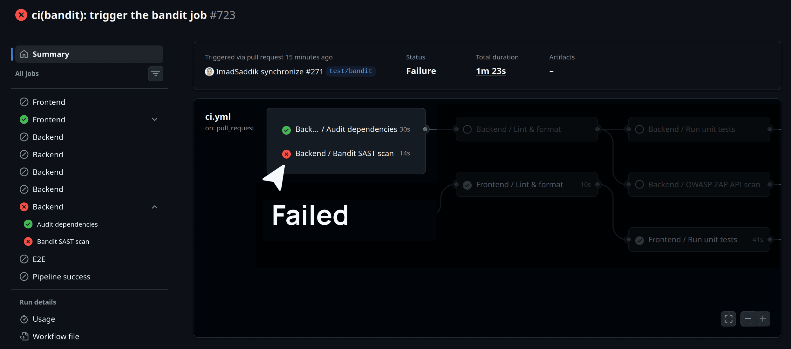
_Bandit automatically detects the weak cryptography pattern and blocks the pipeline._

As you can see, the SAST scan failed because it detected the weak MD5 algorithm. Since this job failed, GitHub Actions immediately halted the workflow. But how did the runner know to skip the formatting and testing jobs? Let's tie it all together by looking at the dependency graph in your master orchestrator.

### Updating the orchestrator

You now have three powerful security workflows ready to go. The final step is to plug them into your main CI pipeline.

Open your `.github/workflows/ci.yml` file. You are going to add the three new security jobs at the very top of your `jobs` list. Then, you are going to update the `needs` array of your existing linting jobs.

Update your file to look like this:

```yaml
# ...

jobs:
  frontend-vulnerability-check:
    name: Frontend vulnerability
    uses: ./.github/workflows/frontend-vulnerability-check.yml

  backend-vulnerability-check:
    name: Backend vulnerability
    uses: ./.github/workflows/backend-vulnerability-check.yml

  backend-sast-check:
    name: Backend SAST
    uses: ./.github/workflows/backend-sast-check.yml

  frontend-lint-format-check:
    name: Frontend lint
    needs: frontend-vulnerability-check
    uses: ./.github/workflows/frontend-lint-format-check.yml

  backend-lint-format-check:
    name: Backend lint
    needs: [backend-vulnerability-check, backend-sast-check]
    uses: ./.github/workflows/backend-lint-format-check.yml

# ...
```

#### The "Fail Fast" strategy

Look closely at the `needs` keywords we just updated. You explicitly told GitHub Actions that `backend-lint-format-check` cannot run until `backend-vulnerability-check` and `backend-sast-check` finish successfully.

This is known in DevOps as a **"Fail Fast"** strategy.

If Bandit discovers that you accidentally hardcoded a database password, or `pip-audit` finds a critical vulnerability in a library you just installed, your code is fundamentally insecure.

There is absolutely no reason to waste server computing time checking if your Python files have the correct indentation. By forcing the pipeline to check security first, you catch critical errors immediately and save compute time.

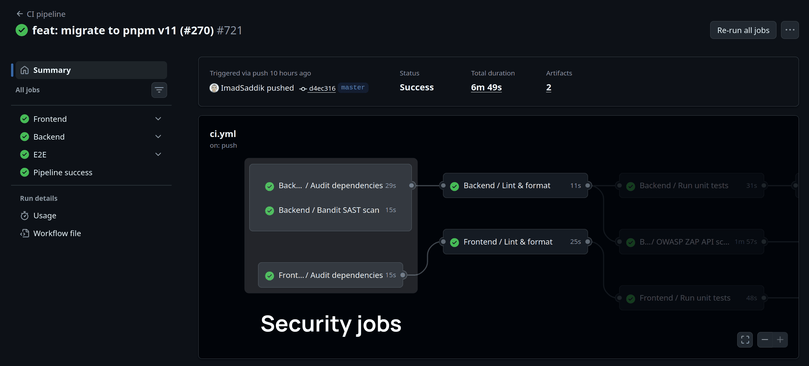
_The visual graph proves the Fail Fast strategy: linting and testing will not start until the security guardrails pass._

From the image above, you can see that the security jobs run first. If any of them fail, the pipeline halts immediately, and the dependent linting and testing jobs are skipped.

#### Update the gatekeeper

Finally, scroll down to the very bottom of your `ci.yml` file and update your `pipeline-success` job. You must add the three new security jobs to the `needs` array so your gatekeeper knows to monitor them:

```yaml
  pipeline-success:
    name: Pipeline success
    needs:
      [
        frontend-vulnerability-check,
        backend-vulnerability-check,
        backend-sast-check,
        frontend-lint-format-check,
        backend-lint-format-check,
        frontend-unit-tests,
        backend-unit-tests,
      ]
    runs-on: ubuntu-latest
    if: always()

# ...
```

Commit and push these changes. If you open a pull request now, you will see your new security checks spin up first to protect your codebase from vulnerabilities before any other checks run.

### What is next?

Your pipeline is now extremely robust. It automatically audits your dependencies, scans your source code for bad practices, enforces strict formatting, and verifies your logic with unit tests. However, all of these checks are "static"; they look at the code while it is sitting still.

In **Chapter 5.4: Advanced testing & DAST**, you will take the pipeline to the next level. You will learn how to start your application inside the CI runner (including the FastAPI backend, the Vue frontend, and a temporary Meilisearch database). Once the app is running, you will execute Playwright End-to-End tests and use OWASP ZAP to dynamically attack your API, proving that your application is secure when it is fully alive.

## Advanced testing & DAST

Up to this point, your pipeline has only looked at static text. It has checked the formatting, scanned for secrets, and run isolated unit tests. However, a modern web application is not a static script; it is a live system of connected services.

In this section, you will bring your application to life inside the GitHub Actions runner. You will start temporary instances of your database, backend, and frontend to show that all the pieces work together well.

To do this, we will follow a clear order. First, you will set up backend integration tests to show that your API can talk to a live Meilisearch database. Next, you will run end-to-end tests with Playwright to simulate a real user clicking through your website. Finally, you will use a dynamic security tool to scan your running application for vulnerabilities.

> [!NOTE]
> This section does not teach you how to write integration tests or end-to-end tests from scratch. Instead, it shows you how to take your existing tests and wire them into an automated pipeline so they run correctly inside GitHub Actions.

### Backend integration tests

Unit tests check individual parts of your code, but integration tests show that your backend can successfully work with other services. For this project, the FastAPI backend relies heavily on Meilisearch to handle search queries. If the backend cannot talk to Meilisearch, the application will not work.

To test this in GitHub Actions, you cannot use a fake database. You need to download the real Meilisearch program, start it up inside the Ubuntu runner, and run your tests against it.

Create a new file at `.github/workflows/backend-integration-tests.yml`:

```yaml
name: Backend integration tests

on:
  workflow_call:

env:
  MEILISEARCH_MASTER_KEY: "aStrongMasterKeyForTestingPurposes"
  MEILISEARCH_URL: "http://localhost:7700"
  MEILISEARCH_INDEX_NAME: "articles_test"
  MEILISEARCH_DOWNLOAD_MAX_RETRIES: "3"
  MEILISEARCH_DOWNLOAD_RETRY_DELAY: "5"

jobs:
  tests:
    name: Run integration tests
    runs-on: ubuntu-latest
    defaults:
      run:
        working-directory: ./backend
    steps:
      - name: Check out repository
        uses: actions/checkout@v6

      - name: Set up Python
        uses: actions/setup-python@v6
        with:
          python-version: "3.13"
          cache: "pip"

      - name: Install dependencies
        run: pip install -r requirements-dev.txt

      - name: Download Meilisearch binary
        run: |
          MAX_RETRIES="${MEILISEARCH_DOWNLOAD_MAX_RETRIES}"
          RETRY_DELAY="${MEILISEARCH_DOWNLOAD_RETRY_DELAY}"
          for i in $(seq 1 $MAX_RETRIES); do
            echo "Attempt $i of $MAX_RETRIES to download Meilisearch..."
            if curl -L https://install.meilisearch.com | sh; then
              echo "Meilisearch downloaded successfully!"
              chmod +x meilisearch
              break
            else
              if [ $i -lt $MAX_RETRIES ]; then
                echo "Download failed. Retrying in $RETRY_DELAY seconds..."
                sleep $RETRY_DELAY
              else
                echo "Download failed after $MAX_RETRIES attempts"
                exit 1
              fi
            fi
          done

      - name: Start Meilisearch
        run: |
          ./meilisearch --master-key="${MEILISEARCH_MASTER_KEY}" &
          echo "Waiting for Meilisearch to start..."
          for i in {1..30}; do
            if curl -s http://localhost:7700/health | grep -q "available"; then
              echo "Meilisearch is ready!"
              break
            fi
            echo "Attempt $i: Meilisearch not ready yet..."
            sleep 1
          done
          if ! curl -s http://localhost:7700/health | grep -q "available"; then
            echo "Meilisearch failed to start after 30 attempts"
            exit 1
          fi

      - name: Run integration tests
        run: pytest tests/integration --tb=short -v
        env:
          MEILISEARCH_URL: ${{ env.MEILISEARCH_URL }}
          MEILISEARCH_MASTER_KEY: ${{ env.MEILISEARCH_MASTER_KEY }}
          MEILISEARCH_INDEX_NAME: ${{ env.MEILISEARCH_INDEX_NAME }}
```

Let's break down the new concepts in this workflow. The first few steps are exactly the same as your other backend jobs: checking out the code, setting up Python, and installing dependencies.

But after that, the workflow changes. Because integration tests need a real database, we have to build that environment from scratch.

```yaml
- name: Download Meilisearch binary
  run: |
    MAX_RETRIES="${MEILISEARCH_DOWNLOAD_MAX_RETRIES}"
    # ... retry loop logic ...
      if curl -L https://install.meilisearch.com | sh; then
```

First, we use `curl` to download the Meilisearch program directly into the Ubuntu runner. Notice the bash retry loop wrapped around it. CI runners share network bandwidth, and sometimes downloads fail. Adding a loop protects your pipeline from temporary network drops so your workflow does not fail by mistake.

```yaml
- name: Start Meilisearch
  run: |
    ./meilisearch --master-key="${MEILISEARCH_MASTER_KEY}" &
```

This is an important detail. Notice the ampersand (`&`) at the end of the command. This tells the Ubuntu machine to start the database in the background. If you forget the `&`, the pipeline will stop there forever watching the database logs, and it will never move on to run your tests.

```yaml
echo "Waiting for Meilisearch to start..."
for i in {1..30}; do
  if curl -s http://localhost:7700/health | grep -q "available"; then
    echo "Meilisearch is ready!"
    break
  fi
  sleep 1
done
```

This introduces a very important step in integration testing: waiting for services to be ready. Even though the database runs in the background, it takes a few seconds to start up completely.

If `pytest` runs immediately, it will fail to connect. To solve this, we use a simple loop that pings the `health` endpoint once every second. The moment it sees the word "available", the loop breaks and your tests begin.

```yaml
- name: Run integration tests
  run: pytest tests/integration --tb=short -v
  env:
    MEILISEARCH_URL: ${{ env.MEILISEARCH_URL }}
```

Finally, we run `pytest`. We take the environment variables defined at the top of the file (like the URL and the master key) and pass them directly into this step. This way, your backend code knows exactly how to talk to the temporary database we just created.

### End to end tests

Now that your API is tested, you can add end to end (E2E) tests. These tests rely on a tool like Playwright to open a real browser and simulate how users actually interact with your application.

Because a user needs to see the user interface (UI) and load data, end-to-end tests require the frontend, backend, and database to all run at the same time. With just one end-to-end test, you can make sure that the entire system works together perfectly.

You can install Playwright inside your frontend directory:

```bash
pnpm create playwright
```

During installation, Playwright will create a configuration file. Let's update it to include clean settings for your GitHub pipeline, such as retries on failure, GitHub error markers, and an automatic development server.

Create or update your `frontend/playwright.config.js` file:

```javascript
import { defineConfig, devices } from "@playwright/test";

export default defineConfig({
  testDir: "./tests/e2e",
  fullyParallel: true,
  forbidOnly: !!process.env.CI,
  retries: process.env.CI ? 2 : 0,
  workers: undefined,
  reporter: process.env.CI ? [["list"], ["github"]] : "html",
  expect: {
    timeout: 10 * 1000,
  },
  use: {
    baseURL: "http://localhost:8080",
    trace: "on-first-retry",
    screenshot: "only-on-failure",
  },
  projects: [
    {
      name: "chromium",
      use: { ...devices["Desktop Chrome"] },
    },
    {
      name: "firefox",
      use: { ...devices["Desktop Firefox"] },
    },
  ],
  webServer: {
    command: "pnpm run dev",
    url: "http://localhost:8080",
    reuseExistingServer: !process.env.CI,
    timeout: 120 * 1000,
  },
});
```

Let's break down how this file changes its behavior automatically when it runs inside GitHub Actions.

```javascript
forbidOnly: !!process.env.CI,
retries: process.env.CI ? 2 : 0,
```

When you write tests on your computer, you might use `test.only` to focus on a single test. If you accidentally commit that line, `forbidOnly` will make the GitHub pipeline fail. This stops you from saving code that skips most of your tests. Also, we set `retries` to 2 only in GitHub Actions to retry any tests that fail by mistake due to slow runner environments.

```javascript
reporter: process.env.CI ? [["list"], ["github"]] : "html",
```

On your computer, Playwright opens a webpage to show your test results. In a GitHub runner, there is no screen to open that page. Instead, we use the `github` reporter when running in CI. This setting shows errors directly inside the GitHub Actions interface, making mistakes very easy to find.

```javascript
webServer: {
  command: "pnpm run dev",
  url: "http://localhost:8080",
  reuseExistingServer: !process.env.CI,
},
```

Instead of writing complex scripts to start your frontend server before running tests, Playwright handles it for you. It runs your startup command and checks the URL until the page responds. The `reuseExistingServer` line means that on your computer, it will use your already running server, but in GitHub Actions, it will start a brand new one.

With the configuration ready, you can create the CI workflow. This workflow will take the most time because it starts the entire system.

Create a new file at `.github/workflows/e2e-tests.yml`:

```yaml
name: E2E tests

on:
  workflow_call:

env:
  MEILISEARCH_MASTER_KEY: "aStrongMasterKeyForTestingPurposes"
  MEILISEARCH_URL: "http://localhost:7700"
  MEILISEARCH_INDEX_NAME: "articles_test"
  MEILISEARCH_DOWNLOAD_MAX_RETRIES: "3"
  MEILISEARCH_DOWNLOAD_RETRY_DELAY: "5"

jobs:
  tests:
    name: Run E2E tests
    runs-on: ubuntu-latest
    timeout-minutes: 30
    steps:
      - name: Check out repository
        uses: actions/checkout@v6

      - name: Set up Python
        uses: actions/setup-python@v6
        with:
          python-version: "3.13"
          cache: "pip"

      - name: Install backend dependencies
        working-directory: ./backend
        run: pip install -r requirements.txt

      - name: Download Meilisearch binary
        working-directory: ./backend
        run: |
          MAX_RETRIES="${MEILISEARCH_DOWNLOAD_MAX_RETRIES}"
          RETRY_DELAY="${MEILISEARCH_DOWNLOAD_RETRY_DELAY}"
          for i in $(seq 1 $MAX_RETRIES); do
            echo "Attempt $i of $MAX_RETRIES to download Meilisearch..."
            if curl -L https://install.meilisearch.com | sh; then
              echo "Meilisearch downloaded successfully!"
              chmod +x meilisearch
              break
            else
              if [ $i -lt $MAX_RETRIES ]; then
                echo "Download failed. Retrying in $RETRY_DELAY seconds..."
                sleep $RETRY_DELAY
              else
                echo "Download failed after $MAX_RETRIES attempts"
                exit 1
              fi
            fi
          done

      - name: Start Meilisearch
        working-directory: ./backend
        run: |
          ./meilisearch --master-key="${MEILISEARCH_MASTER_KEY}" &
          echo "Waiting for Meilisearch to start..."
          for i in {1..30}; do
            if curl -s http://localhost:7700/health | grep -q "available"; then
              echo "Meilisearch is ready!"
              break
            fi
            echo "Attempt $i: Meilisearch not ready yet..."
            sleep 1
          done
          if ! curl -s http://localhost:7700/health | grep -q "available"; then
            echo "Meilisearch failed to start after 30 attempts"
            exit 1
          fi

      - name: Start backend server
        working-directory: ./backend
        run: |
          uvicorn main:app --host 0.0.0.0 --port 8000 &
          echo "Waiting for backend to start..."
          for i in {1..30}; do
            if curl -s http://localhost:8000/api/health | grep -q "ok"; then
              echo "Backend is ready!"
              break
            fi
            echo "Attempt $i: Backend not ready yet..."
            sleep 1
          done
          if ! curl -s http://localhost:8000/api/health | grep -q "ok"; then
            echo "Backend failed to start after 30 attempts"
            exit 1
          fi
        env:
          MEILISEARCH_URL: ${{ env.MEILISEARCH_URL }}
          MEILISEARCH_MASTER_KEY: ${{ env.MEILISEARCH_MASTER_KEY }}
          MEILISEARCH_INDEX_NAME: ${{ env.MEILISEARCH_INDEX_NAME }}

      - name: Seed E2E test data
        working-directory: ./backend
        run: python -m tests.test_data
        env:
          MEILISEARCH_URL: ${{ env.MEILISEARCH_URL }}
          MEILISEARCH_MASTER_KEY: ${{ env.MEILISEARCH_MASTER_KEY }}
          MEILISEARCH_INDEX_NAME: ${{ env.MEILISEARCH_INDEX_NAME }}

      - name: Set up pnpm
        uses: pnpm/action-setup@v4
        with:
          version: "11"

      - name: Set up Node.js
        uses: actions/setup-node@v6
        with:
          node-version: "22"
          cache: "pnpm"
          cache-dependency-path: frontend/pnpm-lock.yaml

      - name: Install frontend dependencies
        working-directory: ./frontend
        run: pnpm install

      - name: Get Playwright version
        id: playwright-version
        working-directory: ./frontend
        run: echo "version=$(pnpm list @playwright/test --json | jq -r '.[0].devDependencies["@playwright/test"].version')" >> $GITHUB_OUTPUT

      - name: Cache Playwright browsers
        uses: actions/cache@v4
        id: playwright-cache
        with:
          path: ~/.cache/ms-playwright
          key: ${{ runner.os }}-playwright-${{ steps.playwright-version.outputs.version }}
          restore-keys: |
            ${{ runner.os }}-playwright-

      - name: Install Playwright browsers (if no cache)
        if: steps.playwright-cache.outputs.cache-hit != 'true'
        working-directory: ./frontend
        run: pnpm exec playwright install --with-deps chromium firefox

      - name: Install Playwright dependencies (if cache hit)
        if: steps.playwright-cache.outputs.cache-hit == 'true'
        working-directory: ./frontend
        run: pnpm exec playwright install-deps chromium firefox

      - name: Run E2E tests
        working-directory: ./frontend
        run: pnpm run test:e2e
        env:
          CI: true

      - name: Upload Playwright report
        uses: actions/upload-artifact@v5
        if: ${{ !cancelled() }}
        with:
          name: playwright-report
          path: frontend/playwright-report/
          retention-days: 30
```

Let's look at the new concepts introduced in this workflow.

```yaml
- name: Seed E2E test data
  working-directory: ./backend
  run: python -m tests.test_data
```

Before running Playwright, the application cannot be empty. If a test tries to click on an article that is not there, it will fail. This step runs a Python script to fill the temporary Meilisearch database with test data so the browser has something to interact with.

```yaml
- name: Cache Playwright browsers
  uses: actions/cache@v4
  id: playwright-cache
  with:
    path: ~/.cache/ms-playwright
    key: ${{ runner.os }}-playwright-${{ steps.playwright-version.outputs.version }}
```

Every time Playwright runs, it downloads large browser programs. Doing this on every commit wastes time. By using `actions/cache@v4`, we save the downloaded browsers. The extra steps make sure we only download the browsers if the saved ones are missing, saving you a minute or more of waiting time.

```yaml
- name: Upload Playwright report
  uses: actions/upload-artifact@v5
  if: ${{ !cancelled() }}
  with:
    name: playwright-report
    path: frontend/playwright-report/
```

If an E2E test fails, it is hard to know why just by looking at text files. Playwright creates a helpful report with screenshots and recordings. The `upload-artifact` step takes this folder and attaches it to the GitHub Actions page. You can download it to see exactly what the browser saw when the test failed. Using `if: ${{ !cancelled() }}` guarantees that the report saves even when your tests fail.

### Dynamic application security testing (DAST)

Earlier in your pipeline, you used Static Application Security Testing (SAST) to check your raw source code for security flaws. But some security issues only appear when your application is running. Dynamic Application Security Testing (DAST) interacts with your live application just like a real hacker would, testing your inputs and services for weaknesses.

To run a DAST scan in GitHub Actions, you need to start the backend system. Once the backend is running, you can point a scanner tool at your local URL to analyze the system.

For this pipeline, you will use the [OWASP ZAP](https://www.zaproxy.org/) (Zed Attack Proxy) API scan. OWASP ZAP is a highly trusted industry-standard tool. By pointing it directly at FastAPI's automatically generated `openapi.json` file, ZAP immediately understands every route your API has and tests them one by one.

> [!NOTE]
> We are using this fast, lightweight DAST scan so it can easily run inside our regular GitHub pipeline without slowing you down. However, this only covers the API. Later in this book, we will set up a separate, rigorous daily scan that runs overnight to check the entire frontend application.

Create a new file at `.github/workflows/dast-scan.yml`:

```yaml
name: DAST API scan

on:
  workflow_call:

jobs:
  zap_scan:
    name: OWASP ZAP API scan
    runs-on: ubuntu-latest
    env:
      MEILISEARCH_MASTER_KEY: "aStrongMasterKeyForTestingPurposes"
      MEILISEARCH_URL: "http://localhost:7700"
      MEILISEARCH_INDEX_NAME: "articles_test"
      ENVIRONMENT: "development"
      MEILISEARCH_DOWNLOAD_MAX_RETRIES: "3"
      MEILISEARCH_DOWNLOAD_RETRY_DELAY: "5"
    defaults:
      run:
        working-directory: ./backend
    steps:
      - name: Check out repository
        uses: actions/checkout@v6

      - name: Set up Python
        uses: actions/setup-python@v6
        with:
          python-version: "3.13"
          cache: "pip"

      - name: Install backend dependencies
        run: pip install -r requirements.txt

      - name: Download Meilisearch binary
        run: |
          MAX_RETRIES="${MEILISEARCH_DOWNLOAD_MAX_RETRIES}"
          RETRY_DELAY="${MEILISEARCH_DOWNLOAD_RETRY_DELAY}"
          for i in $(seq 1 $MAX_RETRIES); do
            echo "Attempt $i of $MAX_RETRIES to download Meilisearch..."
            if curl -L https://install.meilisearch.com | sh; then
              echo "Meilisearch downloaded successfully!"
              chmod +x meilisearch
              break
            else
              if [ $i -lt $MAX_RETRIES ]; then
                echo "Download failed. Retrying in $RETRY_DELAY seconds..."
                sleep $RETRY_DELAY
              else
                echo "Download failed after $MAX_RETRIES attempts"
                exit 1
              fi
            fi
          done

      - name: Start Meilisearch
        run: |
          ./meilisearch --master-key="${MEILISEARCH_MASTER_KEY}" &
          echo "Waiting for Meilisearch to start..."
          for i in {1..30}; do
            if curl -s http://localhost:7700/health | grep -q "available"; then
              echo "Meilisearch is ready!"
              break
            fi
            echo "Attempt $i: Meilisearch not ready yet..."
            sleep 1
          done
          if ! curl -s http://localhost:7700/health | grep -q "available"; then
            echo "Meilisearch failed to start after 30 attempts"
            exit 1
          fi

      - name: Seed test data
        run: python -m tests.test_data

      - name: Start backend
        run: |
          nohup uvicorn main:app --host 0.0.0.0 --port 8000 &
          echo "Waiting for backend to start..."
          for i in {1..30}; do
            if curl -s http://localhost:8000/api/health | grep -q "ok"; then
              echo "Backend is ready!"
              break
            fi
            echo "Attempt $i: Backend not ready yet..."
            sleep 1
          done
          if ! curl -s http://localhost:8000/api/health | grep -q "ok"; then
            echo "Backend failed to start after 30 attempts"
            exit 1
          fi

      - name: ZAP API scan
        uses: zaproxy/action-api-scan@v0.10.0
        with:
          target: "http://localhost:8000/openapi.json"
          format: openapi
          rules_file_name: ".github/zap-rules.tsv"
          allow_issue_writing: false
          fail_action: true
```

Let's break down this workflow into manageable pieces.

```yaml
- name: ZAP API scan
  uses: zaproxy/action-api-scan@v0.10.0
  with:
    target: "http://localhost:8000/openapi.json"
    format: openapi
```

Instead of making the scanner guess how to find your API links by clicking through a webpage, we give it the exact list. Because FastAPI automatically creates an `openapi.json` file, ZAP can read this file to immediately understand every route and setting your backend supports. It then tests those specific links directly.

```yaml
allow_issue_writing: false
fail_action: true
```

By default, the OWASP ZAP GitHub Action tries to open a new GitHub Issue in your project for every single weakness it finds. While this is helpful for daily scheduled scans, it is not ideal for code reviews. If you leave this setting on, one bad update could fill your project with dozens of issues. Setting `allow_issue_writing: false` stops this spam, and `fail_action: true` guarantees the pipeline still fails if a problem is found.

```yaml
rules_file_name: ".github/zap-rules.tsv"
```

Security scanners are very strict and often flag things that are not actually dangerous in your specific project (false alarms). By creating a `zap-rules.tsv` file, you can tell the scanner to ignore specific warnings. This makes sure your pipeline only fails when there is a real threat, preventing developers from getting tired of useless alerts.

If you run the scan right now, your pipeline might turn red and fail, even if your code is secure. This happens because the DAST scanner is testing your local, basic development server instead of a real live website.

In a real production environment, you likely use a tool like `Nginx` or `Cloudflare` to handle SSL certificates and add security headers (like CORS, Cache-Control, and Strict-Transport-Security). Because your temporary GitHub runner does not use Nginx, ZAP will panic and flag these missing headers as dangerous vulnerabilities.

To prevent the pipeline from failing because of these environment differences, you can create a TSV (Tab-Separated Values) file to quiet specific alerts.

Create a new file at `.github/zap-rules.tsv` and add the following lines:

```tsv
10096   IGNORE  (Timestamp Disclosure - Unix)
10106   IGNORE  (HTTP Only Site)
10021   IGNORE  (X-Content-Type-Options - Handled by Nginx)
90004   IGNORE  (Insufficient Site Isolation / CORP - Handled by Nginx)
10020   IGNORE  (X-Frame-Options - Handled by Nginx)
10035   IGNORE  (Strict-Transport-Security - Handled by Nginx)
10038   IGNORE  (Content Security Policy - Handled by Nginx)
10063   IGNORE  (Permissions Policy - Handled by Nginx)
10055   IGNORE  (CSP Wildcards and Unsafe - Handled by Nginx)
40040   IGNORE  (CORS Header - Handled by Nginx)
10049   IGNORE  (Cache Headers - Handled by Nginx)
10027   IGNORE  (Suspicious Comments - False alarms in outside libraries)
```

The format of this file is: `<Rule ID>  <ACTION>  <Comment>`.

By marking these specific IDs as `IGNORE`, you are telling ZAP: "We know these headers are missing right now, but Nginx handles them in production, so do not fail our pipeline". You also tell it to ignore the fact that the test site does not use HTTPS, since you are testing on `localhost`.

Your rules file will change as your project grows. When you first add a DAST scanner, you will spend a few hours or days reviewing the results and adding `IGNORE` rules for false alarms.

Over time, this file will stabilize. Once it stops changing, you can completely trust your pipeline: if the DAST scan fails, it means you have a real security issue that needs your immediate attention.

### Updating the orchestrator

Now you can bring everything together by updating your main `ci.yml` file. Open the file and include the new jobs:

```yaml
# ...

jobs:
  dast-check:
    name: Backend
    needs: backend-lint-format-check
    uses: ./.github/workflows/dast-scan.yml
    secrets: inherit
  
  backend-integration-tests:
    name: Backend
    needs: backend-unit-tests
    uses: ./.github/workflows/backend-integration-tests.yml

  e2e-tests:
    name: E2E
    needs: [frontend-unit-tests, backend-integration-tests]
    uses: ./.github/workflows/e2e-tests.yml
```

Finally, scroll down to the very bottom of your `ci.yml` file and update your `pipeline-success` job. You must add the three new jobs to the `needs` list so the pipeline knows to check them before finishing:

```yaml
  pipeline-success:
    name: Pipeline success
    needs:
      [
        frontend-vulnerability-check,
        backend-vulnerability-check,
        backend-sast-check,
        frontend-lint-format-check,
        backend-lint-format-check,
        frontend-unit-tests,
        backend-unit-tests,
        dast-check,
        backend-integration-tests,
        e2e-tests,
      ]
    runs-on: ubuntu-latest
    if: always()

# ...
```

Save and commit your changes. Your GitHub Actions pipeline is now fully equipped to handle integration testing, end-to-end user browser simulations, and live security scans automatically on every single commit.

### What is next?

Congratulations! You have built a complete Continuous Integration pipeline. Every time you push code, GitHub Actions now starts your entire system to make sure your code is clean, works well, and is secure.

But right now, all of that checked code just sits in your repository. It is time to get it to your users.

In **Chapter 5.5: Continuous delivery**, you will connect GitHub to your live production server. You will learn how to safely save server keys using GitHub Secrets, package your final frontend files, and write a secure deployment script. Finally, you will set up automatic daily backups for your database and search engine so you can update your site with full confidence, knowing your data is always safe.

## Continuous delivery

You have tested the code and scanned it for vulnerabilities. The final step is moving everything to your DigitalOcean production server. But before you can deploy, you need to compile your application and set up a secure way to transfer those files.

However, you should not deploy to production completely automatically just yet. Even with the best tests in the world, you want an approval step that pauses the pipeline and waits for a human to hit the approve button before overwriting live code.

In this subchapter, you will implement a secure deployment workflow that:

1. Compiles your Vue frontend into a ready-to-serve artifact.
2. Creates a backup of your live database and search engine.
3. Safely transfers the new code and the built frontend to the server.
4. Performs an atomic swap of your Python virtual environment.
5. Restarts the backend and reloads the web server.

### The frontend build stage

Before you can push your web application to a server, you need to compile the Vue framework code into pure, static HTML, CSS, and JavaScript files that Nginx can serve to your users.

Create a new file at `.github/workflows/frontend-build.yml` to handle this step:

```yaml
name: Frontend build

on:
  workflow_call:

jobs:
  build:
    name: Build frontend
    runs-on: ubuntu-latest
    defaults:
      run:
        working-directory: ./frontend
    steps:
      - name: Check out repository
        uses: actions/checkout@v6

      - name: Set up pnpm
        uses: pnpm/action-setup@v4
        with:
          version: "11"

      - name: Set up Node.js
        uses: actions/setup-node@v6
        with:
          node-version: "22"
          cache: "pnpm"
          cache-dependency-path: frontend/pnpm-lock.yaml

      - name: Install dependencies
        run: pnpm install

      - name: Build frontend
        run: pnpm build

      - name: Upload build artifacts
        uses: actions/upload-artifact@v5
        with:
          name: frontend-build
          path: frontend/dist
          retention-days: 1
```

This reusable workflow sets up your environment by installing pnpm and Node.js. It then runs `pnpm install` to grab your dependencies and `pnpm build` to compile the frontend code.

The essential part is the final step. Because the deployment will happen in a completely different job on a different runner, the compiled `dist` folder will be lost if you do not save it. The `upload-artifact` action takes the built output and safely stores it in GitHub for 1 day, allowing your deployment job to download it later.

Open `ci.yml` and add the new job to the pipeline:

```yaml
# ...

jobs:
  frontend-build:
    name: Frontend
    needs: e2e-tests
    uses: ./.github/workflows/frontend-build.yml

  # ...

  pipeline-success:
    name: Pipeline success
    needs:
      [
        frontend-vulnerability-check,
        backend-vulnerability-check,
        backend-sast-check,
        frontend-lint-format-check,
        backend-lint-format-check,
        frontend-unit-tests,
        backend-unit-tests,
        dast-check,
        backend-integration-tests,
        e2e-tests,
        frontend-build
      ]
    runs-on: ubuntu-latest
    if: always()

# ...
```

This integrates the frontend build process into your main workflow. By adding `frontend-build` to the `pipeline-success` job's `needs` array, you ensure that the final success status depends on the build completing successfully alongside your tests and security checks.

### Prepare the server scripts

Before GitHub can deploy your code, your DigitalOcean server needs to be ready to receive it. You need to set up two things:

- **A backup management system:** This ensures your server's disk does not fill up.
- **Specific permissions:** This allows your pipeline to restart services without getting stuck asking for a password.

First, let's handle the backups. Every time you deploy, you should back up your application data and any databases you are using. But if you keep every single backup forever, your server will eventually run out of storage.

You can solve this using a rolling retention strategy. This means keeping a specific number of recent backups and automatically deleting the older ones.

Create a new file on your server:

```bash
sudo nano /usr/local/bin/clean_backups.sh
```

Paste the following code into the file:

```bash
#!/bin/bash

# 1. Get the number of backups to keep from the first argument
# ${1:-5} means: "Use argument 1, but if it is empty, default to 5"
KEEP_COUNT=${1:-5}

# 2. Calculate the offset for tail
# If we want to keep 5, we need to start deleting from the 6th file.
# So Offset = Keep Count + 1
OFFSET=$((KEEP_COUNT + 1))

echo "Starting cleanup. Retention policy: Keep last $KEEP_COUNT files."

clean_old_files() {
  TARGET_DIR=$1
  if [ -d "$TARGET_DIR" ]; then
    echo "Cleaning $TARGET_DIR"
    cd "$TARGET_DIR" || exit
    ls -tp | grep -v '/$' | tail -n +$OFFSET | xargs -I {} rm -- "{}"
  else
    echo "Directory $TARGET_DIR does not exist. Skipping."
  fi
}

clean_old_files "/web_app/backups"
clean_old_files "/var/lib/meilisearch/dumps"
```

Let's break down how this works. The script takes one argument which is the number of backups to keep. It calculates an offset and then calls a function named `clean_old_files` to do handle the cleanup. This function lists all files ordered by time, skips the most recent ones using `tail`, and deletes the rest.

Make the script executable so it can be run by your pipeline:

```bash
sudo chmod +x /usr/local/bin/clean_backups.sh
```

Next, we need to fix a permission issue. When your GitHub Action deploys the code, it needs to restart Nginx and Supervisor, and run the backup script. These commands require `sudo`.

If you run these manually, Linux stops and asks you to type your password. A continuous integration pipeline cannot type a password, so the deployment will freeze and fail.

To fix this, you can give your specific user permission to run those exact commands without a password.

Open the sudoers file safely by running:

```bash
sudo visudo
```

Scroll to the very bottom of the file and add this line:

```text
<your_username> ALL=(ALL) NOPASSWD: /usr/bin/systemctl reload nginx, /usr/bin/supervisorctl restart all, /usr/local/bin/clean_backups.sh
```

> [!NOTE]
> Replace `<your_username>` with your actual server username

This is a very secure approach. Even if someone steals your automated SSH keys, they can only reload Nginx, restart Supervisor, or delete old backups. If they try to run any other `sudo` command, Linux will block them and demand a password.

### Protect the data with an exclude file

In the final deployment stage, you will use a tool called `rsync` to move your files from GitHub to DigitalOcean. `rsync` is fast and efficient, but it is also aggressive.

When you tell `rsync` to sync your repository to the server, it makes the server look exactly like your GitHub repository. If a file exists on the server but not on GitHub, `rsync` will delete it. This means it would happily delete your live production database and your backup folders.

To stop this from happening, you need to create an exclude file. This file tells `rsync` which files and folders it should completely ignore during the transfer.

Create a file named `rsync_exclude.txt` in the root directory of your project on your local computer:

```text
*.pyc

.env
.git/
.github/
.gitignore
.DS_Store

rsync_exclude.txt
backups/

frontend/node_modules/
frontend/dist/analytics.html

backend/venv/
backend/__pycache__/
backend/visitors.db
```

Let's look at why we are ignoring these specific files:

- **`backend/visitors.db`**: This line protects your live SQLite database from being overwritten or deleted.
- **`.env`**: Ignoring this file prevents you from accidentally leaking your testing keys to the live environment.
- **`backups/`**: This tells `rsync` to keep its hands off the server backup folder.
- **`backend/venv/` and `frontend/node_modules/**`: You should never upload your local dependencies to a Linux server. The server will install its own fresh, optimized packages later in the deployment process.

Make sure to commit this file and push it to your `master` branch. With this safeguard in place, your data is protected no matter how many times you deploy.

### Configure GitHub environments and secrets

Your pipeline needs a safe way to log in to your DigitalOcean server. You also want an extra layer of protection so nobody can deploy code by mistake. You can do both by setting up a GitHub environment and storing your sensitive information as secrets.

First, let's configure the environment and set up an approval gate. Even though you will trigger the deployment manually, adding a reviewer makes it impossible for an unauthorized person to push code to your live server.

1. Go to your repository **Settings**.
2. Click **Environments** on the left sidebar.
3. Click **New environment**.

    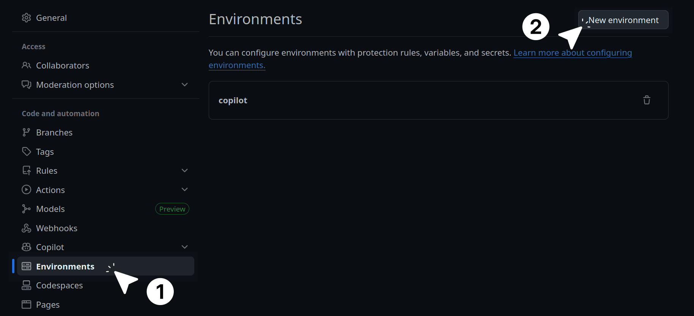
    _Click the **New environment** button._

4. Type `production` in the text field and click **Configure environment**.

    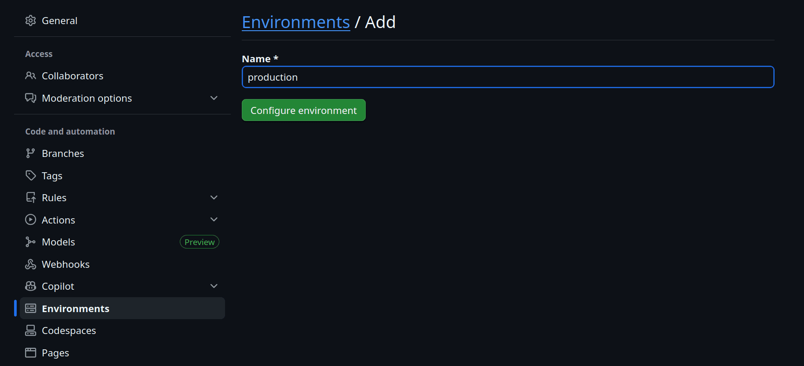
    _Enter the environment name and configure it._

5. Check the box for **Required reviewers**.
6. Search for your GitHub username, select it, and click **Save protection rules**.

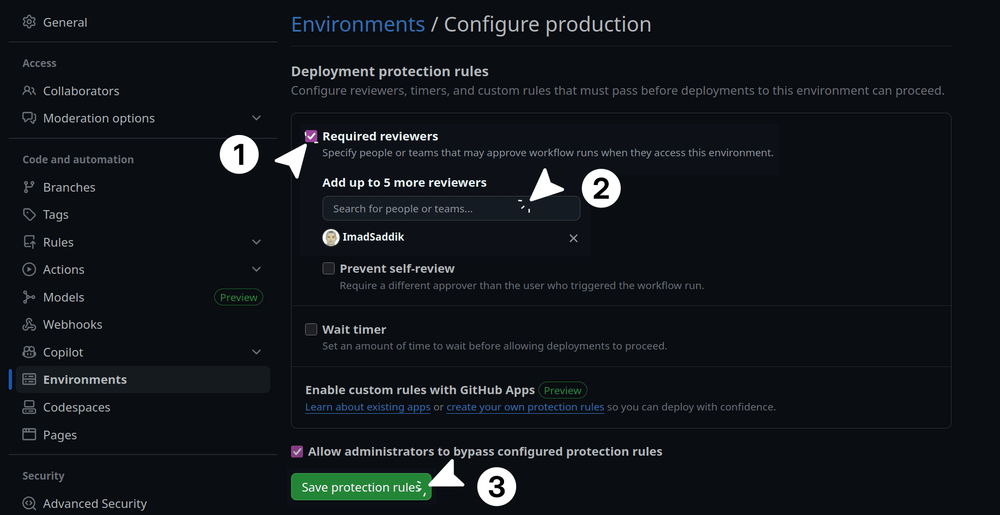
_Select a required reviewer and save the environment rules._

Now, whenever your deployment job runs, GitHub will pause and ask for your explicit approval before touching the server.

Next, you need to add your server credentials. Go to **Settings**, look for **Secrets and variables** in the left sidebar, click **Actions**, and then click the **New repository secret** button.

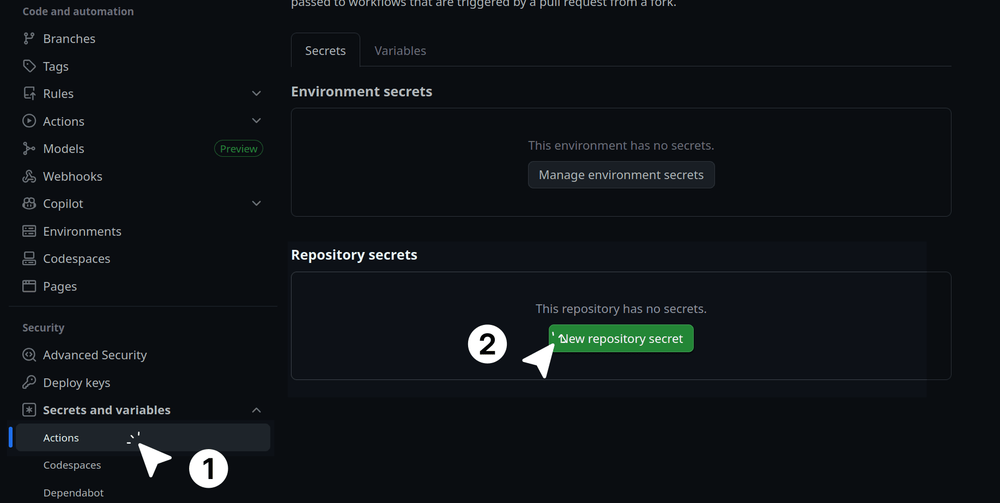
_Add secrets to your repository by clicking on the new repository secret button._

You need to add these four secrets:

- **DIGITAL_OCEAN_HOST_IP**: The IP address of your DigitalOcean Droplet.
- **DIGITAL_OCEAN_USERNAME**: The server username you created earlier.
- **MEILISEARCH_MASTER_KEY**: The master key you use for your Meilisearch database.
- **DIGITAL_OCEAN_SSH_KEY**: A private SSH key that allows GitHub to log in to your server.

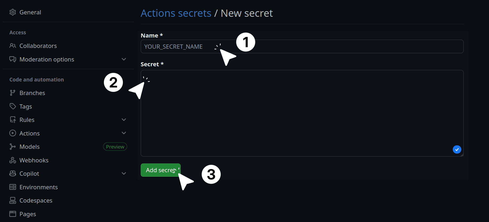
_Provide the secret name and its value, then click **Add secret**_

If you do not have a dedicated SSH key for GitHub yet, you can create one quickly. Open your local terminal and generate a new key without a passphrase:

```bash
ssh-keygen -t rsa -b 4096 -f ~/.ssh/github_actions_key -C "github_actions"
```

> [!NOTE]
> When you run this command, it will ask you to create a passphrase. Just press `Enter` to skip it. Because this key is for an automated pipeline, the system needs to use it in the background without human intervention. If you add a passphrase, the pipeline will get stuck waiting for someone to type it in, causing your deployment to fail.

Print the public key to your screen and copy it:

```bash
cat ~/.ssh/github_actions_key.pub
```

Log in to your DigitalOcean server. Open your authorized keys file:

```bash
nano ~/.ssh/authorized_keys
```

Paste the public key at the very bottom of the file and save it.

Finally, go back to your local computer and print the private key:

```bash
cat ~/.ssh/github_actions_key
```

Copy the entire block of text, including the top header and the bottom footer. Paste this exact text into GitHub as the value for your **DIGITAL_OCEAN_SSH_KEY** secret.

### The deployment workflow

You are ready to write the deployment pipeline. Since we decided to separate the deployment from the testing pipeline to avoid the timeout issue, this workflow will use a manual trigger.

This script is long because it contains several advanced engineering practices. It backs up your data, verifies the search engine dump, performs a safe update of your Python environment, and tests your web server configuration before restarting.

Create a file named `deploy.yml` inside `.github/workflows/`. Paste the following complete configuration:

```yaml
name: Manual deploy

on:
  workflow_dispatch:

jobs:
  build:
    name: Build frontend
    uses: ./.github/workflows/frontend-build.yml

  deploy:
    name: Deploy
    needs: build
    runs-on: ubuntu-latest
    environment:
      name: production
      url: https://imadsaddik.com

    steps:
      - name: Check out repository
        uses: actions/checkout@v6

      - name: Download frontend artifact
        uses: actions/download-artifact@v6
        with:
          name: frontend-build
          path: ./frontend/dist

      - name: Create backups (SQLite & Meilisearch)
        uses: appleboy/ssh-action@v1.2.4
        env:
          MEILISEARCH_KEY: ${{ secrets.MEILISEARCH_MASTER_KEY }}
        with:
          host: ${{ secrets.DIGITAL_OCEAN_HOST_IP }}
          username: ${{ secrets.DIGITAL_OCEAN_USERNAME }}
          key: ${{ secrets.DIGITAL_OCEAN_SSH_KEY }}
          envs: MEILISEARCH_KEY
          script: |
            set -e

            BACKEND_DIR="/web_app/backend"
            BACKUP_DIR="/web_app/backups"
            BACKUP_RETENTION_COUNT=5
            TIMESTAMP=$(date +%Y%m%d%H%M%S)

            mkdir -p $BACKUP_DIR

            echo "Backing up SQLite database..."
            if [ -f "$BACKEND_DIR/visitors.db" ]; then
              cp "$BACKEND_DIR/visitors.db" "$BACKUP_DIR/visitors_$TIMESTAMP.db"
              echo "SQLite backup created successfully."
            else
              echo "Warning: No SQLite database found in $BACKEND_DIR"
            fi

            echo "Triggering Meilisearch dump..."
            if [ -z "$MEILISEARCH_KEY" ]; then
              echo "Error: MEILISEARCH_KEY secret is empty."
              exit 1
            fi

            DUMP_RESPONSE=$(curl -s -w "\n%{http_code}" -X POST 'http://127.0.0.1:7700/dumps' \
              -H "Authorization: Bearer $MEILISEARCH_KEY")
            HTTP_CODE=$(echo "$DUMP_RESPONSE" | tail -n1)
            RESPONSE_BODY=$(echo "$DUMP_RESPONSE" | sed '$d')

            if [ "$HTTP_CODE" -ge 200 ] && [ "$HTTP_CODE" -lt 300 ]; then
              echo "Meilisearch dump request accepted (HTTP $HTTP_CODE)."

              TASK_UID=$(echo "$RESPONSE_BODY" | grep -o '"taskUid":[0-9]*' | cut -d':' -f2)
              if [ -z "$TASK_UID" ]; then
                echo "Error: Could not extract taskUid from response."
                echo "Response: $RESPONSE_BODY"
                exit 1
              fi

              echo "Dump task created with UID: $TASK_UID"
              echo "Waiting for dump to complete..."

              # Poll task status until completion (max 60 seconds)
              MAX_ATTEMPTS=30
              ATTEMPT=0
              while [ $ATTEMPT -lt $MAX_ATTEMPTS ]; do
                TASK_RESPONSE=$(curl -s "http://127.0.0.1:7700/tasks/$TASK_UID" \
                  -H "Authorization: Bearer $MEILISEARCH_KEY")
                TASK_STATUS=$(echo "$TASK_RESPONSE" | grep -o '"status":"[^"]*"' | cut -d'"' -f4)

                if [ "$TASK_STATUS" = "succeeded" ]; then
                  echo "Meilisearch dump completed successfully."
                  break
                elif [ "$TASK_STATUS" = "failed" ]; then
                  echo "Error: Meilisearch dump task failed."
                  echo "Task response: $TASK_RESPONSE"
                  exit 1
                else
                  # Status is "enqueued" or "processing"
                  ATTEMPT=$((ATTEMPT + 1))
                  sleep 2
                fi
              done

              if [ $ATTEMPT -eq $MAX_ATTEMPTS ]; then
                echo "Error: Meilisearch dump timed out after 60 seconds."
                echo "Last task status: $TASK_STATUS"
                exit 1
              fi
            else
              echo "Error: Meilisearch dump request failed with HTTP $HTTP_CODE"
              echo "Response: $RESPONSE_BODY"
              exit 1
            fi

            # 4. Rolling Retention
            echo "Cleaning old backups..."
            sudo /usr/local/bin/clean_backups.sh $BACKUP_RETENTION_COUNT
            echo "Backup process finished successfully."

      - name: Rsync files to droplet
        uses: easingthemes/ssh-deploy@v5.1.0
        with:
          SSH_PRIVATE_KEY: ${{ secrets.DIGITAL_OCEAN_SSH_KEY }}
          REMOTE_HOST: ${{ secrets.DIGITAL_OCEAN_HOST_IP }}
          REMOTE_USER: ${{ secrets.DIGITAL_OCEAN_USERNAME }}
          SOURCE: "./"
          TARGET: "/web_app/"
          ARGS: "-avzr --delete --exclude-from='rsync_exclude.txt'"

      - name: Create backend .env file
        uses: appleboy/ssh-action@v1.2.4
        env:
          MEILISEARCH_KEY: ${{ secrets.MEILISEARCH_MASTER_KEY }}
        with:
          host: ${{ secrets.DIGITAL_OCEAN_HOST_IP }}
          username: ${{ secrets.DIGITAL_OCEAN_USERNAME }}
          key: ${{ secrets.DIGITAL_OCEAN_SSH_KEY }}
          envs: MEILISEARCH_KEY
          script: |
            echo "Creating backend .env file..."
            cat > /web_app/backend/.env <<EOF
            MEILISEARCH_URL=http://127.0.0.1:7700
            MEILISEARCH_INDEX_NAME=articles
            MEILISEARCH_MASTER_KEY=$MEILISEARCH_KEY
            ENVIRONMENT=production
            EOF

      - name: Install Python dependencies (atomic venv swap)
        uses: appleboy/ssh-action@v1.2.4
        with:
          host: ${{ secrets.DIGITAL_OCEAN_HOST_IP }}
          username: ${{ secrets.DIGITAL_OCEAN_USERNAME }}
          key: ${{ secrets.DIGITAL_OCEAN_SSH_KEY }}
          script: |
            set -e

            BACKEND_DIR="/web_app/backend"
            cd $BACKEND_DIR

            echo "Backing up current venv..."
            if [ -d "venv" ]; then
              mv venv venv_backup
              echo "Current venv backed up to venv_backup."
            fi

            echo "Creating new virtual environment..."
            python3 -m venv venv

            echo "Installing Python dependencies..."
            source venv/bin/activate
            if pip install -r requirements.txt; then
              echo "Python dependencies installed successfully."
            else
              echo "Error: Failed to install Python dependencies."
              echo "Rolling back to previous venv..."
              deactivate
              rm -rf venv
              if [ -d "venv_backup" ]; then
                mv venv_backup venv
                echo "Rollback complete."
              fi
              exit 1
            fi
            deactivate

            echo "Copying custom files from backup venv..."
            # Copy gunicorn_start script
            if [ -f "venv_backup/bin/gunicorn_start" ]; then
              cp venv_backup/bin/gunicorn_start venv/bin/gunicorn_start
              chmod +x venv/bin/gunicorn_start
              echo "Copied gunicorn_start script."
            fi

            # Copy logs directory (preserve existing logs)
            if [ -d "venv_backup/logs" ]; then
              cp -r venv_backup/logs venv/
              echo "Copied logs directory."
            else
              mkdir -p venv/logs
              echo "Created new logs directory."
            fi

            # Create run directory for socket file
            mkdir -p venv/run
            echo "Created run directory for socket."

            # Clean up backup after successful deploy
            if [ -d "venv_backup" ]; then
              rm -rf venv_backup
              echo "Cleaned up venv_backup."
            fi

            echo "Virtual environment setup completed successfully."

      - name: Restart backend service
        uses: appleboy/ssh-action@v1.2.4
        with:
          host: ${{ secrets.DIGITAL_OCEAN_HOST_IP }}
          username: ${{ secrets.DIGITAL_OCEAN_USERNAME }}
          key: ${{ secrets.DIGITAL_OCEAN_SSH_KEY }}
          script: |
            set -e

            echo "Restarting FastAPI backend service..."
            if sudo supervisorctl restart imadsaddik_com; then
              echo "FastAPI backend restarted successfully."
            else
              echo "Error: Failed to restart FastAPI backend."
              exit 1
            fi

            # Verify the service is running
            sleep 5
            if sudo supervisorctl status imadsaddik_com | grep -q "RUNNING"; then
              echo "FastAPI backend is running."
            else
              echo "Error: FastAPI backend failed to start properly."
              sudo supervisorctl status imadsaddik_com
              exit 1
            fi

      - name: Reload Nginx
        uses: appleboy/ssh-action@v1.2.4
        with:
          host: ${{ secrets.DIGITAL_OCEAN_HOST_IP }}
          username: ${{ secrets.DIGITAL_OCEAN_USERNAME }}
          key: ${{ secrets.DIGITAL_OCEAN_SSH_KEY }}
          script: |
            set -e

            echo "Testing Nginx configuration..."
            if sudo nginx -t; then
              echo "Nginx configuration is valid."
            else
              echo "Error: Nginx configuration test failed."
              exit 1
            fi

            echo "Reloading Nginx..."
            if sudo nginx -t; then
              echo "Configuration OK. Reloading Nginx..."
              sudo systemctl reload nginx
            else
              echo "Nginx configuration test failed! Not reloading."
              exit 1
            fi

            echo "Deployment complete!"
```

Because this workflow is doing a lot of heavy lifting, let us break it down into specific stages to understand how it protects your live website.

#### The manual trigger and frontend build

```yaml
on:
  workflow_dispatch:

jobs:
  build:
    name: Build frontend
    uses: ./.github/workflows/frontend-build.yml

  deploy:
    name: Deploy
    needs: build
    runs-on: ubuntu-latest
    environment:
      name: production
      url: https://imadsaddik.com

# ...
```

The `workflow_dispatch` command adds a "Run workflow" button to your GitHub Actions page.

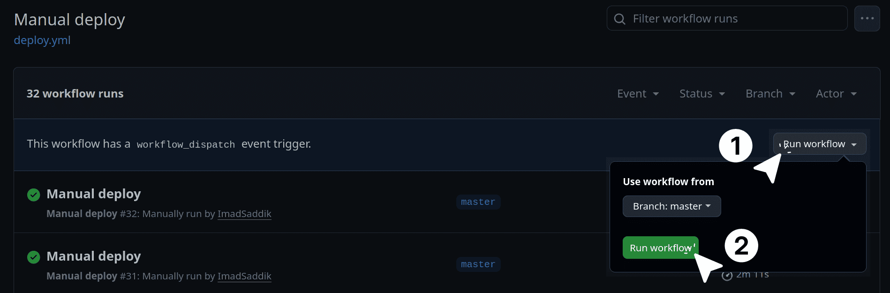
_Click the **Run workflow** button to start the deployment._

When you click it, the pipeline starts and immediately calls the reusable `frontend-build.yml` file to compile a fresh version of your Vue code. Next, it hits the `environment: production` block. GitHub stops the pipeline here and sends you an email. The deployment will not continue until you click the approve button.

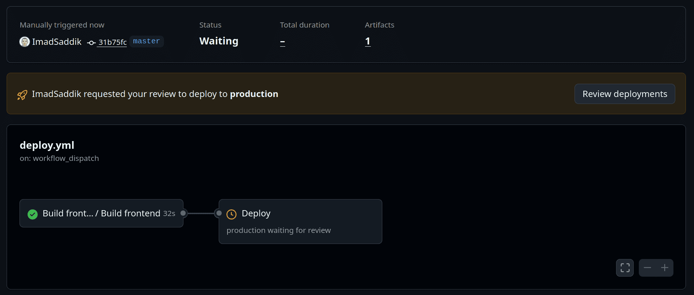
_Click **Review deployments**, select **production**, and click **Approve and deploy**._

#### Safe backups with polling

```yaml
- name: Create backups (SQLite & Meilisearch)
  uses: appleboy/ssh-action@v1.2.4
  env:
    MEILISEARCH_KEY: ${{ secrets.MEILISEARCH_MASTER_KEY }}
  with:
    host: ${{ secrets.DIGITAL_OCEAN_HOST_IP }}
    username: ${{ secrets.DIGITAL_OCEAN_USERNAME }}
    key: ${{ secrets.DIGITAL_OCEAN_SSH_KEY }}
    envs: MEILISEARCH_KEY
    script: |
      # ...

      echo "Triggering Meilisearch dump..."
      DUMP_RESPONSE=$(curl -s -w "\n%{http_code}" -X POST 'http://127.0.0.1:7700/dumps' \
        -H "Authorization: Bearer $MEILISEARCH_KEY")
      
      # ...

      # Poll task status until completion (max 60 seconds)
      MAX_ATTEMPTS=30
      ATTEMPT=0
      while [ $ATTEMPT -lt $MAX_ATTEMPTS ]; do
        TASK_RESPONSE=$(curl -s "http://127.0.0.1:7700/tasks/$TASK_UID" \
          -H "Authorization: Bearer $MEILISEARCH_KEY")
        TASK_STATUS=$(echo "$TASK_RESPONSE" | grep -o '"status":"[^"]*"' | cut -d'"' -f4)

        if [ "$TASK_STATUS" = "succeeded" ]; then
          echo "Meilisearch dump completed successfully."
          break
        # ...
```

Instead of trusting the backup process blindly, the script copies your SQLite database and then triggers a Meilisearch dump. However, creating a dump takes time.

The script captures the `taskUid` from the search engine and enters a `while` loop, checking the status every two seconds. It waits to confirm the backup is totally successful before moving forward.

#### The rsync transfer

```yaml
- name: Rsync files to droplet
  uses: easingthemes/ssh-deploy@v5.1.0
  with:
    SSH_PRIVATE_KEY: ${{ secrets.DIGITAL_OCEAN_SSH_KEY }}
    REMOTE_HOST: ${{ secrets.DIGITAL_OCEAN_HOST_IP }}
    REMOTE_USER: ${{ secrets.DIGITAL_OCEAN_USERNAME }}
    SOURCE: "./"
    TARGET: "/web_app/"
    ARGS: "-avzr --delete --exclude-from='rsync_exclude.txt'"
```

The `easingthemes/ssh-deploy` action takes the files from your GitHub repository and pushes them to your server. It reads the `rsync_exclude.txt` file we wrote earlier so it knows exactly which files it is not allowed to touch or delete.

#### The atomic virtual environment swap

```yaml
- name: Install Python dependencies (atomic venv swap)
  uses: appleboy/ssh-action@v1.2.4
  with:
    host: ${{ secrets.DIGITAL_OCEAN_HOST_IP }}
    username: ${{ secrets.DIGITAL_OCEAN_USERNAME }}
    key: ${{ secrets.DIGITAL_OCEAN_SSH_KEY }}
    script: |
      # ...
      echo "Backing up current venv..."
      if [ -d "venv" ]; then
        mv venv venv_backup
      fi

      echo "Creating new virtual environment..."
      python3 -m venv venv
      source venv/bin/activate

      if pip install -r requirements.txt; then
        echo "Python dependencies installed successfully."
      else
        echo "Rolling back to previous venv..."
        deactivate
        rm -rf venv
        if [ -d "venv_backup" ]; then
          mv venv_backup venv
          echo "Rollback complete."
        fi
        exit 1
      fi
      # ...
```

When updating Python dependencies, things can easily break if a package fails to download. To prevent downtime, this script uses an atomic swap. It backs up your old virtual environment and builds a brand new one.

If the new installation fails at any point, the script catches the error and instantly restores your old environment. Your live website stays up and running the whole time.

#### Service verification

```yaml
- name: Restart backend service
  uses: appleboy/ssh-action@v1.2.4
  with:
    host: ${{ secrets.DIGITAL_OCEAN_HOST_IP }}
    username: ${{ secrets.DIGITAL_OCEAN_USERNAME }}
    key: ${{ secrets.DIGITAL_OCEAN_SSH_KEY }}
    script: |
      # ...

      sudo supervisorctl restart imadsaddik_com
      
      sleep 5
      if sudo supervisorctl status imadsaddik_com | grep -q "RUNNING"; then
        echo "FastAPI backend is running."
      else
        exit 1
      fi

- name: Reload Nginx
  uses: appleboy/ssh-action@v1.2.4
  with:
    host: ${{ secrets.DIGITAL_OCEAN_HOST_IP }}
    username: ${{ secrets.DIGITAL_OCEAN_USERNAME }}
    key: ${{ secrets.DIGITAL_OCEAN_SSH_KEY }}
    script: |
      # ...
  
      echo "Testing Nginx configuration..."
      if sudo nginx -t; then
        sudo systemctl reload nginx
      else
        exit 1
      fi
```

Finally, the script restarts your systems. But before it brings the web server down, it runs `nginx -t` to check your configuration files for mistakes.

If it finds a syntax error, it cancels the reload. For the backend, it tells Supervisor to restart FastAPI, pauses for five seconds, and checks the status to verify the service is running properly.

### Trigger your first deployment

Because we separated continuous integration (testing) from continuous delivery (deployment), your master `ci.yml` orchestrator is already complete. It will run automatically when you push code, verify your tests, build your frontend, and finish with a green checkmark.

Now, it is time to use your new manual deployment pipeline.

The first step is to open a pull request. Create a new branch in your local repository, commit the files you created in this subchapter, and push them to GitHub. Once pushed, open a pull request on GitHub and merge it into the `master` branch after your continuous integration checks pass successfully.

With the changes merged, navigate to GitHub Actions. Open your repository on GitHub and click the Actions tab located near the top of the page.

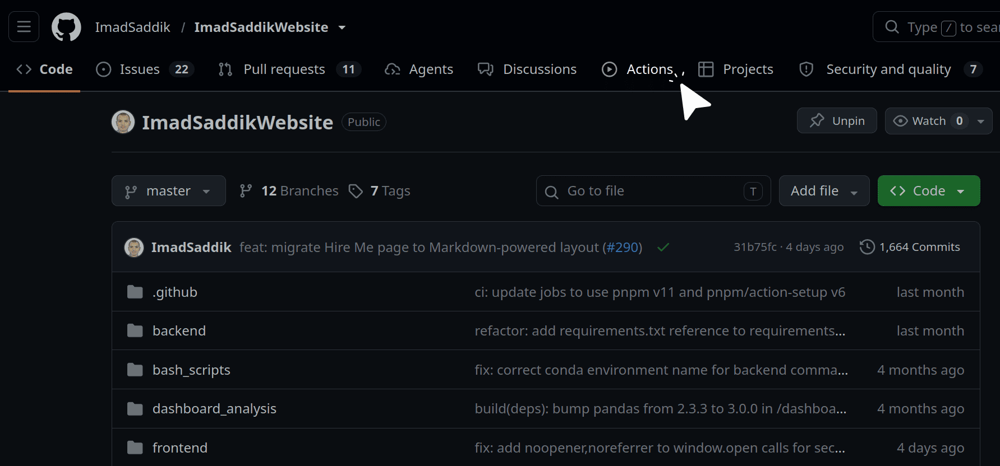
_Navigating to the Actions tab on GitHub._

Next, you need to select the workflow. Look at the left sidebar, where you will see a list of your workflows. Find and click on the one named **Manual deploy**.

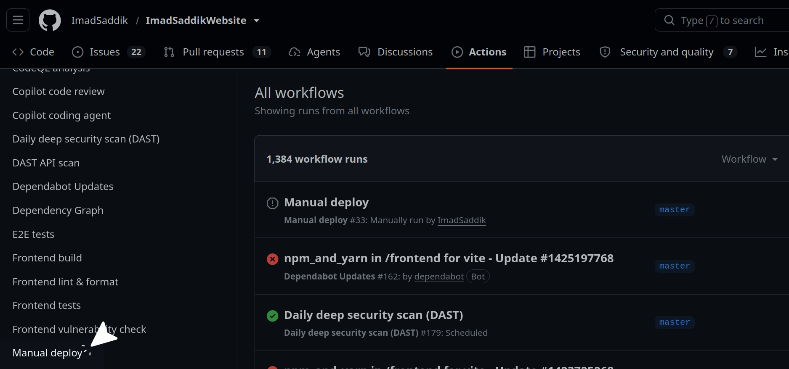
_Selecting the Manual deploy workflow from the Actions sidebar._

Finally, you can run the workflow to start the deployment. On the right side of the screen, click the **Run workflow** dropdown menu. Confirm that the selected branch is set to `master`, and then click the green **Run workflow** button to execute the pipeline.


_Click the **Run workflow** button to start the deployment._

GitHub will start the pipeline, download your repository, and build a fresh copy of your frontend artifact. Once the build finishes, the pipeline will pause.

Because you set up the `production` environment gate earlier, the pipeline will halt and send you an email. On your GitHub Actions screen, you will see a prompt asking to **Review deployments**.


_Click **Review deployments**, select **production**, and click **Approve and deploy**._

Click it, approve the run, and watch the logs. GitHub will log into your DigitalOcean server, back up your database and search engine, sync your new code using your exclude file, swap your virtual environments, and securely restart your application with zero downtime.
